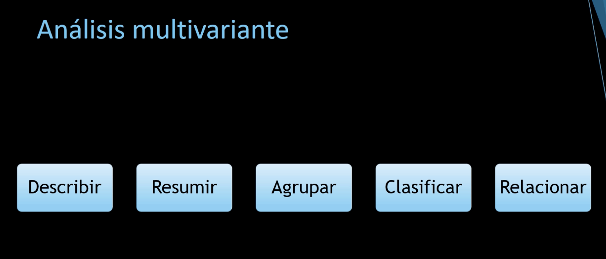
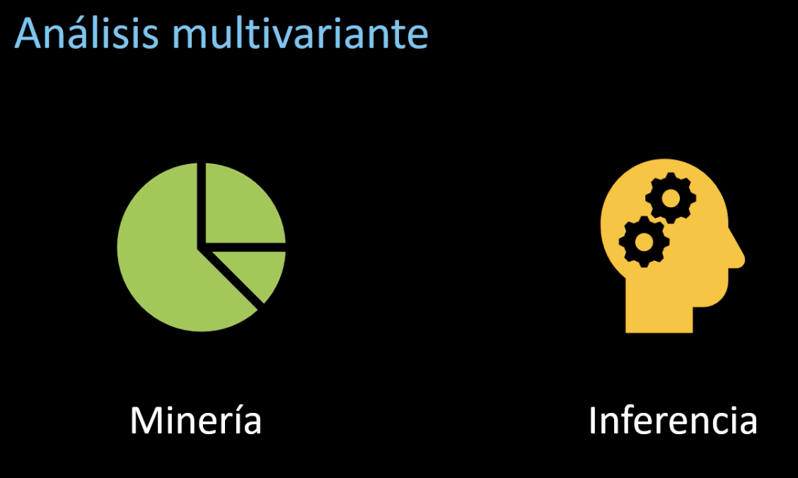
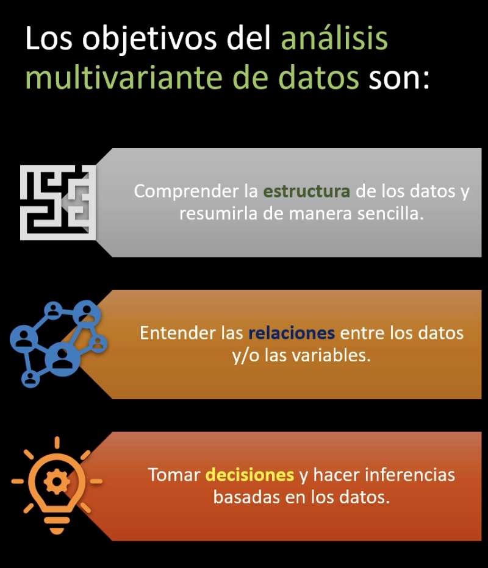
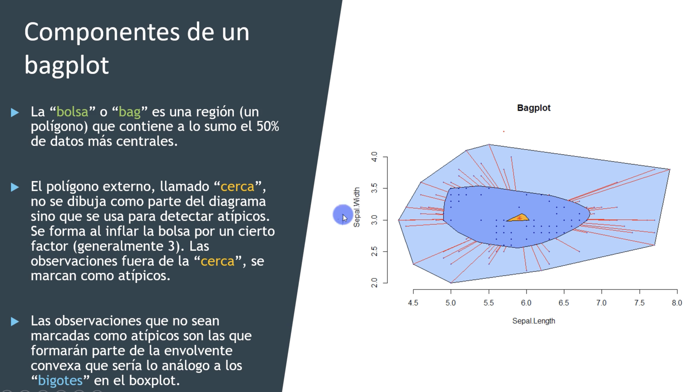
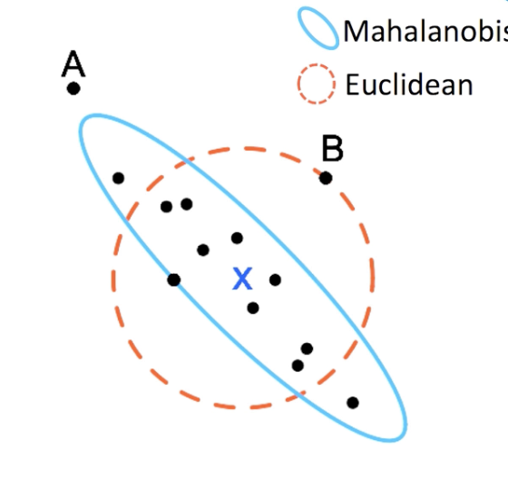

# Introducción


El presente cuaderno resume los temas vistos en el [curso](https://github.com/joanby/curso-estadistica-multivariante) de estadística multivariante de R y Python.

Primero,  ajustamos librerías de Python y R, para poder trabajar con ambos de forma simultanea

```{r message=FALSE, warning=FALSE, include=FALSE}
library(reticulate)

# Forzar a usar el ambiente correcto
use_condaenv("py311_arm", required = TRUE)

# Confirmar que está bien enlazado
py_config()

# # Instalar los paquetes de Python necesarios
# py_install(c(
#   "numpy", 
#   "scipy", 
#   "pandas", 
#   "seaborn", 
#   "matplotlib", 
#   "plotly", 
#   "scikit-learn", 
#   "scikit-learn-extra",   # Para KMedoids
#   "imblearn",             # Para SMOTE y pipelines
#   "statsmodels",          # Modelos estadísticos
#   "factor-analyzer",      # Análisis factorial
#   "pydataset"             # Datasets de ejemplo
# ), pip = TRUE)


```

Ese bloque de código en R configura la integración con Python mediante la librería reticulate: primero carga el paquete, luego indica que se use el intérprete de Python definido en la variable de entorno RETICULATE_PYTHON (que apunta a /usr/local/bin/python3.13), después cambia el contexto para trabajar dentro de una virtualenv específica ubicada en tu carpeta de iCloud (donde están las librerías de Python que deseas usar), y finalmente ejecuta py_config() para mostrar la configuración activa, confirmando qué versión de Python y qué entorno se están utilizando.


Cargamos librerias de Python

```{python message=FALSE, warning=FALSE}
# ===============================
# 📦 Librerías necesarias en Python
# ===============================

import numpy as np                        # Álgebra lineal y operaciones numéricas
import pandas as pd                       # Manipulación y análisis de datos en DataFrames
import matplotlib.pyplot as plt           # Visualización básica y gráficos 2D
import seaborn as sns                     # Visualización estadística (gráficos más elaborados)
import plotly.express as px               # Visualización interactiva (2D y 3D)

# --------------------------------
# 🔹 Estadística y distribuciones
# --------------------------------
from scipy.stats import norm              # Distribución normal y funciones estadísticas
from scipy.stats import multivariate_normal # Distribución normal multivariante
from scipy.stats import chi2              # Distribución chi-cuadrado
from scipy.stats import bartlett          # Test de esfericidad de Bartlett
from scipy.stats import multivariate_t    # Distribución t multivariante
from scipy.spatial.distance import mahalanobis  # Distancia de Mahalanobis
from scipy.spatial.distance import pdist        # Distancias por pares entre observaciones

# --------------------------------
# 🔹 Modelos estadísticos
# --------------------------------
import statsmodels.api as sm              # Modelos estadísticos (regresión, tests, etc.)
from statsmodels.multivariate.manova import MANOVA  # MANOVA (Análisis multivariante de varianza)

# --------------------------------
# 🔹 Machine Learning (scikit-learn)
# --------------------------------
from sklearn.datasets import load_iris    # Dataset de ejemplo (Iris)
from sklearn.datasets import fetch_openml # Descarga de datasets de OpenML
from sklearn.preprocessing import StandardScaler  # Escalamiento de datos
from sklearn.preprocessing import MinMaxScaler    # Normalización de datos [0,1]
from sklearn.decomposition import PCA     # Análisis de Componentes Principales
from sklearn.manifold import MDS          # Escalamiento multidimensional
from sklearn.cluster import KMeans        # Clustering k-means
from sklearn_extra.cluster import KMedoids  # Clustering k-medoids
from sklearn.mixture import GaussianMixture     # Modelos de mezcla gaussiana (clustering)
from sklearn.discriminant_analysis import LinearDiscriminantAnalysis # Análisis discriminante lineal (LDA)
from sklearn.neighbors import KNeighborsClassifier # Clasificación k-NN
from sklearn.naive_bayes import GaussianNB       # Clasificador Naive Bayes Gaussiano
from sklearn.linear_model import LogisticRegression # Regresión logística
from sklearn.linear_model import LinearRegression, Ridge, Lasso, ElasticNet  # Modelos de regresión
from sklearn.linear_model import RidgeCV, LassoCV, ElasticNetCV   # Regularización con validación cruzada
from sklearn.metrics import mean_squared_error, r2_score           # Métricas de desempeño de modelos
from sklearn.metrics import pairwise_distances                     # Matrices de distancia
from sklearn.model_selection import train_test_split, cross_val_score, GridSearchCV  # Validación de modelos

# --------------------------------
# 🔹 Balanceo y pipelines (ML)
# --------------------------------
from imblearn.over_sampling import SMOTE   # Oversampling para clases desbalanceadas
from imblearn.pipeline import Pipeline     # Pipelines con técnicas de balanceo

# --------------------------------
# 🔹 Análisis factorial
# --------------------------------
from factor_analyzer import FactorAnalyzer, calculate_bartlett_sphericity, calculate_kmo  
# Análisis factorial y tests de adecuación (Bartlett y KMO)

# --------------------------------
# 🔹 Herramientas adicionales
# --------------------------------
from scipy.cluster.hierarchy import dendrogram, linkage, fcluster  # Clustering jerárquico
from math import pi                        # Constantes matemáticas
from pandas.plotting import scatter_matrix, andrews_curves, parallel_coordinates  
# Gráficos multivariantes con pandas


```

Cargamos librerías de R

```{r message=FALSE, warning=FALSE}
# Cargar librerias
# Cargar librerías necesarias
library(dplyr)        # Manipulación y transformación de datos (select, filter, mutate, summarise)
library(ggplot2)      # Visualización de datos (gráficos estadísticos y personalizables)
library(GGally)       # Extiende ggplot2 con gráficos multivariantes (pairs, ggpairs)

library(MASS)         # Modelos estadísticos y funciones (mvrnorm, kde2d, LDA)
library(ggthemes)     # Temas y estilos para mejorar la estética en ggplot2
library(plotly)       # Visualización interactiva (2D y 3D)
library(ggrepel)      # Etiquetas en gráficos sin solapamiento
library(mvtnorm)      # Simulación y densidades de distribuciones normales multivariantes
library(mclust)       # Modelos de mezcla gaussiana y clustering
library(copula)       # Modelos de dependencia entre variables (cópulas)
library(Hotelling)    # Test estadístico T² de Hotelling
library(ellipse)      # Gráficos de elipses de confianza multivariantes
library(psych)        # Análisis psicométrico y de factores
library(GPArotation)  # Rotaciones de factores en análisis factorial
library(corrplot)     # Visualización de matrices de correlación
library(tidyr)        # Transformación de datos (pivot_longer, pivot_wider, separate)
library(vegan)        # Análisis multivariante (ordenaciones, diversidad, ecología)
library(cluster)      # Métodos de clustering (k-means, PAM, silhouette, etc.)
library(factoextra)   # Visualización de resultados de clustering y PCA
library(caret)        # Entrenamiento, validación y ajuste de modelos
library(class)        # Clasificación supervisada (kNN)
library(e1071)        # Algoritmos de machine learning (Naive Bayes, SVM)
library(glmnet)       # Regularización (Ridge, Lasso, Elastic Net)
library(ggpubr)       # Gráficos listos para publicaciones (estadísticos y comparaciones)
library(broom)        # Convierte resultados de modelos en data frames ordenados
library(car)          # Herramientas para regresión (VIF, Anova, etc.)
library(leaps)        # Selección de variables en regresión (best subset)
library(ddalpha)      # Métodos de profundidad de datos y clasificación robusta
library(scatterplot3d)# Gráficos 3D simples
library(tibble)       # Data frames modernos (tibbles)
library(patchwork)    # Composición de múltiples gráficos ggplot2
library(aplpack)      # Gráficos robustos (bagplots, faces plots)
library(viridis)      # Paletas de color perceptualmente uniformes
library(tidyverse)    # Colección de paquetes para ciencia de datos (dplyr, ggplot2, tidyr, readr, etc.)
library(janitor)      # Limpieza de datos (clean_names, tabyl)
library(scales)       # Etiquetas y escalas en gráficos (percent, comma, etc.)


library(MASS)
library(ICSNP)
library(ggplot2)


# Quitar notacion cientifica
options(scipen = 999)  # Cuanto mayor el número, menos notación científica
```

# 1) Espacio multivariante



La estadística multivariante sirve para analizar simultáneamente múltiples variables con el fin de entender las relaciones que existen entre ellas y cómo estas influyen en fenómenos complejos. Es especialmente útil cuando los datos contienen muchos atributos interrelacionados, ya que permite identificar patrones, reducir dimensiones, clasificar observaciones, agrupar elementos similares o predecir resultados. Se aplica en diversas áreas como el marketing, la economía, la biología o las ciencias sociales, donde los fenómenos no pueden explicarse adecuadamente con una sola variable, y se requiere una visión integral y estructurada de los datos.



Los métodos de la estadística multivariante suelen agruparse en dos grandes enfoques: la minería de datos y la estadística inferencial. La **minería de datos** se enfoca en descubrir patrones, relaciones ocultas o estructuras dentro de grandes volúmenes de datos, muchas veces sin una hipótesis previa; es más exploratoria y se basa en algoritmos como los árboles de decisión, redes neuronales o métodos de clustering. Por otro lado, la **estadística inferencial** parte de un marco teórico más riguroso y busca hacer generalizaciones sobre una población a partir de una muestra, usando modelos que permiten estimar parámetros, contrastar hipótesis y establecer relaciones causales, como la regresión multivariante o el análisis discriminante. Ambos enfoques son complementarios y permiten obtener una visión más completa y robusta del fenómeno estudiado.



Análisis con "Bagplot"



### 1.1) Ejemplo con datos departamentales de USA (R)

El dataset *US State Facts and Figures* de R reúne información geográfica, demográfica y socioeconómica sobre los 50 estados de Estados Unidos, organizada alfabéticamente. Incluye abreviaciones, nombres completos, áreas en millas cuadradas, centros geográficos aproximados, divisiones y regiones oficiales del país, así como una matriz llamada `state.x77` con estadísticas clave de cada estado, como población estimada en 1975, ingreso per cápita en 1974, tasa de analfabetismo, esperanza de vida, tasa de homicidios, porcentaje de graduados de secundaria, días promedio de heladas y superficie territorial. Esta información proviene del Departamento de Comercio de EE.UU., con datos recolectados principalmente en los años 1970s, y es útil para análisis comparativos y visualizaciones espaciales o estadísticas multivariadas.

```{r message=FALSE, warning=FALSE, paged.print=FALSE}
# Cargar dataset
X <- as.data.frame(state.x77)
glimpse(X)

n.X <- nrow(X)
p.X <- ncol(X)

```

Vemos que el conjunto de datos tiene 50 filas (observaciones de cada estado) y 8 columnas (Variables de cada observacion)

### 1.1.1) Visualización de datos

Graficamos boxplot por variable

```{r fig.height=10, fig.width=10, message=FALSE, warning=FALSE}
X_long <- X %>% 
  rownames_to_column("State") %>%
  pivot_longer(-State, names_to = "Variable", values_to = "Value")

ggplot(X_long, aes(x = Variable, y = Value)) +
  geom_boxplot(fill = "skyblue") +
  facet_wrap(~Variable, scales = "free") +
  theme_minimal()


```

Vemos Bagplot entre ingresos y expectativa de vida

```{r}
bagplot(X$Income, X$`Life Exp`,
        xlab = "Income",
        ylab = "Life Expectancy",
        main = "Bagplot: Income vs Life Exp")
```

El gráfico bagplot de "Income vs Life Expectancy" muestra visualmente cómo se relacionan el ingreso y la esperanza de vida, destacando tanto la tendencia central como la dispersión de los datos: la región central oscura (el "bag") encierra el 50% de las observaciones, indicando una fuerte concentración de datos en ese rango; el área más clara (el "fence") delimita el rango extendido y permite identificar valores atípicos, mientras que las líneas rojas ("rays") señalan la dirección y magnitud de estos valores extremos, lo que facilita detectar patrones, simetrías o anomalías en la distribución conjunta de ambas variables.

Histogramas de la variable "Murder" con diferentes binwidths

El `binwidth` es el ancho de cada barra en un histograma y determina cómo se agrupan los datos en intervalos; un valor pequeño muestra más detalle y variabilidad, mientras que uno grande agrupa más datos en menos barras, dando una visión más general de la distribución.

```{r fig.height=7, fig.width=14, message=TRUE, warning=TRUE}
binwidths <- c(1, 2, 3)

plots <- lapply(binwidths, function(bw) {
  # Secuencia de cortes basada en binwidth y el rango de los datos
  breaks_seq <- seq(floor(min(X$Murder)), ceiling(max(X$Murder)), by = bw)
  
  ggplot(X, aes(x = Murder)) +
    geom_histogram(binwidth = bw, fill = "blue", alpha = 0.6, color = "black") +
    scale_x_continuous(breaks = breaks_seq) +
    labs(
      title = paste("Murder con binwidth =", bw),
      x = "Tasa de homicidios",
      y = "Frecuencia"
    ) +
    theme_minimal()
})

wrap_plots(plots, ncol = 1)

```

El gráfico muestra tres histogramas que representan la distribución de la variable `Murder` (tasa de homicidios por estado en EE. UU.), cada uno con un diferente valor de `binwidth` (1, 2 y 3), lo cual controla el ancho de las barras y, por tanto, el nivel de detalle con que se agrupan los datos. Al comparar los paneles, se observa que un binwidth más pequeño (izquierda) revela más detalle pero puede generar ruido visual, mientras que uno más grande (derecha) suaviza la distribución, facilitando la interpretación general pero ocultando variaciones sutiles. Este ejercicio nos ayuda a entender cómo el tamaño del bin influye en la percepción de la forma de la distribución y permite elegir un nivel de agregación adecuado según el objetivo del análisis.

Histogramas de todas las variables (Sturges)

```{r fig.height=9, fig.width=12, message=FALSE, warning=FALSE}
X_long %>%
  ggplot(aes(x = Value)) +
  geom_histogram(bins = 30, fill = "blue", color = "white") +
  facet_wrap(~Variable, scales = "free") +
  theme_minimal()

```

Densidades kernel por variable

```{r fig.height=10, fig.width=10, message=FALSE, warning=FALSE}
X_long %>%
  ggplot(aes(x = Value)) +
  geom_density(fill = "blue", alpha = 0.4) +
  facet_wrap(~Variable, scales = "free") +
  labs(title = "Densidad kernel por variable") +
  theme_minimal()

```

El gráfico muestra las curvas de densidad kernel para cada variable cuantitativa del dataset `state.x77`, lo que permite visualizar la forma de su distribución sin depender de los histogramas. Al usar `facet_wrap`, cada variable se representa en un panel independiente con escalas libres, lo que facilita comparar sus formas. Por ejemplo, variables como `Illiteracy`, `Population` y `Area` presentan distribuciones asimétricas con sesgo a la derecha (concentración de valores bajos y pocos valores altos), mientras que variables como `Life Exp` o `Income` tienen formas más simétricas o con una leve asimetría. Este tipo de gráfico permite identificar patrones como bimodalidad, concentración de valores y sesgos, siendo útil para decidir transformaciones o verificar supuestos estadísticos previos a un análisis multivariante.

Vemos mapas de calor de densidad bivariada con su respectivo contorno

```{r}

# Cargar dataset
X <- as.data.frame(state.x77)

# Extraer variables de interés
x <- X$Income
y <- X$`Life Exp`


bivkde <- kde2d(x, y, n = 100)


bivkde_df <- expand.grid(x = bivkde$x, y = bivkde$y)
bivkde_df$z <- as.vector(bivkde$z)


p1 <- ggplot(bivkde_df, aes(x = x, y = y, fill = z)) +
  geom_tile() +
  scale_fill_viridis_c() +
  labs(title = "Mapa de calor de densidad bivariada",
       x = "Income", y = "Life Expectancy", fill = "Densidad") +
  theme_minimal()

print(p1)


p2 <- ggplot(bivkde_df, aes(x = x, y = y, z = z)) +
  geom_contour_filled() +
  labs(title = "Contornos de densidad bivariada",
       x = "Income", y = "Life Expectancy", fill = "Nivel") +
  theme_minimal()

print(p2)


```

Los gráficos de densidad bivariada de "Income" versus "Life Expectancy" permiten visualizar cómo se distribuyen conjuntamente estas dos variables en el conjunto de datos: el mapa de calor muestra que la mayor concentración de observaciones se encuentra en un rango de ingresos entre aproximadamente 4500 y 6000 unidades monetarias y una esperanza de vida entre 70 y 71 años, lo cual se representa con colores más claros (amarillo); por su parte, el gráfico de contornos refuerza esta interpretación al delimitar zonas de igual densidad, destacando un núcleo central de alta densidad rodeado por niveles decrecientes, lo que sugiere una relación positiva moderada entre ingreso y esperanza de vida, con pocos valores extremos alejados de esta concentración principal.

Visualizamos lo anterior en en un grafico dinamico

```{r}
p3 <- plot_ly(x = bivkde$x, y = bivkde$y, z = bivkde$z) %>%
  add_surface(colorscale = 'Viridis') %>%
  layout(title = "Superficie de densidad bivariada (3D)",
         scene = list(
           xaxis = list(title = "Income"),
           yaxis = list(title = "Life Expectancy"),
           zaxis = list(title = "Densidad")
         ))

p3  

```

Comparación de kernel Gaussiano vs Epanechnikov

La principal diferencia entre el kernel Gaussiano y el Epanechnikov radica en la forma en que suavizan la distribución de los datos: el **kernel Gaussiano** utiliza una función de densidad normal que asigna peso a todos los puntos, aunque decrece exponencialmente con la distancia, lo que produce curvas suaves y extendidas; en cambio, el **kernel Epanechnikov** es más eficiente computacionalmente, tiene soporte compacto (solo considera puntos dentro de un cierto rango) y genera curvas más concentradas alrededor de los datos, con bordes más marcados. En la práctica, ambos estimadores suelen producir resultados similares, pero el Epanechnikov es óptimo en términos de varianza mínima para muchos casos, mientras que el Gaussiano es preferido por su suavidad y familiaridad.

```{r fig.height=12, fig.width=12, message=FALSE, warning=FALSE}
plot_list <- lapply(unique(X_long$Variable), function(var){
  ggplot(filter(X_long, Variable == var), aes(x = Value)) +
    geom_density(kernel = "gaussian", color = "blue", fill = "blue", alpha = 0.3) +
    geom_density(kernel = "epanechnikov", color = "green", fill = "green", alpha = 0.2) +
    labs(title = paste("Kernel Gaussiano vs Epanechnikov:", var)) +
    theme_minimal()
})
wrap_plots(plot_list)

```

El gráfico compara dos estimaciones de densidad kernel para cada variable del dataset `state.x77` usando los núcleos **Gaussiano** (línea azul) y **Epanechnikov** (línea verde). Cada panel muestra cómo varía la forma de la distribución según el tipo de kernel, aunque en la mayoría de los casos las diferencias son sutiles. Ambos métodos suavizan la distribución, pero el kernel gaussiano suele generar curvas más suaves y extendidas, mientras que el Epanechnikov tiende a ser más eficiente y local, marcando picos ligeramente más agudos. Esta comparación permite ver que, si bien el núcleo elegido puede influir levemente en la forma estimada, en distribuciones bien definidas (como `Income` o `Life Exp`) ambas curvas son muy similares, mientras que en otras más irregulares o asimétricas (como `Area` o `Population`) las diferencias pueden ser más evidentes. En general, el análisis resalta la importancia de considerar el tipo de kernel al interpretar estructuras en los datos.

Scatterplot Income vs Life Exp

```{r}
ggplot(X, aes(x = Income, y = `Life Exp`)) +
  geom_point(color = "blue") +
  labs(title = "Income vs Life Expectancy") +
  theme_minimal()

```

El gráfico de dispersión muestra la relación entre el ingreso per cápita (`Income`) y la esperanza de vida (`Life Exp`) en los estados de EE. UU., revelando una **tendencia positiva general**, donde los estados con mayores ingresos tienden a tener una mayor esperanza de vida. Sin embargo, la relación no es perfectamente lineal, ya que hay cierta dispersión y algunos estados con ingresos altos no necesariamente tienen la mayor esperanza de vida, lo que sugiere que aunque el ingreso influye, otros factores también juegan un papel importante en la longevidad. Esta visualización permite identificar patrones generales, así como posibles excepciones o valores atípicos.

Gráfico 3D con plotly

```{r}
plot_ly(data = X, x = ~Income, y = ~`Life Exp`, z = ~Murder, 
        type = "scatter3d", mode = "markers",
        marker = list(size = 5, color = "blue"))

```

Pairs plot (scatterplot matrix)

```{r fig.height=12, fig.width=12, message=FALSE, warning=FALSE}
GGally::ggpairs(X)

```

El gráfico generado con `GGally::ggpairs(X)` muestra una matriz de correlaciones y relaciones bivariadas entre todas las variables numéricas del dataset `state.x77`. Cada celda inferior presenta un diagrama de dispersión que permite visualizar la relación entre dos variables, mientras que las diagonales muestran la distribución univariada (densidad) de cada variable, y las celdas superiores presentan los coeficientes de correlación de Pearson, incluyendo su significancia estadística (`*`, `**`, `***`). Se destacan correlaciones fuertes como la negativa entre `Illiteracy` y `HS Grad` (-0.657), y entre `Murder` y `Life Exp` (-0.781), lo que sugiere que mayores tasas de alfabetización y educación secundaria están asociadas con menor criminalidad y mayor esperanza de vida. También se observa una correlación positiva moderada entre `Income`y `HS Grad` (0.620), y entre `Income` y `Area` (0.363), lo que puede indicar una asociación entre desarrollo económico y extensión territorial. Este tipo de gráfico facilita la detección de patrones, asociaciones clave y posibles variables explicativas para análisis posteriores como regresión o segmentación.

Coordenadas paralelas

```{r fig.height=7, fig.width=15, message=FALSE, warning=FALSE}
parcoord(X, col = "blue", var.label = TRUE)

```

Este es un **gráfico de coordenadas paralelas** que representa todas las variables numéricas del dataset `state.x77` para los 50 estados de EE. UU. Cada línea azul representa un estado, y su recorrido conecta los valores que tiene ese estado en variables como `Population`, `Income`, `Illiteracy`, `Life Exp`, `Murder`, `HS Grad`, `Frost` y `Area`. Al observar la trama de líneas, se pueden identificar patrones generales: por ejemplo, estados con alta tasa de `Illiteracy` tienden a tener menor `Life Exp` y mayor `Murder`, mientras que aquellos con mayor `HS Grad` suelen tener menor `Illiteracy` y mayor `Income`. También se observan algunos estados que se comportan como outliers, con valores extremos en `Population` o `Area`. Este tipo de gráfico es útil para explorar relaciones multivariadas y contrastar perfiles de observaciones sin necesidad de reducir la dimensionalidad.

### 1.1.2) Medidas descriptivas multivariantes

Calculamos las medias para cada unas de las variables

```{r}
mu.X <- colMeans(X)
mu.X

```

Calculamos profundidad de Tukey

```{r}
depth.X <- depth.halfspace(X, X, num.directions = 100000, seed = 1)
sort.depth.X <- sort(depth.X, decreasing = TRUE, index.return = TRUE)

depth.X.sort <- sort.depth.X$x
depth.X.sort.index <- sort.depth.X$ix

# Estado más profundo (más central)
X[depth.X.sort.index[1], ]

```

El análisis aplica la medida de **profundidad de halfspace (o Tukey depth)** al dataset `state.x77`, una técnica de estadística robusta que evalúa cuán "central" es cada observación dentro del conjunto multivariado. Se calcularon las profundidades de todos los estados con respecto al conjunto completo, usando 100.000 direcciones aleatorias, y luego se ordenaron en orden descendente para identificar el estado más profundo, es decir, el más representativo o central según la distribución multivariada de las variables. El resultado muestra que **Wisconsin** es el estado más profundo, lo que indica que sus valores en variables como `Population`, `Income`, `Illiteracy`, `Life Exp`, `Murder`, `HS Grad`, `Frost` y `Area` están equilibradamente ubicados respecto a las demás observaciones, sin ser extremos en ninguna dimensión, y por tanto representa bien el "centro" del conjunto de datos.

Calculamos matriz de covarianza y correlación

```{r}
S.X <- cov(X)
R.X <- cor(X)

eigen_S <- eigen(S.X)
eigen_R <- eigen(R.X)

list(
  Covarianza = S.X,
  Autovalores_S = eigen_S$values,
  Autovectores_S = eigen_S$vectors,
  Correlación = R.X,
  Autovalores_R = eigen_R$values,
  Autovectores_R = eigen_R$vectors,
  Traza_S = sum(eigen_S$values),
  Determinante_S = det(S.X),
  Traza_R = sum(eigen_R$values),
  Determinante_R = det(R.X)
)

```

Este análisis explora las propiedades estructurales del conjunto de datos `state.x77` mediante la matriz de **covarianza** y la matriz de **correlación**, junto con sus **autovalores** y **autovectores**. La matriz de covarianza (`S.X`) refleja cómo varían conjuntamente las variables en sus unidades originales, mostrando que `Area` y `Population` presentan una variabilidad especialmente alta, lo que también se evidencia en su autovalor dominante (≈ 7.28e+09). Los autovalores de `S.X` indican cuánta varianza explica cada componente principal, mientras que sus autovectores determinan la dirección de estos componentes. La **traza** (suma de autovalores) de `S.X` representa la varianza total del sistema (≈ 7.3e+09) y su **determinante** es muy alto, lo cual sugiere que las variables no están fuertemente correlacionadas linealmente. En contraste, la matriz de **correlación** (`R.X`) estandariza las relaciones, eliminando las unidades y permitiendo comparar relaciones entre variables de diferente escala. Sus autovalores suman 8 (por tener 8 variables estandarizadas), y el determinante bajo (≈ 0.0089) indica que hay redundancia o alta correlación entre algunas variables. Este análisis es fundamental en **análisis de componentes principales (PCA)** y permite comprender tanto la magnitud como la estructura de las relaciones entre variables.

Estandarización univariante y multivariante

```{r fig.height=10, fig.width=15, message=FALSE, warning=FALSE}
# Univariante
sX <- scale(X)
GGally::ggpairs(as.data.frame(sX))

# Multivariante (esferización)
iS.X <- solve(S.X)
e <- eigen(iS.X)
V <- e$vectors
B <- V %*% diag(sqrt(e$values)) %*% t(V)
Xtil <- scale(X, scale = FALSE)
SX <- Xtil %*% B

colMeans(SX)
cov(SX)
GGally::ggpairs(as.data.frame(SX))

```

Finalmente, graficamos la mediana multivariada por región

```{r}
#  Carfamos Dataset  nuevmaente
X <- as.data.frame(state.x77)
X <- rownames_to_column(X, "Estado")

# Si tienes una variable de agrupación como Región, puedes agregarla aquí
# Por ejemplo:
X$Region <- state.region  # vector disponible en R base

# Calcular la mediana multivariada por grupo (por ejemplo, por Región)
medianas_region <- X %>%
  group_by(Region) %>%
  group_modify(~ {
    d <- depth.halfspace(.x[, c("Population", "Income", "Illiteracy", "Life Exp")],
                         .x[, c("Population", "Income", "Illiteracy", "Life Exp")],
                         num.directions = 100000, seed = 1)
    idx <- which.max(d)
    .x[idx, ]
  })


# Gráfico con etiquetas de región en las medianas
ggplot(X, aes(x = Income, y = `Life Exp`, color = Region)) +
  geom_point(alpha = 0.6) +
  geom_point(data = medianas_region,
             aes(x = Income, y = `Life Exp`),
             shape = 21, size = 5, fill = "black", color = "white") +
  geom_text_repel(data = medianas_region,
                  aes(x = Income, y = `Life Exp`, label = Region),
                  color = "black", size = 4, fontface = "bold") +
  labs(title = "Mediana multivariada por región con etiquetas") +
  theme_minimal()


```

Este código en R carga el conjunto de datos state.x77, añade el nombre del estado como columna y asigna a cada estado una región (Region) usando el vector state.region. Luego, calcula la mediana multivariada por región utilizando la función depth.halfspace, que identifica el punto más central (con mayor profundidad estadística) dentro de las variables Population, Income, Illiteracy y Life Exp. Finalmente, se genera un gráfico con ggplot2 que muestra la relación entre Income (ingreso) y Life Exp (esperanza de vida), donde cada punto representa un estado y está coloreado según su región. Los puntos grandes en negro indican la mediana multivariada de cada región, lo que permite comparar visualmente la posición central de cada grupo regional en el espacio de las dos variables seleccionadas.

## 1.2) Ejemplo con Python:

El dataset de Iris es un conjunto de datos clásico en estadística y aprendizaje automático que contiene 150 observaciones de flores del género Iris, divididas en tres especies: setosa, versicolor y virginica. Para cada flor se registran cuatro características numéricas: largo y ancho del sépalo, y largo y ancho del pétalo (en centímetros), lo que permite analizar diferencias entre especies y aplicar técnicas de clasificación, reducción de dimensión y visualización multivariada.

**Primero**, cargamos datos

```{python}


# Cargar el dataset
iris_bunch = load_iris()

# Crear el DataFrame con las variables + columna 'Species'
iris = pd.DataFrame(
    data=iris_bunch.data,
    columns=iris_bunch.feature_names
)

# Agregar directamente la columna 'Species' con nombres legibles
iris['Species'] = iris_bunch.target_names[iris_bunch.target]


# Validams los nombres de las columnas del df
iris.columns

```

Ahora vamos a hacernos las primeras preguntas:

1.  ¿Cuántos datos hay en el dataset?
2.  ¿Cuántas variables?
3.  ¿Cuántos grupos de variables o categorías?
4.  ¿Cuántas observaciones corresponden a cada grupo?

```{python}
iris.info()
```

Podemos ver que el conjunto de datos tine 150 filas por 5 columnas. De las cuales 4 son numericas y una es categorica

```{python}
iris.head
```

```{python}
iris.shape
```

Vemos el formato de del df que es 150 x 5

Renombramos df

```{python}
iris_num=iris
```

Vemos los valores unicos de la variable especie

```{python}
iris_num['Species'].value_counts()
```

¿Qué medidas numéricas podemos obtener para describir los datos?

```{python}
iris_num.describe()
```

Gráficamente, ¿cómo podemos ver la cantidad de observaciones en cada grupo?

```{python}
sns.countplot('Species',data=iris)
plt.show()
```

Veamos cómo hacer boxplots por grupos

```{python message=FALSE, warning=FALSE}
 Boxplots
sns.boxplot(x="Species", y="PetalLengthCm", data=iris  ,linewidth=2.5 )
plt.show()
```

```{python fig.height=15, fig.width=15, message=FALSE, warning=FALSE}
# Boxplots para cada variable divididos por grupos en "Species"
iris_num.boxplot(by="Species", figsize=(12, 6))
plt.show() #esto último se pone cuando no se quiere que salga el último mensaje informativo
```

Veamos cómo hacer histogramas por grupos

```{python fig.height=15, fig.width=15, message=FALSE, warning=FALSE}
# Histogramas 
iris_num.hist(edgecolor='black', linewidth=1.2, grid=False, figsize=(12, 6))
plt.show()
```

Con scipy(sc).stats podemos obtener medidas numéricas que describen las variables

```{python fig.height=15, fig.width=15, message=FALSE, warning=FALSE}
irissk = load_iris()

#irissk es ahora un numpy array 
X = irissk.data
Y = irissk.target

# Descripcion estadistica
sc.stats.describe(X)
```

Densidades kernels

```{python fig.height=15, fig.width=15, message=FALSE, warning=FALSE}
sns.distplot(X[Y == 0,2],bins=10)
sns.distplot(X[Y == 1,2],bins=10)
sns.distplot(X[Y == 2,2],bins=10)
plt.show()
```

KDE (Kernel density estimation) de una sola variable

```{python fig.height=15, fig.width=15, message=FALSE, warning=FALSE}
sns.distplot(X[:,1],bins=10)
plt.show()
```

Realizamos grafico de dispersion

```{python}
#Scatterplot donde salen también histogramas


sns.jointplot(
    x='sepal length (cm)',
    y='sepal width (cm)',
    data=iris,
    kind='scatter',   # (opcional: 'scatter', 'kde', 'hex', etc.)
    color='steelblue'
)
plt.show()
```

Creamos graficos de pares

```{python fig.height=15, fig.width=15, message=FALSE, warning=FALSE}
# Scatterplot matrix (kde en la diagonal)
sns.pairplot(iris_num,hue='Species')
plt.show()
```

Venos otro tipo de grafico de la desnidad de kernel

```{python fig.height=15, fig.width=15, message=FALSE, warning=FALSE}
# Otra forma de cargar los datos IRIS (con seaborn - sns)
iris = sns.load_dataset("iris")
print(iris.head()) # no tiene variable Id, las demas vbles se llaman diferentes y las categorias tambien
```

Densidad de kernel bimidensional

```{python fig.height=15, fig.width=15, message=FALSE, warning=FALSE}
# Densidad kernel bidimensional


# Subconjuntos
setosa = iris[iris.species == "setosa"]
virginica = iris[iris.species == "virginica"]

# Gráfico
sns.kdeplot(x=setosa.sepal_length, y=setosa.sepal_width, cmap="Reds", fill=True, alpha=0.5)
sns.kdeplot(x=virginica.sepal_length, y=virginica.sepal_width, cmap="Blues", fill=True, alpha=0.5)

plt.xlabel("Sepal Length")
plt.ylabel("Sepal Width")
plt.title("Distribución de Setosa vs Virginica")
plt.show()

```

Graficamos matriz de covarianza numerica

```{python fig.height=15, fig.width=15, message=FALSE, warning=FALSE}


# Cargar el dataset iris y convertir a DataFrame
iris_bunch = load_iris()
iris = pd.DataFrame(iris_bunch.data, columns=iris_bunch.feature_names)

# Matriz de correlación
correlation_matrix = iris.corr()

# Graficar heatmap
plt.figure(figsize=(10, 10))
ax = sns.heatmap(
    correlation_matrix,
    vmin=-1, vmax=1, center=0,
    cmap="GnBu", annot=True, fmt=".2f",
    square=True, cbar_kws={"shrink": 0.8},
    linewidths=0.5, linecolor='white'
)

# Corregir desalineación visual (el bug común en seaborn/matplotlib)
bottom, top = ax.get_ylim()
ax.set_ylim(top + 0.5, bottom - 0.5)

plt.show()


```

Grafico de coordenadas paralelas

```{python fig.height=15, fig.width=15, message=FALSE, warning=FALSE}


# Cargar el dataset iris
iris_bunch = load_iris()
iris = pd.DataFrame(iris_bunch.data, columns=iris_bunch.feature_names)
iris["species"] = pd.Categorical.from_codes(iris_bunch.target, iris_bunch.target_names)

# Escalar variables numéricas
scaler = MinMaxScaler()
iris_scaled = pd.DataFrame(scaler.fit_transform(iris.iloc[:, :-1]), columns=iris.columns[:-1])
iris_scaled["species"] = iris["species"]

# Graficar coordenadas paralelas
plt.figure(figsize=(10, 6))
parallel_coordinates(iris_scaled, "species", colormap='cool')
plt.show()

```

Grafico de Andrews

```{python fig.height=15, fig.width=15, message=FALSE, warning=FALSE}
#Curvas de Andrews

andrews_curves(iris,"species",colormap='rainbow')
plt.show()
```

Finalmente, ilustramos un grafico radial

```{python fig.height=15, fig.width=15, message=FALSE, warning=FALSE}
#Grafico Radial
new_iris=iris.drop('species',axis=1)
print(new_iris.head()) # le quitamos la variable species
categories = list(iris)[:4]
N = len(categories)
angles = [ n / float(N)*2*pi for n in range(N)]
angles = angles + angles[:1]
plt.figure(figsize = (10,10))
ax = plt.subplot(111,polar = True)
ax.set_theta_offset(pi/2)
ax.set_theta_direction(-1)
plt.xticks(angles[:-1],categories)
ax.set_rlabel_position(0)
plt.yticks([0,2,4,6],["0","2","4","6"],color= "red", size = 7)
plt.ylim(0,6)

values = new_iris.loc[0].values.flatten().tolist()
values = values + values[:1]
ax.plot(angles,values,linewidth = 1,linestyle="solid",label='setosa' )
ax.fill(angles,values,"b",alpha=0.1)


values = new_iris.loc[79].values.flatten().tolist()
values = values + values[:1]
ax.plot(angles,values,linewidth = 1,linestyle="solid",label='versicolor' )
ax.fill(angles,values,"orange",alpha=0.1)


values = new_iris.loc[149].values.flatten().tolist()
values = values + values[:1]
ax.plot(angles,values,linewidth = 1,linestyle="solid",label='virginica' )
ax.fill(angles,values,"green",alpha=0.1)

plt.legend(loc = "upper left",bbox_to_anchor = (0.1,0.1))
plt.show()
```

# 2) Variables multivariantes

**Definicion**

Las **variables multivariantes** se refieren a situaciones donde se observan **múltiples variables aleatorias al mismo tiempo** para cada individuo, unidad o caso. En lugar de analizar una sola variable (como la estatura), el análisis multivariante considera varias simultáneamente (como estatura, peso y edad). Este enfoque permite estudiar relaciones, patrones y dependencias entre las variables, lo cual es fundamental en contextos complejos donde los fenómenos no pueden explicarse por una sola dimensión.

Por ejemplo, en un estudio de salud, podrías observar variables como **presión arterial**, **nivel de colesterol**, **frecuencia cardíaca** y **edad** de cada paciente. En economía, podrías analizar simultáneamente el **PIB per cápita**, la **tasa de natalidad**, la **esperanza de vida** y la **tasa de mortalidad infantil** de cada país. Estas variables, consideradas en conjunto, forman una **variable multivariante** y permiten realizar análisis como regresión múltiple, análisis de componentes principales (PCA), clustering o análisis discriminante.

**¿Que es una función de distribución conjunta?**

La función de distribución conjunta es una herramienta estadística que describe la probabilidad de que dos o más variables aleatorias tomen simultáneamente ciertos valores menores o iguales a los dados. Sirve para analizar el comportamiento conjunto de variables, permitiendo calcular probabilidades conjuntas, marginales y condicionales, así como entender la dependencia entre ellas. Por ejemplo, se puede usar para conocer la probabilidad de que una persona tenga un ingreso mensual menor a \$2.000.000 y al mismo tiempo un gasto menor a \$1.500.000, o para evaluar cómo se relacionan la temperatura y la humedad en un mismo día.

## 2.1) **Distribución condicional e independencia**

La distribución condicional describe el comportamiento de una variable aleatoria dado que otra ha tomado un valor específico. Permite responder preguntas como: “¿cómo se distribuye YY si sabemos que X=xX=x?”. Por ejemplo, si sabemos que una persona tiene un ingreso de \$2.000.000, la distribución condicional del gasto muestra cómo varían los niveles de gasto dentro de ese grupo específico. Se usa para analizar relaciones entre variables y calcular probabilidades más específicas dentro de subconjuntos del espacio muestral.

Dos variables aleatorias son independientes si el valor de una no afecta la distribución de la otra. Formalmente, XX y YY son independientes si la distribución condicional de YY dado X=xX=x es igual a la distribución marginal de YY, para todo xx. En la práctica, esto significa que conocer el valor de XX no da información adicional sobre YY. Por ejemplo, si el género de una persona no afecta su consumo de cierto producto, entonces esas dos variables son independientes.

## 2.2) Teorema de Bayes

El **Teorema de Bayes** es una regla fundamental de la probabilidad que permite actualizar nuestras creencias sobre un evento a partir de nueva información. Establece cómo calcular la probabilidad de un evento AA dado que ocurrió otro evento BB, usando la relación:

$$
P(A \mid B) = \frac{P(B \mid A) \cdot P(A)}{P(B)}
$$

Aquí, P(A)P(A) es la probabilidad inicial (a priori) de AA, P(B∣A)P(B∣A) es la probabilidad de observar BB si AA es cierto (verosimilitud), y P(A∣B)P(A∣B) es la probabilidad actualizada (a posteriori) de AA después de observar BB.

Este teorema es clave en situaciones donde tenemos información parcial o incierta y queremos mejorar nuestras predicciones. Por ejemplo, si un test médico da positivo (BB), el Teorema de Bayes permite calcular la probabilidad de que una persona realmente tenga la enfermedad (AA) considerando tanto la precisión del test como la prevalencia de la enfermedad. Se aplica ampliamente en estadística bayesiana, diagnóstico médico, inteligencia artificial y toma de decisiones bajo incertidumbre.

## 2.3)**El valor esperado, la covarianaza y la correlacion**

El **valor esperado** (o esperanza matemática) es el promedio ponderado de todos los posibles valores de una variable aleatoria, donde cada valor se multiplica por su probabilidad. Representa el resultado promedio que se esperaría si un experimento se repitiera infinitas veces. Por ejemplo, en economía, el valor esperado se usa para estimar ingresos futuros o evaluar decisiones bajo incertidumbre, como en modelos de riesgo o teoría de juegos.

La **covarianza** mide cómo varían dos variables aleatorias juntas. Si es positiva, significa que tienden a aumentar o disminuir simultáneamente; si es negativa, cuando una sube, la otra tiende a bajar. Aunque indica la dirección de la relación, su magnitud depende de las unidades de medida, por lo que no siempre es fácil de interpretar directamente. Se utiliza, por ejemplo, en portafolios financieros para medir cómo se mueven juntas dos acciones.

La **correlación**, en cambio, es una versión estandarizada de la covarianza que siempre toma valores entre -1 y 1, y permite comparar relaciones entre variables sin importar sus unidades. Una correlación cercana a 1 indica una relación lineal positiva fuerte; cercana a -1, una relación negativa fuerte; y cercana a 0, poca o ninguna relación lineal. Es fundamental en análisis estadístico, machine learning, ciencia de datos y econometría para identificar patrones, seleccionar variables o evaluar asociaciones entre fenómenos.

## 2.4) **Esperanza condicional y la ley de varianza total**

La **esperanza condicional** es el valor esperado de una variable aleatoria dado que conocemos el valor (o información) de otra. En lugar de calcular el promedio general de una variable, la esperanza condicional responde a la pregunta: “¿Cuál es el valor esperado de YY si sé que X=xX=x?”. Se denota como E(Y∣X=x)E(Y∣X=x) y puede interpretarse como una función de xx. Esta herramienta es muy útil cuando se dispone de información parcial y se quiere hacer una predicción más ajustada con base en esa información.

Por ejemplo, si YY es el ingreso mensual y XX es el nivel educativo, E(Y∣X=universitario)E(Y∣X=universitario)representa el ingreso promedio entre quienes tienen formación universitaria. En este sentido, la esperanza condicional permite construir modelos predictivos o de regresión, ya que se enfoca en cómo cambia el valor esperado de una variable en función de otra.

La **ley de la varianza total** (también llamada descomposición de la varianza) permite dividir la varianza de una variable aleatoria YY en dos componentes: una parte explicada por la variación en la media condicional, y otra por la variabilidad residual dentro de cada grupo condicional. Su fórmula es:

$$
\mathrm{Var}(Y) = \mathbb{E}[\mathrm{Var}(Y \mid X)] + \mathrm{Var}(\mathbb{E}[Y \mid X])
$$

Esta ley muestra que la variabilidad total de YY se puede entender como la suma de la variabilidad **dentro de los subgrupos definidos por** XX (primer término) y la variabilidad **entre las medias de esos subgrupos** (segundo término). Es clave en estadística y machine learning para entender qué tanta variación se explica por un predictor y cuánta queda sin explicar, lo que es esencial en análisis de regresión, inferencia y modelos jerárquicos.

## 2.5) Codigo ilustrativo en R:

El código ilustra los conceptos anteriormente visto:

```{r message=FALSE, warning=FALSE}
# Cargar y limpiar dataset
data("mtcars")
df <- mtcars %>%
  rownames_to_column("modelo") %>%
  clean_names() %>%
  mutate(cyl = as.factor(cyl))  # tratamos cyl como variable categórica

# 1. Variables multivariantes - gráfico de pares
df %>%
  dplyr::select(mpg, hp, wt, qsec) %>%
  ggpairs(title = "Gráfico de pares: Variables multivariantes")

# 2. Función de distribución conjunta: mpg vs hp
ggplot(df, aes(x = mpg, y = hp)) +
  geom_bin2d(bins = 15) +
  scale_fill_gradient(low = "lightblue", high = "darkblue") +
  labs(title = "Distribución conjunta: mpg vs hp", x = "Millas por galón", y = "Caballos de fuerza")

# 3. Distribución condicional: Boxplot de mpg según cyl
ggplot(df, aes(x = cyl, y = mpg, fill = cyl)) +
  geom_boxplot() +
  labs(title = "Distribución condicional de mpg dado cyl")

# 4. Independencia: scatterplot de wt vs qsec por cyl
ggplot(df, aes(x = wt, y = qsec, color = cyl)) +
  geom_point(size = 3) +
  labs(title = "¿Hay independencia entre peso (wt) y tiempo 1/4 milla (qsec)?")

# 5. Teorema de Bayes - simulación simple
set.seed(123)
N <- 10000
# Evento A: enfermedad (5%)
# Evento B: test positivo (90% sensibilidad, 10% falso positivo)
personas <- tibble(
  enfermedad = rbinom(N, 1, 0.05),
  test_positivo = if_else(enfermedad == 1,
                          rbinom(N, 1, 0.9),
                          rbinom(N, 1, 0.1))
)
# P(enfermedad | test positivo)
bayes_prob <- personas %>%
  filter(test_positivo == 1) %>%
  summarise(prob = mean(enfermedad == 1))

print(bayes_prob)

# 6. Valor esperado, covarianza y correlación
df %>%
  summarise(
    valor_esperado_mpg = mean(mpg),
    var_hp = var(hp),
    cov_mpg_hp = cov(mpg, hp),
    cor_mpg_hp = cor(mpg, hp)
  )

# 7. Esperanza condicional y ley de varianza total
esperanza_condicional <- df %>%
  group_by(cyl) %>%
  summarise(media_mpg = mean(mpg), varianza_mpg = var(mpg), .groups = "drop")

var_total <- var(df$mpg)
esperanza_cond <- mean(esperanza_condicional$varianza_mpg)
var_esperanzas <- var(esperanza_condicional$media_mpg)

cat("Varianza total: ", var_total, "\n")
cat("E[Var(Y|X)]: ", esperanza_cond, "\n")
cat("Var(E[Y|X]): ", var_esperanzas, "\n")
cat("Suma: ", esperanza_cond + var_esperanzas, "\n")

```

## 2.6) Codigo ilustrativo en Python:

```{python fig.height=15, fig.width=15, message=FALSE, warning=FALSE}


# 1. Cargar y limpiar dataset
from pydataset import data  # mtcars está disponible en pydataset
df = data('mtcars').copy()
df['modelo'] = df.index
df = df.reset_index(drop=True)
df['cyl'] = df['cyl'].astype(str)  # tratamos cyl como categórica (como factor)

# 2. Variables multivariantes - gráfico de pares
sns.pairplot(df[['mpg', 'hp', 'wt', 'qsec']])
plt.suptitle("Gráfico de pares: Variables multivariantes", y=1.02)
plt.show()

# 3. Función de distribución conjunta: mpg vs hp
plt.figure(figsize=(8, 6))
hb = plt.hist2d(df['mpg'], df['hp'], bins=15, cmap='Blues')
plt.colorbar(hb[3])
plt.xlabel('Millas por galón (mpg)')
plt.ylabel('Caballos de fuerza (hp)')
plt.title('Distribución conjunta: mpg vs hp')
plt.show()

# 4. Distribución condicional: Boxplot de mpg según cyl
plt.figure(figsize=(8, 6))
sns.boxplot(x='cyl', y='mpg', data=df, palette="Set2")
plt.title("Distribución condicional de mpg dado cyl")
plt.xlabel("Cilindros")
plt.ylabel("Millas por galón (mpg)")
plt.show()

# 5. Independencia: scatterplot de wt vs qsec por cyl
plt.figure(figsize=(8, 6))
sns.scatterplot(x='wt', y='qsec', hue='cyl', data=df, s=100)
plt.title("¿Hay independencia entre peso (wt) y tiempo 1/4 milla (qsec)?")
plt.xlabel("Peso (wt)")
plt.ylabel("Tiempo 1/4 milla (qsec)")
plt.show()

# 6. Teorema de Bayes - simulación simple
np.random.seed(123)
N = 10000
enfermedad = np.random.binomial(1, 0.05, N)
test_positivo = np.where(enfermedad == 1,
                         np.random.binomial(1, 0.9, N),
                         np.random.binomial(1, 0.1, N))
personas = pd.DataFrame({'enfermedad': enfermedad, 'test_positivo': test_positivo})

# P(enfermedad | test positivo)
bayes_prob = personas[personas['test_positivo'] == 1]['enfermedad'].mean()
print(f"P(enfermedad | test positivo) ≈ {bayes_prob:.4f}")

# 7. Valor esperado, covarianza y correlación
valor_esperado_mpg = df['mpg'].mean()
var_hp = df['hp'].var()
cov_mpg_hp = df[['mpg', 'hp']].cov().iloc[0, 1]
cor_mpg_hp = df[['mpg', 'hp']].corr().iloc[0, 1]

print(f"Valor esperado de mpg: {valor_esperado_mpg:.2f}")
print(f"Varianza de hp: {var_hp:.2f}")
print(f"Covarianza mpg-hp: {cov_mpg_hp:.2f}")
print(f"Correlación mpg-hp: {cor_mpg_hp:.2f}")

# 8. Esperanza condicional y ley de varianza total
cond_stats = df.groupby('cyl').agg(media_mpg=('mpg', 'mean'), varianza_mpg=('mpg', 'var')).reset_index()

var_total = df['mpg'].var()
esperanza_cond = cond_stats['varianza_mpg'].mean()
var_esperanzas = cond_stats['media_mpg'].var()

print(f"\nVarianza total: {var_total:.4f}")
print(f"E[Var(Y|X)]: {esperanza_cond:.4f}")
print(f"Var(E[Y|X]): {var_esperanzas:.4f}")
print(f"Suma (E[Var(Y|X)] + Var(E[Y|X])): {esperanza_cond + var_esperanzas:.4f}")

```

# 3) Distribución multivariante

## 3.1) Distribucion normal multivariante

**Distribucion Normal Univariante**

La densidad normal univariante (también conocida como distribución normal o gaussiana) es una función de probabilidad que describe cómo se distribuyen los valores de una variable aleatoria continua en torno a su media. Tiene una forma de campana simétrica, donde los valores cercanos a la media son los más probables y la probabilidad disminuye a medida que nos alejamos de ella. Está completamente determinada por dos parámetros: la media (μ), que indica el centro de la distribución, y la desviación estándar (σ), que refleja la dispersión o el ancho de la campana.

Matemáticamente, su función de densidad se expresa como:

$$
f(x) = \frac{1}{\sqrt{2\pi\sigma^2}} \, e^{-\frac{(x - \mu)^2}{2\sigma^2}}
$$

Esta distribución es fundamental en estadística porque modela muchos fenómenos naturales y es la base del teorema central del límite, que establece que la suma de muchas variables aleatorias tiende a seguir una distribución normal, incluso si esas variables no son normales individualmente.

En un caso **bivariante**, se analizan dos variables al mismo tiempo para entender la relación entre ellas. Por ejemplo, si estudiamos el ingreso mensual y el nivel educativo de una muestra de personas, buscamos ver cómo cambia una variable respecto a la otra. Este análisis permite identificar correlaciones (positivas, negativas o nulas), visualizar la relación con gráficos como el diagrama de dispersión y ajustar modelos como la regresión lineal para predecir una variable en función de la otra, ayudando así a comprender patrones conjuntos y dependencias entre ambas dimensiones.

La distribución normal estándar es una versión específica de la distribución normal en la que la media es 0 y la desviación estándar es 1, y se utiliza como referencia para comparar distintos conjuntos de datos. Esta transformación se logra mediante la estandarización, un proceso que convierte cualquier valor de una distribución normal general a un valor de la normal estándar mediante la fórmula $Z = \frac{X - \mu}{\sigma}$, donde $X$ es el valor original, $\mu$ la media y $\sigma$ la desviación estándar. Esta distribución es simétrica en torno a la media, tiene forma de campana, y permite calcular probabilidades y realizar comparaciones al expresar cuán lejos está un dato respecto a la media en unidades de desviación estándar.

La estandarización inversa es el proceso mediante el cual se transforma un valor estandarizado (puntaje z) de la distribución normal estándar de vuelta a su escala original. Esto se logra usando la fórmula inversa: $X = Z \cdot \sigma + \mu$, donde $Z$ es el valor estandarizado, $\sigma$ es la desviación estándar y $\mu$ la media del conjunto original. Sirve para interpretar los resultados en unidades reales después de haber trabajado con datos estandarizados, por ejemplo, al predecir o simular valores en su contexto original tras aplicar un modelo basado en la normal estándar.

La transformación lineal es una operación matemática que ajusta los valores de una variable mediante una fórmula de la forma $X' = aX + b$, donde $a$ y $b$ son constantes que escalan y trasladan los datos, respectivamente. La estandarización y su inversa son casos específicos de transformación lineal: al estandarizar, usamos $Z = \frac{X - \mu}{\sigma}$, lo cual equivale a restar la media (traslación) y dividir por la desviación estándar (escalamiento); al revertirla, usamos $X = Z \cdot \sigma + \mu$, otra transformación lineal. Por tanto, la transformación lineal es el marco general que permite pasar de una escala original a una escala deseada (como la normal estándar), facilitando comparaciones, normalización y análisis estadístico.

```{r message=FALSE, warning=FALSE}


# Parámetros de la distribución normal
mu <- 50     # media
sigma <- 10  # desviación estándar

# Secuencia de valores x
x <- seq(mu - 4*sigma, mu + 4*sigma, length.out = 1000)

# Densidad normal con media y desviación dada
densidad_normal <- dnorm(x, mean = mu, sd = sigma)

# Densidad de la normal estándar (mu = 0, sigma = 1)
x_std <- seq(-4, 4, length.out = 1000)
densidad_estandar <- dnorm(x_std)

# Crear data frame para graficar ambas
df <- data.frame(
  x = x,
  densidad = densidad_normal,
  x_std = x_std,
  densidad_std = densidad_estandar
)

# Graficar ambas curvas de densidad
ggplot() +
  geom_line(data = df, aes(x = x, y = densidad), color = "blue", size = 1.2) +
  geom_line(data = df, aes(x = x_std * sigma + mu, y = densidad_std), 
            color = "red", linetype = "dashed", size = 1.2) +
  labs(title = "Distribución Normal Univariante y Normal Estándar",
       subtitle = "Azul: N(50,10) | Rojo: N(0,1) reescalada",
       x = "x", y = "Densidad") +
  theme_minimal()

# --- Estandarización de un valor X ---
X <- 70
Z <- (X - mu) / sigma  # Estandarización
cat("Valor original:", X, "\nPuntaje Z:", Z, "\n")

# --- Estandarización inversa ---
X_recuperado <- Z * sigma + mu
cat("Valor recuperado desde Z:", X_recuperado, "\n")

# --- Transformación lineal general ---
# Por ejemplo: X' = 2X + 5
a <- 2
b <- 5
X_transformado <- a * X + b
cat("Transformación lineal X' = 2X + 5:\nResultado:", X_transformado, "\n")

```

## 3.2) Curvas de nivel o contorno

Una curva de nivel o línea de contorno es una representación gráfica que conecta puntos que tienen el mismo valor de una función en un plano bidimensional. En estadística y análisis multivariado, estas curvas se utilizan comúnmente para visualizar funciones de densidad conjunta, especialmente en distribuciones bivariadas como la normal bivariante. En este contexto, cada curva indica una región del espacio donde la combinación de valores de las dos variables tiene la misma densidad de probabilidad, similar a cómo un mapa topográfico muestra alturas constantes.

Estas curvas son útiles porque permiten identificar visualmente la forma, orientación y concentración de la distribución conjunta. Por ejemplo, en una normal bivariante, las curvas de nivel suelen tomar la forma de elipses, cuya orientación y alargamiento reflejan la dirección y fuerza de la correlación entre las variables. Así, las curvas de nivel permiten entender cómo se relacionan dos variables, detectar patrones de dependencia, y comparar distribuciones multivariantes de manera intuitiva, sin necesidad de interpretar directamente fórmulas o tablas numéricas.

El caso bivariado se refiere al análisis conjunto de dos variables aleatorias, permitiendo estudiar cómo se relacionan entre sí en términos de dependencia, asociación o correlación. A diferencia del caso univariado, que describe una sola variable, el análisis bivariado examina simultáneamente la distribución conjunta, como en el caso de la distribución normal bivariante, donde cada par de valores tiene una probabilidad asociada. Esto permite visualizar relaciones mediante diagramas de dispersión y curvas de nivel (como elipses en una normal bivariante), identificar patrones lineales o no lineales, y ajustar modelos como la regresión para predecir una variable en función de la otra, siendo esencial para entender interacciones entre dimensiones en conjuntos de datos multivariados.

```{r message=FALSE, warning=FALSE}


# Parámetros de la normal bivariada
mu <- c(0, 0)  # medias de X y Y
sigma <- matrix(c(1, 0.8, 
                  0.8, 1), nrow = 2)  # matriz de covarianza con correlación positiva

# Simular datos bivariados
set.seed(123)
datos <- as.data.frame(mvrnorm(n = 1000, mu = mu, Sigma = sigma))
colnames(datos) <- c("X", "Y")

# Graficar curvas de nivel (densidad conjunta) con scatterplot
ggplot(datos, aes(x = X, y = Y)) +
  stat_density_2d(aes(fill = ..level..), geom = "polygon", color = "black", alpha = 0.6) +
  geom_point(alpha = 0.3, color = "blue", size = 0.8) +
  scale_fill_viridis_c(option = "D") +
  coord_fixed() +
  theme_minimal() +
  labs(
    title = "Curvas de Nivel de la Distribución Normal Bivariada",
    subtitle = "Elipses muestran regiones con igual densidad conjunta",
    x = "Variable X",
    y = "Variable Y",
    fill = "Densidad"
  )

```

La densidad de kernel es un método no paramétrico para estimar la función de densidad de probabilidad de una variable aleatoria continua a partir de una muestra de datos. A diferencia de los histogramas, que agrupan los datos en intervalos, la densidad de kernel genera una curva suave que aproxima cómo se distribuyen los datos, sin asumir una forma específica como la normal. Este método coloca una función simétrica (el "kernel", comúnmente una normal) centrada en cada punto de los datos y las suma para formar la estimación global. La suavidad de la curva depende del ancho de banda o parámetro de suavización: un valor pequeño produce una curva muy irregular (sobreajuste), mientras que uno muy grande genera una curva demasiado lisa (subajuste). Es especialmente útil para explorar la distribución subyacente de los datos de manera flexible y visual.

```{r}


# Simular datos bivariados (con cierta correlación)
set.seed(42)
n <- 500
x <- rnorm(n, mean = 0, sd = 1)
y <- 0.5 * x + rnorm(n, mean = 0, sd = 1)
datos <- data.frame(x, y)

# Estimar densidad kernel bidimensional
densidad <- kde2d(datos$x, datos$y, n = 50)

# Preparar la gráfica 3D con contornos
fig <- plot_ly(
  x = densidad$x, y = densidad$y, z = densidad$z,
  type = "surface",
  contours = list(
    z = list(show = TRUE, usecolormap = TRUE, highlightcolor = "#ff0000", highlightwidth = 2)
  )
) %>%
  layout(
    title = "Densidad Kernel 2D con superficie 3D y contornos",
    scene = list(
      xaxis = list(title = "X"),
      yaxis = list(title = "Y"),
      zaxis = list(title = "Densidad")
    )
  )

# Mostrar gráfico interactivo
fig

```

## 3.3) Distancia Euclidiana

La distancia euclidiana es una medida geométrica que calcula la longitud del segmento recto entre dos puntos en un espacio euclidiano. En dos dimensiones, si se tienen dos puntos $A = (x_1, y_1)$ y $B = (x_2, y_2)$, su distancia euclidiana se define como:

$$
d(A, B) = \sqrt{(x_2 - x_1)^2 + (y_2 - y_1)^2}
$$

Este concepto se extiende naturalmente a espacios de más dimensiones. En general, para dos puntos $A = (x_1, x_2, \dots, x_n)$ y $B = (y_1, y_2, \dots, y_n)$ en un espacio $n$-dimensional, la fórmula es:

$$
d(A, B) = \sqrt{\sum_{i=1}^{n} (x_i - y_i)^2}
$$

La distancia euclidiana es ampliamente utilizada en estadística multivariada, aprendizaje automático y análisis de datos para evaluar la similitud o disimilitud entre observaciones. Sirve, por ejemplo, en algoritmos de clustering como k-means, clasificación como k-NN, y análisis de conglomerados jerárquicos, donde ayuda a agrupar datos que están “cerca” unos de otros en el espacio de características. Su simplicidad y significado geométrico la convierten en una de las medidas de distancia más intuitivas y universales.

```{r}


# Definir los puntos A y B
A <- c(2, 3)
B <- c(7, 6)

# Calcular distancia euclidiana
distancia <- sqrt((B[1] - A[1])^2 + (B[2] - A[2])^2)

# Crear data frame con los puntos
puntos <- data.frame(
  x = c(A[1], B[1]),
  y = c(A[2], B[2]),
  label = c("A", "B")
)

# Gráfico
ggplot(puntos, aes(x = x, y = y)) +
  geom_point(size = 4, color = "blue") +
  geom_text(aes(label = label), hjust = -0.3, vjust = -0.5, size = 5) +
  geom_segment(aes(x = A[1], y = A[2], xend = B[1], yend = B[2]), 
               arrow = arrow(length = unit(0.2, "cm")), 
               color = "red", size = 1.2) +
  annotate("text", x = (A[1] + B[1])/2, y = (A[2] + B[2])/2 + 0.5,
           label = paste0("Distancia Euclidiana = ", round(distancia, 2)),
           color = "black", size = 5) +
  xlim(0, 10) + ylim(0, 10) +
  coord_fixed() +
  theme_minimal() +
  labs(title = "Visualización de la Distancia Euclidiana entre dos puntos",
       x = "Eje X", y = "Eje Y")

```

## 3.4) Distancia de Mahalanobis

Esta medida es importante ya que la distancia euclidiana tiene la desventaja de en el espacio multivariante las variables pueden estar correlacionadas y la euclidiana no lo tienen en cuenta. Por lo tanto, cuando la distribución no es esférica es mejor usar una distribución que si tenga en cuenta las correlaciones y covarinazas



La distancia de Mahalanobis es una medida estadística utilizada para calcular cuán lejos está un punto respecto a una distribución de datos multivariada, considerando las correlaciones entre las variables. A diferencia de la distancia euclidiana, que simplemente mide la distancia recta entre dos puntos en el espacio, la distancia de Mahalanobis ajusta esta medida teniendo en cuenta la estructura de varianza y covarianza de los datos. Esto la hace especialmente útil cuando las variables tienen distintas escalas o están correlacionadas.

Esta distancia fue introducida en 1936 por el estadístico indio Prasanta Chandra Mahalanobis, quien la desarrolló inicialmente para estudios antropométricos, comparando características físicas entre diferentes grupos poblacionales. Desde entonces, se ha convertido en una herramienta fundamental en diversas áreas como el análisis discriminante, la detección de valores atípicos (outliers), el análisis de conglomerados (clustering), y el reconocimiento de patrones en inteligencia artificial y machine learning.

La fórmula de la distancia de Mahalanobis para un vector de observaciones x, respecto a una distribución con media μ y matriz de covarianza S, se expresa de la siguiente manera:

$D_M(\mathbf{x}) = \sqrt{(\mathbf{x} - \boldsymbol{\mu})^\top \mathbf{S}^{-1} (\mathbf{x} - \boldsymbol{\mu})}$

La distancia de Mahalanobis es una herramienta eficaz para detectar valores atípicos (también llamados outliers) en conjuntos de datos con múltiples variables. A diferencia de métodos univariantes como el z-score, esta distancia considera simultáneamente todas las variables y las correlaciones entre ellas, por lo que permite una detección más precisa en contextos multivariados.

Para utilizar esta técnica, primero se debe calcular la media multivariada del conjunto de datos y la matriz de covarianza entre las variables. Luego, para cada observación, se calcula su distancia de Mahalanobis al centro de los datos, usando la fórmula: $D_M(\mathbf{x}_i) = \sqrt{(\mathbf{x}_i - \boldsymbol{\mu})^\top \mathbf{S}^{-1} (\mathbf{x}_i - \boldsymbol{\mu})}$. Si una observación está muy alejada —en términos de esta distancia— se considera un potencial atípico.

Un paso clave es definir un umbral de corte para determinar qué tan “lejos” es demasiado lejos. La distancia de Mahalanobis al cuadrado ($D_M^2$) sigue, bajo ciertas condiciones, una distribución chi-cuadrado ($\chi^2$) con grados de libertad iguales al número de variables ($p$). Por tanto, se puede usar un valor crítico de esa distribución como referencia. Por ejemplo, si se tienen $3$ variables y se desea un nivel de confianza del $95%$, cualquier observación con una distancia al cuadrado mayor que $\chi^2_{3, 0.95} \approx 7.81$ será considerada un atípico.

Este enfoque es especialmente útil cuando los datos son aproximadamente normales multivariados. Si esa condición no se cumple, la distancia de Mahalanobis puede dar falsos positivos o negativos. Por eso, es buena práctica complementarla con visualizaciones como gráficos de dispersión, análisis de componentes principales (PCA) o métodos robustos.

En resumen, la distancia de Mahalanobis permite detectar observaciones inusuales considerando la forma, escala y correlación del conjunto de datos. Es un método clásico, estadísticamente sólido y ampliamente utilizado en áreas como la bioestadística, la detección de fraudes, la calidad industrial y la minería de datos.

```{r}


# Usamos un subconjunto multivariado del dataset mtcars
data <- mtcars[, c("mpg", "disp", "hp")]

# Calcular media y matriz de covarianza
mu <- colMeans(data)
S <- cov(data)

# Calcular distancia de Mahalanobis para cada observación
mahal_dist <- mahalanobis(data, center = mu, cov = S)

# Calcular distancia euclidiana desde la media
eucl_dist <- apply(data, 1, function(x) sqrt(sum((x - mu)^2)))

# Agregar resultados al dataframe
data_plot <- data %>%
  mutate(
    Car = rownames(.),
    Mahalanobis = mahal_dist,
    Euclidean = eucl_dist
  )

# Determinar umbral de corte para outliers (Chi-cuadrado con 3 variables y 95% de confianza)
p <- ncol(data)
alpha <- 0.05
threshold <- qchisq(1 - alpha, df = p)

data_plot <- data_plot %>%
  mutate(Outlier = Mahalanobis > threshold)

# Imprimir los outliers
cat("Observaciones consideradas outliers (Mahalanobis > ", round(threshold, 2), "):\n")
print(data_plot %>% filter(Outlier) %>% select(Car, Mahalanobis))

# Gráfico: comparación entre distancias Euclidianas y Mahalanobis
ggplot(data_plot, aes(x = Euclidean, y = Mahalanobis, label = Car, color = Outlier)) +
  geom_point(size = 3) +
  geom_text(hjust = 1.2, vjust = 0.5, size = 3.5, show.legend = FALSE) +
  geom_hline(yintercept = threshold, linetype = "dashed", color = "red") +
  labs(
    title = "Comparación entre distancia Euclidiana y Mahalanobis",
    subtitle = paste("Línea roja = Umbral Chi-cuadrado (", round(threshold, 2), ")"),
    x = "Distancia Euclidiana a la media",
    y = "Distancia Mahalanobis"
  ) +
  scale_color_manual(values = c("black", "red")) +
  theme_minimal()

```

Este gráfico compara la distancia Euclidiana (eje X) y la distancia de Mahalanobis (eje Y) desde la media multivariada para cada automóvil en el conjunto de datos mtcars, utilizando las variables mpg, disp y hp. La línea roja discontinua representa el umbral de corte correspondiente al percentil 95% de una distribución chi-cuadrado con 3 grados de libertad ($\chi^2_{3, 0.95} \approx 7.81$), usado para identificar outliers multivariados. Cada punto representa un vehículo, y su color indica si fue clasificado como atípico: negro para observaciones normales y rojo para outliers. En este caso, el Maserati Bora tiene una alta distancia de Mahalanobis (mayor a 15), lo que lo convierte en un claro atípico, aunque otros autos como el Cadillac Fleetwood o el Lincoln Continental están más alejados en distancia euclidiana, pero dentro del rango aceptable al considerar las correlaciones entre variables. Esto ilustra cómo la distancia de Mahalanobis es más adecuada para detectar valores extremos en datos correlacionados.

```{r message=FALSE, warning=FALSE}


# Simular datos correlacionados en 2D
set.seed(123)
mu <- c(0, 0)
Sigma <- matrix(c(4, 3, 3, 4), nrow = 2)  # matriz con correlación
data <- as.data.frame(mvrnorm(200, mu = mu, Sigma = Sigma))
colnames(data) <- c("X1", "X2")

# Centro (media)
center <- colMeans(data)

# Punto de referencia alejado del centro
punto <- c(4, 4)

# Función de distancia Euclidiana
euclidean_distance <- function(x, center) {
  sqrt(sum((x - center)^2))
}

# Función de distancia Mahalanobis
mahal_distance <- function(x, center, cov_matrix) {
  sqrt(t(x - center) %*% solve(cov_matrix) %*% (x - center))
}

# Calcular ambas distancias
d_euc <- euclidean_distance(punto, center)
d_mah <- mahal_distance(punto, center, cov(data))

# Crear el gráfico
ggplot(data, aes(x = X1, y = X2)) +
  geom_point(alpha = 0.5) +
  geom_point(aes(x = punto[1], y = punto[2]), color = "red", size = 4) +
  geom_point(aes(x = center[1], y = center[2]), color = "blue", size = 4) +
  geom_segment(aes(x = center[1], y = center[2], xend = punto[1], yend = punto[2]),
               arrow = arrow(length = unit(0.3, "cm")), color = "black", linetype = "dotted") +
  stat_ellipse(level = 0.5, color = "darkgreen", linetype = "dashed", size = 1) +  # Mahalanobis
  annotate("text", x = punto[1], y = punto[2] + 1,
           label = paste0("Dist. Euclidiana: ", round(d_euc, 2), "\nDist. Mahalanobis: ", round(d_mah, 2)),
           color = "red", size = 4) +
  labs(
    title = "Comparación entre distancia Euclidiana y Mahalanobis",
    subtitle = "Elipse = misma distancia Mahalanobis; línea recta = distancia Euclidiana",
    x = "Variable X1",
    y = "Variable X2"
  ) +
  theme_minimal()


```

Este gráfico ilustra visualmente la diferencia conceptual entre la distancia Euclidiana y la distancia de Mahalanobis en un conjunto de datos bidimensional (variables X1 y X2). Los puntos grises representan observaciones generadas con una distribución elíptica y correlación positiva entre variables. El punto azul marca el centro de los datos (la media multivariada), mientras que el punto rojo es una observación específica cuya distancia al centro se está midiendo.

La línea punteada negra muestra la distancia Euclidiana, que es la línea recta entre el centro y el punto rojo, e ignora completamente la estructura de varianza y correlación de los datos. En cambio, la elipse verde representa una línea de igual distancia Mahalanobis, que toma en cuenta la dispersión y forma del conjunto. En este caso, aunque el punto rojo está a una distancia euclidiana considerable del centro ($5.68$), su distancia de Mahalanobis es mucho menor ($2.28$), porque se encuentra alineado con la dirección principal de dispersión de los datos. Esto demuestra cómo la distancia de Mahalanobis "deforma" el espacio según la estructura interna de los datos, y por eso es mucho más adecuada para identificar qué tan inusual es realmente una observación en contextos multivariados.

## 3.5) Distribución t-student multivariante

La distribución t de Student multivariante es una extensión de la distribución t univariada al caso en el que se trabaja con vectores aleatorios en lugar de variables individuales. Esta distribución permite modelar datos multivariados con colas más pesadas que las de la distribución normal multivariada, lo que la hace más adecuada para situaciones donde pueden aparecer valores extremos (outliers) o donde la normalidad estricta no es una buena suposición. Es ampliamente utilizada en estadística robusta, modelos bayesianos, econometría y análisis de riesgos financieros.

Formalmente, decimos que un vector aleatorio $\mathbf{X} \in \mathbb{R}^p$ tiene una distribución t de Student multivariante con $\nu$ grados de libertad, media $\boldsymbol{\mu}$ y matriz de escala $\boldsymbol{\Sigma}$ si:

\$ \mathbf{X} \sim t\_\nu(\boldsymbol{\mu}, \boldsymbol{\Sigma}) \$

La función de densidad de probabilidad de esta distribución está dada por:

\$ f(\mathbf{x}) = \frac{\Gamma\left( \frac{\nu + p}{2} \right)}{\Gamma\left( \frac{\nu}{2} \right) \nu^{p/2} \pi^{p/2} |\boldsymbol{\Sigma}|^{1/2}} \left[ 1 + \frac{1}{\nu} (\mathbf{x} - \boldsymbol{\mu})^\top \boldsymbol{\Sigma}^{-1} (\mathbf{x} - \boldsymbol{\mu}) \right]\^{-\frac{\nu + p}{2}} \$

En esta fórmula, $\Gamma(\cdot)$ es la función gamma, $p$ es la dimensión del vector $\mathbf{x}$, y $|\boldsymbol{\Sigma}|$ representa el determinante de la matriz de escala. Como se puede ver, la forma de la densidad es muy similar a la de la normal multivariante, pero incluye un factor adicional que hace que la densidad decrezca más lentamente conforme $\mathbf{x}$ se aleja de la media $\boldsymbol{\mu}$. Por eso, esta distribución tiene colas más pesadas, lo cual permite una mayor probabilidad de valores extremos.

Una forma útil de entender esta distribución es su relación con la normal multivariante. Si $\mathbf{Z} \sim \mathcal{N}_p(\mathbf{0}, \boldsymbol{\Sigma})$ y $W \sim \chi^2(\nu)$ de forma independiente, entonces:

\$ \mathbf{X} = \boldsymbol{\mu} + \frac{\mathbf{Z}}{\sqrt{W/\nu}} \$

sigue una distribución $t_\nu(\boldsymbol{\mu}, \boldsymbol{\Sigma})$. Esto muestra que puede verse como una normal multivariante escalada aleatoriamente por una variable chi-cuadrado, lo que introduce mayor variabilidad.

Además, si los grados de libertad $\nu$ tienden a infinito, es decir, $\nu \to \infty$, entonces la distribución t multivariante converge a la normal multivariante, lo cual refuerza la idea de que es una versión más flexible y robusta de la misma.

En resumen, la distribución t de Student multivariante es muy útil cuando se desea modelar datos multivariados en los que hay incertidumbre sobre la varianza, colas pesadas o riesgo de observaciones extremas. Al igual que la normal multivariante, incorpora una matriz de escala que describe la forma y la correlación de las variables, pero su comportamiento es más conservador y realista en presencia de datos anómalos.

```{r}

# Creamos semillas
set.seed(123)

# Parámetros
mu <- c(0, 0)
Sigma <- matrix(c(1, 0.7, 0.7, 1), 2, 2)
n <- 1000
df <- 3  # Grados de libertad para la t multivariante

# Simulación
norm_data <- mvrnorm(n, mu, Sigma)
t_data <- rmvt(n, sigma = Sigma, df = df, delta = mu)

# Convertir a data frame
norm_df <- as.data.frame(norm_data)
t_df <- as.data.frame(t_data)
norm_df$tipo <- "Normal"
t_df$tipo <- "t-Student"

names(norm_df)[1:2] <- names(t_df)[1:2] <- c("X1", "X2")
data <- rbind(norm_df, t_df)

# Graficar
ggplot(data, aes(x = X1, y = X2, color = tipo)) +
  geom_point(alpha = 0.5) +
  stat_ellipse(level = 0.95, linetype = "dashed") +
  theme_minimal(base_size = 14) +
  labs(
    title = "Comparación entre distribución normal y t-Student multivariantes",
    subtitle = paste0("Ambas con misma media y covarianza; t-Student con df = ", df),
    color = "Distribución",
    x = "X1", y = "X2"
  )

```

Las distribuciones esféricas y elípticas son clases generales de distribuciones multivariadas que extienden la idea de simetría en el espacio. Se caracterizan por tener niveles de densidad constantes en formas geométricas específicas: esferas y elipses, respectivamente.

Una distribución esférica es aquella cuya función de densidad depende únicamente de la distancia euclidiana al centro de la distribución. Es decir, la probabilidad de observar un punto depende solamente de qué tan lejos está del centro, no de la dirección. Formalmente, si $\mathbf{x} \in \mathbb{R}^p$ es un vector aleatorio, decimos que tiene una distribución esférica si su densidad (cuando existe) puede escribirse como:

$$
f(\mathbf{x}) = g\left( |\mathbf{x} - \boldsymbol{\mu} |^2 \right)
$$

donde $\boldsymbol{\mu}$ es el vector de media (centro de simetría), $| \cdot |$ denota la norma euclidiana, y $g(\cdot)$ es una función escalar que determina la forma de la distribución. Un ejemplo clásico de distribución esférica es la normal multivariada estándar, con media cero y matriz de covarianza igual a la identidad.

Por otro lado, las distribuciones elípticas generalizan las esféricas permitiendo diferentes escalas y correlaciones entre las variables. En lugar de tener isodensidades en forma de esferas, las tienen en forma de elipses (o elipsoides en dimensiones mayores). Esto las hace mucho más flexibles para modelar datos reales. La forma general de la densidad de una distribución elíptica es:

$$
f(\mathbf{x}) = |\boldsymbol{\Sigma}|^{-1/2} \cdot h\left((\mathbf{x} - \boldsymbol{\mu})^\top \boldsymbol{\Sigma}^{-1} (\mathbf{x} - \boldsymbol{\mu})\right)
$$

donde $\boldsymbol{\mu}$ es el vector de media, $\boldsymbol{\Sigma}$ es la matriz de dispersión (proporcional a la covarianza), y $h(\cdot)$ es una función generadora escalar. Este tipo de estructura incluye como casos particulares a muchas distribuciones multivariadas conocidas, como:

La normal multivariada (cuando $h(z) = \exp(-z/2)$), La t de Student multivariante (cuando $h(z)$ decae más lentamente), Distribuciones robustas como la de tipo Laplace multivariada o Cauchy. Una característica clave de las distribuciones elípticas es que permiten conservar la idea de "dirección" y "forma" de la dispersión de los datos, pero ajustando mejor las colas pesadas o las formas no normales. Esto las hace muy útiles en análisis robusto, detección de atípicos, y modelos financieros multivariados.

En resumen, las distribuciones esféricas son un caso particular dentro de las elípticas, y ambas ofrecen herramientas poderosas para modelar datos multidimensionales con estructuras de simetría y correlación.

```{r}

# Crear datos para el círculo (esférica) y la elipse (elíptica)
theta <- seq(0, 2*pi, length.out = 200)

# Círculo: radio 1 (distribución esférica)
circle <- data.frame(
  x = cos(theta),
  y = sin(theta),
  tipo = "Distribución esférica"
)

# Elipse: semiejes a = 2, b = 1 (distribución elíptica)
ellipse <- data.frame(
  x = 2 * cos(theta),
  y = 1 * sin(theta),
  tipo = "Distribución elíptica"
)

# Unir ambos data frames
df <- rbind(circle, ellipse)

# Graficar
ggplot(df, aes(x = x, y = y, color = tipo)) +
  geom_path(size = 1) +
  coord_equal() +
  theme_minimal() +
  labs(
    title = "Distribuciones Esférica vs Elíptica",
    x = "Eje X", y = "Eje Y",
    color = "Tipo de distribución"
  )

```

## 3.6) Mixtura de distribuciones

Las mixturas de distribuciones (o mixture models) son modelos estadísticos utilizados para representar poblaciones heterogéneas, en las cuales se supone que los datos provienen de varias subpoblaciones diferentes, cada una con su propia distribución. En lugar de modelar todos los datos como provenientes de una sola distribución, se asume que cada observación es generada por una de varias distribuciones con cierta probabilidad.

La fórmula general de una mezcla de distribuciones es:

$$
f(\mathbf{x}) = \sum_{k=1}^{K} \pi_k f_k(\mathbf{x})
$$

donde:

$\mathbf{x}$ es el vector de datos de entrada, $f_k(\mathbf{x})$ es la densidad de la $k$-ésima componente del modelo, $\pi_k$ es el peso o proporción de la componente $k$ en la mezcla, con:

$$
0 < \pi_k < 1, \quad \sum_{k=1}^{K} \pi_k = 1
$$ Este modelo indica que la probabilidad de observar $\mathbf{x}$ se obtiene como una combinación ponderada de las probabilidades de cada componente.

Una de las aplicaciones más comunes es la mezcla de distribuciones normales multivariadas. En ese caso, cada $f_k(\mathbf{x})$ es una densidad normal multivariada con media $\boldsymbol{\mu}_k$ y matriz de covarianza $\boldsymbol{\Sigma}_k$, y se expresa como:

$$
f_k(\mathbf{x}) = \frac{1}{(2\pi)^{p/2} |\boldsymbol{\Sigma}_k|^{1/2}} \exp\left( -\frac{1}{2} (\mathbf{x} - \boldsymbol{\mu}_k)^\top \boldsymbol{\Sigma}_k^{-1} (\mathbf{x} - \boldsymbol{\mu}_k) \right)
$$

donde:

$p$ es la dimensión de los datos, $\boldsymbol{\mu}_k$ es el vector de medias para la componente $k$, $\boldsymbol{\Sigma}_k$ es la matriz de covarianza para la componente $k$, $|\boldsymbol{\Sigma}_k|$ es el determinante de la matriz de covarianza. Este enfoque permite modelar poblaciones que tienen subgrupos estructurados, lo cual es especialmente útil en aplicaciones como:

Segmentación de clientes, Detección de anomalías, Clasificación no supervisada (clustering), Reconocimiento de patrones. Las mixturas de gaussianas, por ejemplo, son la base de algoritmos como el EM (Expectation-Maximization), que estima iterativamente los parámetros del modelo y asigna probabilidades de pertenencia a cada observación.

```{r}


# Simula datos desde una mezcla de 3 distribuciones normales
set.seed(123)
n <- 500
mu1 <- c(0, 0)
mu2 <- c(5, 5)
mu3 <- c(0, 5)

sigma1 <- matrix(c(1, 0.5, 0.5, 1), ncol = 2)
sigma2 <- matrix(c(1, -0.3, -0.3, 1), ncol = 2)
sigma3 <- matrix(c(0.5, 0, 0, 0.5), ncol = 2)

x1 <- MASS::mvrnorm(n = round(n * 0.4), mu = mu1, Sigma = sigma1)
x2 <- MASS::mvrnorm(n = round(n * 0.35), mu = mu2, Sigma = sigma2)
x3 <- MASS::mvrnorm(n = round(n * 0.25), mu = mu3, Sigma = sigma3)

data <- rbind(x1, x2, x3)

# Ajusta un modelo de mezcla gaussiana
modelo <- Mclust(data)

# Visualiza los resultados
plot(modelo, what = "classification")

```

## 3.7) Cópulas

Una cópula es una función matemática que permite modelar la dependencia entre variables aleatorias de forma separada a sus distribuciones marginales. En otras palabras, las cópulas nos permiten construir distribuciones conjuntas a partir de las distribuciones individuales (marginales), capturando exclusivamente cómo estas variables se relacionan entre sí. Esto es muy útil en contextos donde las variables tienen diferentes comportamientos marginales pero comparten cierta estructura de dependencia, como en finanzas, seguros o análisis de riesgos.

Formalmente, una cópula es una función multivariada

$C: [0,1]^d \rightarrow [0,1]$

que asocia un vector de probabilidades marginales univariadas que asocia un vector de probabilidades marginales univariadas

$(u_1, u_2, \dots, u_d)$, cada una en el intervalo $[0,1]$, con una probabilidad conjunta.

La base teórica de las cópulas se encuentra en el Teorema de Sklar, propuesto por Abe Sklar en 1959. Este teorema establece que:

Si $F(x_1, \dots, x_d)$ es una función de distribución conjunta continua con marginales $F_1(x_1), \dots, F_d(x_d)$, entonces existe una única cópula $C$ tal que:

$$
F(x_1, \dots, x_d) = C(F_1(x_1), \dots, F_d(x_d))
$$

Este resultado implica que cualquier función de distribución conjunta continua puede descomponerse en sus marginales univariadas y una cópula que modela la estructura de dependencia. Además, si las marginales son continuas, la cópula es única; si no lo son, existe pero puede no ser única.

Por el contrario, si conocemos una cópula $C$ y las funciones de distribución marginales $F_1, \dots, F_d$, también podemos reconstruir la función de distribución conjunta mediante la misma relación:

$$
F(x_1, \dots, x_d) = C(F_1(x_1), \dots, F_d(x_d))
$$

Esto permite una enorme flexibilidad, ya que se puede modelar cada variable con la distribución que mejor se ajuste a sus características y luego usar una cópula para unirlas según su dependencia.

Uno de los ejemplos más utilizados es la cópula gaussiana, que se basa en la distribución normal multivariada. Su expresión es:

$$
C_\Sigma(u_1, \dots, u_d) = \Phi_\Sigma(\Phi^{-1}(u_1), \dots, \Phi^{-1}(u_d))
$$

donde:

$\Phi^{-1}$ es la inversa de la función de distribución normal estándar (también llamada función cuantílica o quantile function), $\Phi_\Sigma$ es la función de distribución de una normal multivariada con matriz de correlación $\Sigma$. Esta cópula transforma las variables uniformes marginales a normales estándar, luego calcula la probabilidad conjunta bajo una normal multivariada, y así genera la dependencia.

Las cópulas son fundamentales en campos como:

Finanzas, para modelar riesgo conjunto de portafolios o dependencias extremas en crisis. Actuaría, para modelar eventos dependientes como longevidad y enfermedades. Hidrología, para estudiar la dependencia entre precipitaciones y caudales extremos. En conclusión, las cópulas ofrecen un marco teórico y práctico muy potente para estudiar la dependencia entre variables aleatorias. Gracias al teorema de Sklar, se pueden separar los efectos marginales de la estructura de dependencia, permitiendo modelos más flexibles, interpretables y adecuados para fenómenos reales donde la correlación lineal resulta insuficiente.

```{r}

# Definir copulas
normal_cop <- normalCopula(param = 0.7, dim = 2)    # dependencia positiva
clayton_cop <- claytonCopula(param = 3, dim = 2)    # dependencia en colas inferiores

# Simular datos
set.seed(123)
u_normal <- rCopula(1000, normal_cop)
u_clayton <- rCopula(1000, clayton_cop)

# Dibujar gráficos
par(mfrow = c(1, 2))  # dividir ventana en 2 gráficos

plot(u_normal, main = "Cópula Gaussiana (ρ = 0.7)", 
     xlab = expression(U[1]), ylab = expression(U[2]), pch = 20, col = rgb(0, 0, 1, 0.5))

plot(u_clayton, main = "Cópula de Clayton (θ = 3)", 
     xlab = expression(U[1]), ylab = expression(U[2]), pch = 20, col = rgb(1, 0, 0, 0.5))

```

## 3.8) Ejemplo con python

```{python}


# Configuración general
sns.set(style="whitegrid")
np.random.seed(42)

# 1. Distribución normal univariante vs estándar
mu, sigma = 50, 10
x = np.linspace(mu - 4*sigma, mu + 4*sigma, 1000)
x_std = np.linspace(-4, 4, 1000)
pdf = norm.pdf(x, mu, sigma)
pdf_std = norm.pdf(x_std)

plt.figure(figsize=(8, 4))
plt.plot(x, pdf, label="N(50,10)", color="blue")
plt.plot(x_std*sigma + mu, pdf_std, '--', label="N(0,1) reescalada", color="red")
plt.title("Distribución Normal Univariante y Estándar")
plt.xlabel("x")
plt.ylabel("Densidad")
plt.legend()
plt.grid(True)
plt.tight_layout()
plt.show()

# Estandarización y transformaciones
X = 70
Z = (X - mu) / sigma
X_inv = Z * sigma + mu
X_linear = 2 * X + 5

print("Puntaje Z:", Z)
print("Recuperado desde Z:", X_inv)
print("Transformación lineal (2X + 5):", X_linear)

# 2. Curvas de nivel de una normal bivariada
mean = [0, 0]
cov = [[1, 0.8], [0.8, 1]]
data = np.random.multivariate_normal(mean, cov, 1000)
df = pd.DataFrame(data, columns=["X", "Y"])

sns.kdeplot(data=df, x="X", y="Y", fill=True, thresh=0.01, levels=10, cmap="viridis")
plt.scatter(df["X"], df["Y"], s=5, alpha=0.3, color="blue")
plt.title("Curvas de Nivel - Normal Bivariada")
plt.xlabel("X")
plt.ylabel("Y")
plt.axis("equal")
plt.tight_layout()
plt.show()

# 3. Distancia Euclidiana
A = np.array([2, 3])
B = np.array([7, 6])
dist = np.linalg.norm(B - A)

plt.figure(figsize=(6, 6))
plt.plot([A[0], B[0]], [A[1], B[1]], 'r--', lw=2)
plt.scatter(*A, color="blue", s=100, label="A")
plt.scatter(*B, color="green", s=100, label="B")
plt.text((A[0]+B[0])/2, (A[1]+B[1])/2+0.5, f"Distancia Euclidiana = {dist:.2f}", ha="center")
plt.xlim(0, 10)
plt.ylim(0, 10)
plt.legend()
plt.grid(True)
plt.title("Distancia Euclidiana entre A y B")
plt.tight_layout()
plt.show()

# 4. Distancia de Mahalanobis
iris = load_iris()
X_iris = iris.data[:, :3]
mu_iris = np.mean(X_iris, axis=0)
S_iris = np.cov(X_iris.T)

mahal_dist = [mahalanobis(x, mu_iris, np.linalg.inv(S_iris)) for x in X_iris]
eucl_dist = [np.linalg.norm(x - mu_iris) for x in X_iris]
mahal_dist = np.array(mahal_dist)
eucl_dist = np.array(eucl_dist)

threshold = np.sqrt(chi2.ppf(0.95, df=3))
outliers = mahal_dist > threshold

df_iris = pd.DataFrame({
    "Mahalanobis": mahal_dist,
    "Euclidean": eucl_dist,
    "Outlier": outliers
})

plt.figure(figsize=(8, 5))
sns.scatterplot(data=df_iris, x="Euclidean", y="Mahalanobis", hue="Outlier", palette={False: "black", True: "red"})
plt.axhline(threshold, linestyle="--", color="red", label=f"Umbral χ² (95%) = {threshold:.2f}")
plt.legend()
plt.title("Distancia Mahalanobis vs Euclidiana")
plt.tight_layout()
plt.show()

# 5. Comparación Normal vs t multivariadas
mu = np.array([0, 0])
Sigma = np.array([[1, 0.7], [0.7, 1]])
n = 1000
df_t = 3

t_data = multivariate_t.rvs(loc=mu, shape=Sigma, df=df_t, size=n)
norm_data = np.random.multivariate_normal(mu, Sigma, size=n)

t_df = pd.DataFrame(t_data, columns=["X1", "X2"])
t_df["Distribución"] = "t-Student"

norm_df = pd.DataFrame(norm_data, columns=["X1", "X2"])
norm_df["Distribución"] = "Normal"

all_df = pd.concat([t_df, norm_df])

sns.scatterplot(data=all_df, x="X1", y="X2", hue="Distribución", alpha=0.5)
plt.title("Comparación: Normal vs t-Student multivariadas")
plt.tight_layout()
plt.show()

```

# 4) Inferencia multivariante

La **estadística inferencial multivariante** es una rama de la estadística que permite hacer inferencias o generalizaciones sobre una población a partir de muestras, considerando **más de una variable al mismo tiempo**. A diferencia de la estadística univariante o bivariante, que analiza una o dos variables por separado, la multivariante busca entender **cómo se relacionan varias variables entre sí y cómo esas relaciones afectan un fenómeno o resultado**. Su objetivo no es solo describir los datos observados, sino **estimar parámetros poblacionales, contrastar hipótesis y predecir comportamientos**, considerando la interacción conjunta de las variables.

Entre los **casos de uso** más comunes de la estadística inferencial multivariante están:

-   **Análisis de componentes principales (PCA)**, que reduce la dimensión de los datos manteniendo la mayor varianza posible.

-   **Análisis discriminante**, que permite clasificar observaciones en grupos previamente definidos.

-   **Análisis de conglomerados (cluster analysis)**, que agrupa observaciones similares entre sí.

-   **Modelos multivariantes de regresión**, que explican una o más variables dependientes usando múltiples variables independientes.

-   **MANOVA (análisis multivariante de varianza)**, que compara grupos considerando varias variables de respuesta a la vez.

Estos métodos se aplican en diversas áreas: en **marketing**, para segmentar clientes según sus características de consumo; en **biología**, para clasificar especies o evaluar efectos de tratamientos; en **psicología**, para analizar perfiles de personalidad; o en **finanzas**, para evaluar el riesgo y rendimiento de portafolios considerando múltiples indicadores. En resumen, la estadística inferencial multivariante es clave para tomar decisiones fundamentadas en contextos complejos con múltiples variables simultáneas.

## 4.1) Estadísticos muéstrales multivariantes

Los **estadísticos muestrales multivariantes** son medidas calculadas a partir de una muestra que resumen y describen las características conjuntas de varias variables al mismo tiempo. Estos estadísticos permiten analizar la estructura interna de los datos multivariados, es decir, cómo se relacionan y varían las variables entre sí dentro de la muestra. Entre los más comunes están el **vector de medias muestral**, que resume el valor promedio de cada variable; la **matriz de varianzas y covarianzas**, que indica cómo varían las variables conjuntamente; y la **matriz de correlaciones**, que estandariza esa relación para facilitar la comparación.

Estos estadísticos sirven como base para realizar inferencias sobre la población, por ejemplo, al contrastar hipótesis sobre la igualdad de medias entre grupos, evaluar la homogeneidad de covarianzas o construir modelos predictivos. Además, se utilizan en técnicas como el análisis de componentes principales, análisis discriminante y regresión múltiple, donde la comprensión de la estructura multivariada de los datos es esencial.

```{r message=FALSE, warning=FALSE}


# Usar el dataset iris (solo las variables numéricas)
data(iris)
datos_numericos <- iris %>% select(Sepal.Length, Sepal.Width, Petal.Length, Petal.Width)

# 1. Vector de medias muestral
medias <- colMeans(datos_numericos)
print("Vector de medias muestral:")
print(medias)

# 2. Matriz de covarianzas muestral
covarianzas <- cov(datos_numericos)
print("Matriz de varianzas y covarianzas:")
print(covarianzas)

# 3. Matriz de correlaciones (opcional)
correlaciones <- cor(datos_numericos)
print("Matriz de correlaciones:")
print(correlaciones)

# 4. Gráfico de dispersión multivariado
ggpairs(datos_numericos, title = "Gráfico de dispersión multivariado - Dataset Iris")

```

## 4.2) Teorema central del limite multivariante

El Teorema Central del Límite Multivariante (TCLM) extiende el clásico Teorema Central del Límite al caso de vectores aleatorios. Establece que, si se tienen variables aleatorias vectoriales independientes e idénticamente distribuidas (i.i.d.) con media vectorial $\mu$ y matriz de covarianza $\Sigma$, entonces la media muestral vectorial —al ser centrada y escalada adecuadamente— converge en distribución a una distribución normal multivariada conforme el tamaño de muestra crece. Específicamente, si $\mathbf{X}_1, \dots, \mathbf{X}_n$ son vectores aleatorios i.i.d., entonces:

$$
\sqrt{n}(\bar{\mathbf{X}} - \boldsymbol{\mu}) \xrightarrow{d} \mathcal{N}_k(\mathbf{0}, \boldsymbol{\Sigma})
$$

donde $\bar{\mathbf{X}}$ es la media muestral vectorial de dimensión $k$, y $\mathcal{N}_k(0, \Sigma)$ denota la distribución normal multivariada de media cero y matriz de covarianza $\Sigma$. Este teorema es fundamental porque permite usar técnicas de inferencia estadística multivariada aun cuando las distribuciones originales de los datos no sean normales, siempre que el tamaño de muestra sea suficientemente grande. Gracias al TCLM, se pueden construir intervalos de confianza multivariados, realizar contrastes de hipótesis (como el test de Hotelling), y aplicar modelos lineales multivariados bajo el supuesto de normalidad asintótica.

En la práctica, el TCLM multivariante se usa en campos como la econometría (para comparar medias vectoriales de indicadores económicos), la psicología (donde se analizan puntajes en múltiples escalas), o la bioestadística (por ejemplo, al evaluar múltiples biomarcadores en ensayos clínicos). También es clave en el análisis de componentes principales y en técnicas de reducción de dimensionalidad, donde se parte del supuesto de normalidad multivariada para simplificar la estructura de los datos.

```{r message=FALSE, warning=FALSE}


# Parámetros de la distribución original
mu <- c(3, 7)
Sigma <- matrix(c(1, 0.8,
                  0.8, 2), nrow = 2)

# Configuración de simulación
n <- 50                # Tamaño de muestra
reps <- 1000           # Número de repeticiones

# Simulación: generar medias muestrales
set.seed(123)
medias <- replicate(reps, {
  muestra <- mvrnorm(n = n, mu = mu, Sigma = Sigma)
  colMeans(muestra)
})

# Convertimos a data frame
df <- as.data.frame(t(medias))
colnames(df) <- c("X1", "X2")

# Gráfico
ggplot(df, aes(x = X1, y = X2)) +
  geom_point(alpha = 0.3, color = "steelblue") +
  stat_ellipse(type = "norm", color = "red", size = 1.2) +
  labs(title = "Distribución de medias muestrales bivariadas",
       subtitle = paste("Simulación de", reps, "medias muestrales con n =", n),
       x = "Media muestral de X1",
       y = "Media muestral de X2") +
  theme_minimal()

```

## 4.3) Máxima verosimilitud

La máxima verosimilitud es un método estadístico utilizado para estimar los parámetros desconocidos de un modelo probabilístico, dados unos datos observados. La idea es encontrar el valor del parámetro que hace más probable haber observado los datos disponibles. Si la función de densidad o de probabilidad es f(x;θ), donde θ es el parámetro a estimar y x son los datos observados, entonces la función de verosimilitud se define como:

$$
L(\theta) = \prod_{i=1}^n f(x_i; \theta)
$$

El estimador de máxima verosimilitud es el valor $\hat{\theta}$ que maximiza esta función:

$$
\hat{\theta} = \arg\max_{\theta} L(\theta)
$$

Para facilitar los cálculos, se usa generalmente la log-verosimilitud, que transforma productos en sumas:

$$
\ell(\theta) = \log L(\theta) = \sum_{i=1}^n \log f(x_i; \theta)
$$

Luego, se derivan las condiciones de primer orden resolviendo:

$$
\frac{d\ell(\theta)}{d\theta} = 0
$$

y se verifica que se trata de un máximo. Este enfoque proporciona estimaciones que, bajo condiciones generales, son consistentes, insesgadas y eficientes asintóticamente.

El método de máxima verosimilitud se utiliza ampliamente en estadística, econometría y machine learning. Por ejemplo, se aplica para estimar parámetros en modelos de regresión (como la regresión logística), ajustar distribuciones a datos (como normal, binomial o Poisson), o entrenar modelos probabilísticos complejos como mezclas de gaussianas o modelos ocultos de Markov. Su popularidad se debe a su generalidad y a las buenas propiedades estadísticas de los estimadores obtenidos.

```{r message=FALSE, warning=FALSE}


# Paso 1: Simular datos
set.seed(123)
n <- 100
mu_verdadero <- 5
sigma_verdadero <- 2
datos <- rnorm(n, mean = mu_verdadero, sd = sigma_verdadero)

# Paso 2: Función de log-verosimilitud en función de mu (sigma conocido)
log_verosimilitud <- function(mu, datos, sigma) {
  n <- length(datos)
  suma <- sum((datos - mu)^2)
  ll <- -n/2 * log(2 * pi * sigma^2) - suma / (2 * sigma^2)
  return(ll)
}

# Paso 3: Evaluar log-verosimilitud para muchos valores de mu
mu_vals <- seq(3, 7, length.out = 200)
ll_vals <- sapply(mu_vals, log_verosimilitud, datos = datos, sigma = sigma_verdadero)

# Paso 4: Crear data frame para graficar
df <- data.frame(mu = mu_vals, logL = ll_vals)
mu_MLE <- mu_vals[which.max(ll_vals)]

# Paso 5: Gráfico
ggplot(df, aes(x = mu, y = logL)) +
  geom_line(color = "steelblue", size = 1) +
  geom_vline(xintercept = mu_MLE, linetype = "dashed", color = "red") +
  geom_point(aes(x = mu_MLE, y = max(logL)), color = "red", size = 2) +
  labs(
    title = "Log-verosimilitud para distintos valores de $$\\mu$$",
    subtitle = paste("Máxima verosimilitud en mu =", round(mu_MLE, 3)),
    x = expression(mu),
    y = "Log-verosimilitud"
  ) +
  theme_minimal()

```

## 4.4) Estimadores MLE para una normal

Los estimadores de máxima verosimilitud (MLE) para una distribución normal permiten estimar los parámetros desconocidos de la distribución: la media $\mu$ y la varianza $\sigma^2$. Dados datos independientes $x_1, x_2, \dots, x_n$ provenientes de una distribución $\mathcal{N}(\mu, \sigma^2)$, el objetivo es encontrar los valores de $\mu$ y $\sigma^2$ que maximizan la función de verosimilitud, es decir, que hacen más probable haber observado esos datos. La función de log-verosimilitud para estos datos es:

$$
\ell(\mu, \sigma^2) = -\frac{n}{2} \log(2\pi) - \frac{n}{2} \log(\sigma^2) - \frac{1}{2\sigma^2} \sum_{i=1}^n (x_i - \mu)^2
$$

Al derivar esta expresión respecto a $\mu$ y $\sigma^2$ y resolver las ecuaciones de primer orden, se obtienen los siguientes estimadores MLE:

$$
\hat{\mu} = \frac{1}{n} \sum_{i=1}^n x_i
$$

Estos estimadores se usan ampliamente en estadística porque son consistentes, eficientes y tienen buenas propiedades asintóticas. Se aplican en múltiples áreas como econometría, psicología, biología y machine learning, especialmente al ajustar modelos probabilísticos, realizar inferencias y construir intervalos de confianza. Es importante notar que $\hat{\sigma}^2$ (MLE) es un estimador sesgado porque divide entre $n$, pero es el adecuado dentro del marco de máxima verosimilitud.

**Estimador de máxima verosimilitud para la varianza:**

$$
\hat{\sigma}^2 = \frac{1}{n} \sum_{i=1}^n (x_i - \hat{\mu})^2
$$

```{r message=FALSE, warning=FALSE}


# Paso 1: Simular datos de una normal
set.seed(123)
n <- 100
mu_real <- 5
sigma_real <- 2
datos <- rnorm(n, mean = mu_real, sd = sigma_real)

# Paso 2: Estimadores MLE
mu_mle <- mean(datos)
sigma2_mle <- mean((datos - mu_mle)^2)
sigma_mle <- sqrt(sigma2_mle)

# Paso 3: Graficar histograma + densidad normal con parámetros MLE
df <- data.frame(x = datos)

ggplot(df, aes(x = x)) +
  geom_histogram(aes(y = ..density..), bins = 30, fill = "lightblue", color = "black", alpha = 0.7) +
  stat_function(fun = dnorm, args = list(mean = mu_mle, sd = sigma_mle),
                color = "red", size = 1.2) +
  labs(title = "Estimación por máxima verosimilitud",
       subtitle = bquote(hat(mu) == .(round(mu_mle, 2)) ~ "," ~ hat(sigma)^2 == .(round(sigma2_mle, 2))),
       x = "Datos simulados",
       y = "Densidad") +
  theme_minimal()

```

## 4.5) Test de hipotesis multivariante

El test de hipótesis multivariante es una extensión del contraste de hipótesis univariado al caso donde se analizan múltiples variables aleatorias simultáneamente. Este tipo de pruebas permite determinar si existen diferencias significativas entre grupos o si un conjunto de medias vectoriales es igual a un valor específico, considerando además la correlación entre variables. En lugar de trabajar con una media escalar, se trabaja con una media vectorial $\boldsymbol{\mu}$ y una matriz de covarianza $\boldsymbol{\Sigma}$. Uno de los casos más comunes es el test de Hotelling $T^2$, que es el análogo multivariante de la prueba $t$ de Student. Por ejemplo, si se tiene una muestra de vectores aleatorios $\mathbf{X}_1, \dots, \mathbf{X}_n$ provenientes de una distribución normal multivariada con media $\boldsymbol{\mu}$ y se desea contrastar la hipótesis nula $H_0: \boldsymbol{\mu} = \boldsymbol{\mu}_0$, el estadístico de prueba es:

$$
T^2 = n(\bar{\mathbf{X}} - \boldsymbol{\mu}_0)^\top \mathbf{S}^{-1}(\bar{\mathbf{X}} - \boldsymbol{\mu}_0)
$$

```{r message=FALSE, warning=FALSE}


# Simular datos bivariados
set.seed(123)
n <- 30
mu <- c(5, 10)
sigma <- matrix(c(1, 0.8, 0.8, 1), nrow = 2)

X <- mvrnorm(n, mu = mu, Sigma = sigma)
X_df <- as.data.frame(X)
colnames(X_df) <- c("X1", "X2")

# Hipótesis nula: mu = (5, 10)
mu0 <- c(5, 10)

# Calcular media muestral
X_bar <- colMeans(X_df)

# Calcular matriz de covarianza
S <- cov(X_df)

# Calcular estadístico T² de Hotelling manualmente
diff <- X_bar - mu0
T2 <- n * t(diff) %*% solve(S) %*% diff

# Transformar a estadístico F
p <- ncol(X_df)
F_stat <- ((n - p) / (p * (n - 1))) * T2
p_valor <- 1 - pf(F_stat, p, n - p)

# Mostrar resultados
cat("Estadístico T²:", T2, "\n")
cat("Estadístico F:", F_stat, "\n")
cat("Valor p:", p_valor, "\n")

# Graficar los datos y las medias
ggplot(X_df, aes(x = X1, y = X2)) +
  geom_point(alpha = 0.6, color = "blue") +
  geom_point(aes(x = mu0[1], y = mu0[2]), color = "red", size = 4, shape = 4) +
  geom_point(aes(x = X_bar[1], y = X_bar[2]), color = "darkgreen", size = 4, shape = 18) +
  labs(
    title = "Test de Hotelling T²",
    subtitle = paste0("T² = ", round(T2, 2), 
                      ", p-valor = ", round(p_valor, 4)),
    x = "Variable 1", y = "Variable 2"
  ) +
  theme_minimal()

```

donde $\bar{\mathbf{X}}$ es la media muestral y $\mathbf{S}$ es la matriz de covarianza muestral. Este estadístico, bajo $H_0$, se distribuye como una F de Fisher ajustada. Los tests de hipótesis multivariantes son ampliamente usados en análisis discriminante, experimentos con varias respuestas dependientes, y validación de modelos con múltiples predictores.

## 4.6) Contraste para la media de una normal multivariante

El contraste para la media de una normal multivariante es una prueba estadística que permite determinar si la media poblacional de un vector aleatorio multivariante $\mathbf{X} \sim \mathcal{N}_p(\boldsymbol{\mu}, \boldsymbol{\Sigma})$ es igual a un valor específico $\boldsymbol{\mu}_0$. Este contraste es una extensión multivariada de la prueba t de Student univariada y se utiliza cuando se desea comprobar si un conjunto de medias de varias variables relacionadas coincide con un vector de medias teóricas. Es ampliamente usado en análisis de perfiles, calidad industrial, estudios clínicos y economía multivariada.

El procedimiento se basa en el estadístico de Hotelling $T^2$, definido como:

$$
T^2 = n (\bar{\mathbf{X}} - \boldsymbol{\mu}_0)^\top \mathbf{S}^{-1} (\bar{\mathbf{X}} - \boldsymbol{\mu}_0)
$$

donde $n$ es el tamaño muestral, $\bar{\mathbf{X}}$ es la media muestral, $\mathbf{S}$ es la matriz de covarianza muestral y $\boldsymbol{\mu}_0$ es el vector de medias bajo la hipótesis nula $H_0: \boldsymbol{\mu} = \boldsymbol{\mu}_0$. Bajo $H_0$, el estadístico $T^2$ puede transformarse en una estadística $F$ con $p$ y $n-p$ grados de libertad, permitiendo calcular el valor-p para tomar una decisión.

Este contraste es útil cuando se trabaja con datos donde las variables están correlacionadas entre sí y se necesita evaluar hipótesis sobre múltiples medias simultáneamente. Por ejemplo, en un estudio nutricional con varias mediciones (calorías, proteínas, grasas, etc.), podríamos probar si el promedio conjunto de estas variables en una muestra coincide con las recomendaciones nutricionales oficiales.

```{r message=FALSE, warning=FALSE}
# ============================
# 1. Simular datos
# ============================
set.seed(123)
n <- 50
mu <- c(2, 3)
Sigma <- matrix(c(1, 0.5, 0.5, 2), nrow = 2)
datos <- mvrnorm(n, mu, Sigma)

# ============================
# 2. Contraste de hipótesis
# ============================
mu0 <- c(2, 3)
test <- HotellingsT2(datos, mu = mu0)
print(test)

# ============================
# 3. Media muestral
# ============================
media_muestral <- colMeans(datos)

# ============================
# 4. Gráfico con elipse 95%
# ============================
ggplot(as.data.frame(datos), aes(x = V1, y = V2)) +
  geom_point(color = "steelblue", alpha = 0.6) +
  stat_ellipse(level = 0.95, color = "black", linetype = "dashed") +
  geom_point(aes(x = mu0[1], y = mu0[2]), color = "red", size = 3) +
  geom_point(aes(x = media_muestral[1], y = media_muestral[2]), color = "darkgreen", size = 3) +
  labs(x = "Variable 1", y = "Variable 2",
       title = "Elipse de confianza del 95% para la media multivariada",
       subtitle = "Rojo: μ₀ bajo H₀ | Verde: media muestral") +
  theme_minimal()

```

## 4.7) Contraste para la matriz de covarianza de una normal multivariante

El contraste para la matriz de covarianza de una normal multivariante permite evaluar si la matriz de covarianza poblacional $\boldsymbol{\Sigma}$ cumple con una estructura específica. Este test es fundamental en análisis multivariado, ya que muchos métodos (como análisis discriminante o MANOVA) suponen que las poblaciones tienen matrices de covarianza iguales. La hipótesis nula típica es:

$$
H_0 : \boldsymbol{\Sigma} = \boldsymbol{\Sigma}_0
$$

donde $\boldsymbol{\Sigma}_0$ es una matriz de covarianza conocida o bajo alguna estructura (por ejemplo, matriz diagonal, identidad, o común entre grupos).

Un caso muy usado es el test de esfericidad, en el cual se contrasta:

$$
H_0 : \boldsymbol{\Sigma} = \sigma^2 \mathbf{I}
$$

lo cual implica que todas las variables tienen igual varianza y son incorreladas. Otro test común es el de igualdad de matrices de covarianza entre grupos, fundamental en técnicas como la LDA (Linear Discriminant Analysis). Estos contrastes suelen basarse en el estadístico de razón de verosimilitud, que bajo ciertas condiciones se aproxima a una distribución $\chi^2$.

Este tipo de pruebas es crucial para validar supuestos antes de aplicar modelos multivariantes. Por ejemplo, en un análisis discriminante, si las matrices de covarianza difieren entre grupos, la técnica clásica (LDA) no es adecuada, y se prefiere QDA (Quadratic Discriminant Analysis). También se usa para validar estructuras en modelos como el análisis factorial o modelos de ecuaciones estructurales.

```{r message=FALSE, warning=FALSE}


# Simular datos normales multivariantes
set.seed(123)
mu <- c(0, 0, 0)
Sigma <- matrix(c(1, 0.5, 0.3,
                  0.5, 1, 0.4,
                  0.3, 0.4, 1), nrow = 3)
datos <- mvrnorm(n = 100, mu = mu, Sigma = Sigma)

# Aplicar el test de esfericidad de Bartlett
resultado <- cortest.bartlett(cor(datos), n = nrow(datos))
print(resultado)

# Visualización: pares de dispersión
pairs(datos, main = "Dispersión de variables multivariadas")

```

## 4.8) Contraste de igualdad de varias medias

El contraste de igualdad de varias medias en el contexto multivariante evalúa si varios grupos poblacionales comparten la misma media vectorial multivariada. Esta prueba generaliza el análisis univariado de varianza (ANOVA) al caso en que cada observación es un vector en lugar de un solo valor escalar. Es especialmente útil cuando se tienen múltiples variables dependientes y se desea saber si la media conjunta de esas variables difiere entre grupos. La hipótesis nula plantea que todas las poblaciones tienen la misma media vectorial:

$$
H_0: \boldsymbol{\mu}_1 = \boldsymbol{\mu}_2 = \dots = \boldsymbol{\mu}_g
$$

frente a la alternativa

$$
H_1: \text{al menos una } \boldsymbol{\mu}_i \text{ difiere}
$$

Para realizar este contraste se utiliza el MANOVA (Multivariate Analysis of Variance). La estadística de prueba más común es el criterio de Wilks’ Lambda ($\Lambda$), definido como la razón entre el determinante del residuo (dentro de los grupos) y el determinante total:

$$
\Lambda = \frac{|\mathbf{W}|}{|\mathbf{T}|}
$$

donde $\mathbf{W}$ es la matriz de sumas de cuadrados y productos dentro de los grupos, y $\mathbf{T}$ es la matriz total (suma de $\mathbf{W}$ y $\mathbf{B}$, la matriz entre grupos). Un valor pequeño de $\Lambda$ sugiere diferencias significativas entre las medias.

Este tipo de prueba es útil en contextos como psicología, medicina o economía, donde se mide a varios grupos en varias dimensiones simultáneamente. Por ejemplo, comparar distintos métodos de enseñanza evaluando múltiples habilidades académicas en estudiantes.

## 4.9) Ejemplo con python


```{python}

# 4.1) Estadísticos muestrales multivariantes
iris = load_iris()
df_iris = pd.DataFrame(iris.data, columns=iris.feature_names)

print("Vector de medias muestral:")
print(df_iris.mean())

print("\nMatriz de covarianzas:")
print(df_iris.cov())

print("\nMatriz de correlaciones:")
print(df_iris.corr())

sns.pairplot(df_iris)
plt.suptitle("Gráfico de dispersión multivariado - Dataset Iris", y=1.02)
plt.show()

# 4.2) Teorema central del límite multivariante
np.random.seed(123)
mu = np.array([3, 7])
Sigma = np.array([[1, 0.8], [0.8, 2]])
n = 50
reps = 1000

samples = np.random.multivariate_normal(mu, Sigma, size=(reps, n))
sample_means = samples.mean(axis=1)

df_means = pd.DataFrame(sample_means, columns=["X1", "X2"])
sns.scatterplot(data=df_means, x="X1", y="X2", alpha=0.3, color="steelblue")
sns.kdeplot(data=df_means, x="X1", y="X2", levels=5, color="red")
plt.title(f"Distribución de medias muestrales bivariadas\nSimulación de {reps} medias muestrales con n = {n}")
plt.xlabel("Media muestral de X1")
plt.ylabel("Media muestral de X2")
plt.show()

# 4.3) Máxima verosimilitud
np.random.seed(123)
n = 100
mu_true = 5
sigma_true = 2
data = np.random.normal(mu_true, sigma_true, n)

def log_likelihood(mu, data, sigma):
    n = len(data)
    return -n/2 * np.log(2 * np.pi * sigma**2) - np.sum((data - mu)**2) / (2 * sigma**2)

mu_vals = np.linspace(3, 7, 200)
ll_vals = [log_likelihood(mu, data, sigma_true) for mu in mu_vals]
mu_mle = mu_vals[np.argmax(ll_vals)]

plt.plot(mu_vals, ll_vals, color="steelblue")
plt.axvline(mu_mle, color="red", linestyle="--")
plt.scatter(mu_mle, max(ll_vals), color="red")
plt.title("Log-verosimilitud para distintos valores de μ")
plt.xlabel("μ")
plt.ylabel("Log-verosimilitud")
plt.show()

# 4.4) Estimadores MLE para una normal
mu_mle = np.mean(data)
sigma2_mle = np.mean((data - mu_mle)**2)
sigma_mle = np.sqrt(sigma2_mle)

plt.hist(data, bins=30, density=True, alpha=0.7, color="lightblue", edgecolor="black")
x_vals = np.linspace(min(data), max(data), 100)
plt.plot(x_vals, norm.pdf(x_vals, mu_mle, sigma_mle), color="red", linewidth=2)
plt.title("Estimación por máxima verosimilitud")
plt.xlabel("Datos simulados")
plt.ylabel("Densidad")
plt.show()

# 4.5) Test de hipótesis multivariante (Hotelling T²)
np.random.seed(123)
n = 30
mu = np.array([5, 10])
Sigma = np.array([[1, 0.8], [0.8, 1]])
X = np.random.multivariate_normal(mu, Sigma, n)
X_bar = np.mean(X, axis=0)
S = np.cov(X, rowvar=False)
mu0 = np.array([5, 10])
diff = X_bar - mu0
T2 = n * diff.T @ np.linalg.inv(S) @ diff
p = X.shape[1]
F_stat = ((n - p) / (p * (n - 1))) * T2
p_value = 1 - chi2.cdf(T2, p)

print(f"Estadístico T²: {T2}")
print(f"Estadístico F: {F_stat}")
print(f"Valor p: {p_value}")

plt.scatter(X[:, 0], X[:, 1], alpha=0.6, color="blue")
plt.scatter(*mu0, color="red", s=100, marker="x")
plt.scatter(*X_bar, color="green", s=100, marker="D")
plt.title(f"Test de Hotelling T²\nT² = {round(T2, 2)}, p-valor = {round(p_value, 4)}")
plt.xlabel("Variable 1")
plt.ylabel("Variable 2")
plt.show()

# 4.6) Contraste para la media de una normal multivariante
np.random.seed(123)
n = 50
mu = np.array([2, 3])
Sigma = np.array([[1, 0.5], [0.5, 2]])
data_mv = np.random.multivariate_normal(mu, Sigma, n)
mu0 = np.array([2, 3])
X_bar = np.mean(data_mv, axis=0)
S = np.cov(data_mv, rowvar=False)
diff = X_bar - mu0
T2 = n * diff.T @ np.linalg.inv(S) @ diff
p = data_mv.shape[1]
p_value = 1 - chi2.cdf(T2, p)

print(f"Hotelling T²: {T2}, p-valor: {p_value}")

plt.scatter(data_mv[:, 0], data_mv[:, 1], alpha=0.6, color="steelblue")
plt.scatter(*mu0, color="red", s=100, marker="x")
plt.scatter(*X_bar, color="green", s=100, marker="D")
plt.title("Elipse de confianza del 95% para la media multivariada")
plt.xlabel("Variable 1")
plt.ylabel("Variable 2")
plt.show()

# 4.7) Contraste para la matriz de covarianza
np.random.seed(123)
mu = np.array([0, 0, 0])
Sigma = np.array([[1, 0.5, 0.3], [0.5, 1, 0.4], [0.3, 0.4, 1]])
data_cov = np.random.multivariate_normal(mu, Sigma, 100)
bartlett_test = bartlett(*data_cov.T)
print("Test de esfericidad de Bartlett:")
print(bartlett_test)

# 4.8) Contraste de igualdad de varias medias (MANOVA)
df_manova = pd.DataFrame(data_cov, columns=["X1", "X2", "X3"])
df_manova["Group"] = ["A"] * 50 + ["B"] * 50
maov = MANOVA.from_formula("X1 + X2 + X3 ~ Group", data=df_manova)
print(maov.mv_test())

```

# 5) Análisis con componentes principales

El Análisis con Componentes Principales (PCA, por sus siglas en inglés) es una técnica estadística que transforma un conjunto de variables posiblemente correlacionadas en un nuevo conjunto de variables no correlacionadas llamadas componentes principales. Cada componente principal es una combinación lineal de las variables originales, y se ordenan de manera que el primer componente ($PC_1$) capture la mayor varianza posible de los datos, el segundo ($PC_2$) capture la mayor varianza restante, y así sucesivamente. Matemáticamente, si tenemos una matriz de datos $X$ (centrada), el PCA se basa en descomponer su matriz de covarianzas $\Sigma$ en valores y vectores propios, de modo que $\Sigma v_k = \lambda_k v_k$, donde $v_k$ es el vector propio y $\lambda_k$ su varianza asociada.

Su utilidad principal es reducir la dimensionalidad del conjunto de datos manteniendo la mayor cantidad posible de información (varianza). Esto es valioso cuando se tienen muchas variables, ya que ayuda a simplificar el análisis, reducir ruido y evitar problemas como la multicolinealidad. La proyección de los datos sobre los primeros $m$ componentes principales ($m < p$, siendo $p$ el número original de variables) genera una representación más compacta, pero con la mayor varianza preservada. El nuevo conjunto transformado se expresa como $Z = XW$, donde $W$ es la matriz formada por los vectores propios seleccionados.

En la práctica, el PCA se usa para visualización de datos en 2D o 3D, preprocesamiento en modelos de machine learning, compresión de datos, identificación de patrones y eliminación de ruido. Por ejemplo, en genética se usa para diferenciar grupos poblacionales, en reconocimiento facial para reducir el número de píxeles a analizar, y en economía para sintetizar indicadores macroeconómicos correlacionados en unos pocos factores que expliquen la mayor parte de la variabilidad.

## 5.1) La maldición de la dimensionalidad

La maldición de la dimensionalidad describe cómo, al aumentar el número de dimensiones $p$ en un conjunto de datos, el volumen del espacio crece exponencialmente y los puntos se vuelven escasos, lo que degrada medidas de proximidad como la distancia euclidiana $d(x_i, x_j) = \sqrt{\sum_{k=1}^p (x_{ik} - x_{jk})^2}$ que tiende a ser similar para todos los pares de puntos; esto provoca problemas como sobreajuste, pérdida de capacidad discriminativa y necesidad de un número de observaciones que crece exponencialmente con $p$, motivo por el cual se aplican técnicas de reducción de dimensionalidad como PCA, t-SNE o UMAP.

```{r}
# Creamos semilla
set.seed(123)

# ===============================
# 1. Generar datos simulados
# ===============================
n <- 100
x1 <- rnorm(n, mean = 5, sd = 2)
x2 <- 0.5 * x1 + rnorm(n, mean = 0, sd = 1)  # Correlacionada con x1
x3 <- -0.3 * x1 + 0.8 * x2 + rnorm(n, sd = 0.5)

datos <- data.frame(X1 = x1, X2 = x2, X3 = x3)

# ===============================
# 2. Gráfico 3D datos originales
# ===============================
fig3d <- plot_ly(datos, x = ~X1, y = ~X2, z = ~X3,
                 type = "scatter3d", mode = "markers",
                 marker = list(size = 4, color = 'blue', opacity = 0.7)) %>%
  layout(title = "Datos originales en 3D")
fig3d

# ===============================
# 3. PCA
# ===============================
pca <- prcomp(datos, center = TRUE, scale. = TRUE)

# Varianza explicada
var_exp <- pca$sdev^2 / sum(pca$sdev^2)
df_var <- data.frame(Componente = paste0("PC", 1:length(var_exp)),
                     Varianza = var_exp)

# Scree plot
ggplot(df_var, aes(x = Componente, y = Varianza)) +
  geom_bar(stat = "identity", fill = "skyblue") +
  geom_text(aes(label = round(Varianza, 2)), vjust = -0.5) +
  theme_minimal() +
  labs(title = "Varianza explicada por componente",
       y = "Proporción de varianza")

# ===============================
# 4. Proyección en los dos primeros PCs
# ===============================
scores <- as.data.frame(pca$x)
ggplot(scores, aes(x = PC1, y = PC2)) +
  geom_point(color = "red", alpha = 0.7) +
  theme_minimal() +
  labs(title = "Proyección en los dos primeros componentes principales")

# ===============================
# 5. Maldición de la dimensionalidad
# ===============================
dimensiones <- 1:50
distancias_rel <- sapply(dimensiones, function(p) {
  datos_hd <- matrix(runif(n * p), nrow = n) # Datos aleatorios en alta dimensión
  d <- dist(datos_hd)
  d_min <- min(d)
  d_max <- max(d)
  (d_max - d_min) / d_min # Diferencia relativa
})

df_md <- data.frame(Dimensiones = dimensiones,
                    DifRelativa = distancias_rel)

ggplot(df_md, aes(x = Dimensiones, y = DifRelativa)) +
  geom_line(color = "darkgreen", size = 1) +
  theme_minimal() +
  labs(title = "Maldición de la dimensionalidad",
       y = "Diferencia relativa entre distancias")

```

## 5.2) Selección de componentes

Para seleccionar el número ideal de componentes principales, un método muy usado es el criterio de Kaiser, que consiste en conservar aquellos componentes cuyo valor propio ($\lambda_k$) sea mayor que $1$ cuando se trabaja con la matriz de correlaciones. La lógica es que cada variable estandarizada aporta una varianza de $1$ a la varianza total; por tanto, un componente con $\lambda_k > 1$ explica más varianza que una variable original y se justifica conservarlo. Otro método ampliamente empleado es observar el gráfico de sedimentación (scree plot), donde se grafican los valores propios en orden descendente y se busca el “codo” de la curva: el punto a partir del cual la ganancia de varianza explicada por añadir nuevos componentes es marginal. Este enfoque es intuitivo y permite balancear la simplicidad del modelo con la retención de información.

Ambos métodos son prácticos porque combinan criterios cuantitativos (valores propios) y visuales (codo del scree plot), evitando retener componentes que solo capturan ruido. En aplicaciones reales, también puede considerarse un umbral de varianza acumulada (por ejemplo, conservar los primeros $m$ componentes que expliquen al menos un $80%$ de la varianza), lo que permite asegurar que la reducción dimensional mantenga la mayor parte de la información relevante para el análisis.

```{r}
# ==========================
# 1. Datos y PCA
# ==========================
data("USArrests")
datos <- na.omit(USArrests)

pca <- prcomp(datos, center = TRUE, scale. = TRUE)

# ==========================
# 2. Valores propios (Eigenvalues)
# ==========================
eigenvalues <- pca$sdev^2
names(eigenvalues) <- paste0("PC", 1:length(eigenvalues))

# Criterio de Kaiser (λ > 1)
kaiser_components <- sum(eigenvalues > 1)

# Varianza explicada
var_exp <- eigenvalues / sum(eigenvalues)
var_acum <- cumsum(var_exp)

# Número de componentes para ≥ 80% varianza
m_80 <- which(var_acum >= 0.80)[1]

# ==========================
# 3. Scree plot
# ==========================
df_pca <- data.frame(
  Componente = factor(names(eigenvalues), levels = names(eigenvalues)),
  ValorPropio = eigenvalues,
  VarExp = var_exp,
  VarAcum = var_acum
)

ggplot(df_pca, aes(x = Componente, y = ValorPropio)) +
  geom_point(size = 3) +
  geom_line(aes(group = 1)) +
  geom_hline(yintercept = 1, color = "red", linetype = "dashed") +
  theme_minimal() +
  labs(title = "Scree plot y Criterio de Kaiser",
       y = "Valor propio (λ)",
       x = "Componente principal") +
  annotate("text", x = kaiser_components, y = 1.1,
           label = paste("Kaiser:", kaiser_components, "componentes"),
           hjust = -0.1, color = "red")

# ==========================
# 4. Varianza acumulada
# ==========================
ggplot(df_pca, aes(x = Componente, y = VarAcum)) +
  geom_point(size = 3, color = "blue") +
  geom_line(aes(group = 1), color = "blue") +
  geom_hline(yintercept = 0.80, color = "darkgreen", linetype = "dashed") +
  theme_minimal() +
  labs(title = "Varianza acumulada",
       y = "Proporción acumulada de varianza",
       x = "Componente principal") +
  annotate("text", x = m_80, y = 0.82,
           label = paste("≥80% con", m_80, "componentes"),
           hjust = -0.1, color = "darkgreen")

```

## 5.3) Graficos para el entendimiento de dimensiones

En PCA, el gráfico de magnitudes y direcciones (o biplot de cargas) muestra cómo cada variable original contribuye y se orienta respecto a los primeros componentes principales. Las flechas indican la dirección en la que aumenta cada variable y su longitud refleja la magnitud de su contribución: flechas largas apuntan a variables que tienen mayor peso en la construcción de esos componentes. Cuando dos flechas están próximas y en la misma dirección, sus variables están positivamente correlacionadas; si están opuestas, están negativamente correlacionadas.

La versión en dispersión (o biplot con observaciones) proyecta simultáneamente las observaciones y las variables en el espacio definido por $PC_1$ y $PC_2$. Así, se puede ver no solo cómo se relacionan las variables, sino también cómo se distribuyen las unidades de análisis (por ejemplo, países, personas, productos) en función de esas combinaciones. Los puntos representan las observaciones y las flechas representan las variables; la proximidad entre un punto y una flecha sugiere que esa observación tiene un valor alto en esa variable.

```{r message=FALSE, warning=FALSE}


data("USArrests")
pca <- prcomp(USArrests, scale. = TRUE)

# 1. Gráfico de magnitudes y direcciones (solo variables)
factoextra::fviz_pca_var(
  pca,
  col.var = "contrib",
  gradient.cols = c("#2C7BB6", "#FFFFBF", "#D7191C"),
  repel = TRUE
) +
  ggtitle("PCA - Magnitudes y direcciones (variables)") +
  theme_minimal()

# 2. Biplot en dispersión (variables + observaciones)
factoextra::fviz_pca_biplot(
  pca,
  repel = TRUE,
  col.var = "#D7191C",
  col.ind = "#2C7BB6"
) +
  ggtitle("PCA - Biplot con observaciones y variables") +
  theme_minimal()

```

## 5.4) Ejemplo en python

```{python}

# Semilla de reproducibilidad
np.random.seed(123)

# ===============================
# 1. Generar datos simulados
# ===============================
n = 100
x1 = np.random.normal(5, 2, n)
x2 = 0.5 * x1 + np.random.normal(0, 1, n)
x3 = -0.3 * x1 + 0.8 * x2 + np.random.normal(0, 0.5, n)

datos = pd.DataFrame({"X1": x1, "X2": x2, "X3": x3})

# ===============================
# 2. Gráfico 3D datos originales
# ===============================
fig3d = px.scatter_3d(datos, x="X1", y="X2", z="X3",
                      opacity=0.7, color_discrete_sequence=["blue"])
fig3d.update_traces(marker=dict(size=4))
fig3d.update_layout(title="Datos originales en 3D")
fig3d.show()

# ===============================
# 3. PCA
# ===============================
scaler = StandardScaler()
datos_scaled = scaler.fit_transform(datos)

pca = PCA()
pca.fit(datos_scaled)

# Varianza explicada
var_exp = pca.explained_variance_ratio_
df_var = pd.DataFrame({
    "Componente": [f"PC{i+1}" for i in range(len(var_exp))],
    "Varianza": var_exp
})

# Scree plot
plt.figure(figsize=(6,4))
sns.barplot(x="Componente", y="Varianza", data=df_var, color="skyblue")
for i, v in enumerate(var_exp):
    plt.text(i, v + 0.01, f"{v:.2f}", ha="center")
plt.title("Varianza explicada por componente")
plt.ylabel("Proporción de varianza")
plt.show()

# ===============================
# 4. Proyección en los dos primeros PCs
# ===============================
scores = pca.transform(datos_scaled)
plt.figure(figsize=(6,4))
sns.scatterplot(x=scores[:,0], y=scores[:,1], color="red", alpha=0.7)
plt.xlabel("PC1")
plt.ylabel("PC2")
plt.title("Proyección en los dos primeros componentes principales")
plt.show()

# ===============================
# 5. Maldición de la dimensionalidad
# ===============================
dimensiones = range(1, 51)
distancias_rel = []

for p in dimensiones:
    datos_hd = np.random.rand(n, p)
    d = pdist(datos_hd)
    d_min = np.min(d)
    d_max = np.max(d)
    distancias_rel.append((d_max - d_min) / d_min)

df_md = pd.DataFrame({"Dimensiones": dimensiones,
                      "DifRelativa": distancias_rel})

plt.figure(figsize=(6,4))
sns.lineplot(x="Dimensiones", y="DifRelativa", data=df_md, color="darkgreen")
plt.title("Maldición de la dimensionalidad")
plt.ylabel("Diferencia relativa entre distancias")
plt.show()

```

# 6) Análisis factorial

El análisis factorial es una técnica estadística multivariante que busca identificar factores latentes (variables no observadas) que explican la correlación entre un conjunto de variables observadas. Matemáticamente, se asume que cada variable observada $x_i$ puede expresarse como una combinación lineal de factores comunes $F_j$ más un término de error:

$$
x_i = \lambda_{i1}F_1 + \lambda_{i2}F_2 + \dots + \lambda_{im}F_m + \varepsilon_i
$$

donde $\lambda_{ij}$ son las cargas factoriales, $F_j$ los factores y $\varepsilon_i$ el error específico.

Sirve principalmente para reducir la dimensionalidad y descubrir estructuras subyacentes en los datos, agrupando variables correlacionadas en factores que representan constructos teóricos (por ejemplo, “inteligencia”, “satisfacción”, “riesgo”). Esto permite simplificar modelos, eliminar redundancia y facilitar la interpretación de fenómenos complejos.

Entre los casos de uso más comunes están:

-   Psicometría: identificar dimensiones como ansiedad, depresión o motivación a partir de ítems de cuestionarios.
-   Marketing: agrupar atributos de productos en factores como “calidad percibida” o “precio-beneficio”.
-   Análisis socioeconómico: construir índices compuestos (ej. desarrollo humano) a partir de múltiples indicadores.

**Diferencia con componentes principales**

La diferencia central es que el **análisis factorial** es un **modelo estadístico** que parte de la hipótesis de que las variables observadas están influidas por un conjunto reducido de factores latentes no observables, por lo que busca explicar las correlaciones entre variables a través de estas dimensiones subyacentes; en cambio, el **análisis de componentes principales (PCA)** es una **herramienta descriptiva** que transforma las variables originales en combinaciones lineales ortogonales llamadas componentes, maximizando la varianza explicada sin asumir la existencia de factores latentes, siendo más útil para reducción de dimensionalidad y visualización que para inferir estructuras teóricas.

**Ejemplo con R**

```{r message=FALSE, warning=FALSE}


# ---------- 1) Datos ----------
# Usaremos los 25 ítems de personalidad tipo Likert del dataset bfi que viene en psych
data(bfi, package = "psych")
df <- bfi[, 1:25]              # ítems A1:A5, C1:C5, E1:E5, N1:N5, O1:O5
df <- na.omit(df)              # removemos casos con NA
n  <- nrow(df)

message(sprintf("Observaciones tras NA-omit: %s; Variables: %s", n, ncol(df)))

# ---------- 2) Correlaciones, KMO y Bartlett ----------
# Para Likert, opcionalmente podrías usar correlación policórica; aquí usamos Pearson para velocidad.
R <- cor(df)

# Mapa de calor de correlaciones
corrplot(R,
         method = "color",
         order = "hclust",
         addrect = 5,                 # dibuja 5 bloques por clustering
         tl.cex = 0.6,
         number.cex = 0.6,
         mar = c(0,0,2,0),
         title = "Mapa de calor de correlaciones (agrupadas)")

# Adecuación muestral (KMO) y Esfericidad (Bartlett)
message("==> KMO:")
print(KMO(R))
message("==> Test de esfericidad de Bartlett:")
print(cortest.bartlett(R, n = n))

# ---------- 3) Número de factores: Scree + Análisis paralelo ----------
# fa.parallel devuelve gráficos y ayuda a decidir cuántos factores retener
fa.parallel(df, fa = "fa", fm = "ml",
            main = "Scree + Análisis paralelo (FA-ML)")

# Sugerencia: para bfi suelen ser ~5 factores (Big Five)
nfactors <- 5   # Ajusta si el análisis paralelo sugiere otro número
message(sprintf("Número de factores seleccionado: %d", nfactors))

# ---------- 4) AFE (ML) con rotación oblicua (oblimin) ----------
fa_fit <- fa(df,
             nfactors = nfactors,
             rotate   = "oblimin",  # permite correlación entre factores
             fm       = "ml",
             scores   = "regression")

cat("\n==> RESUMEN DE CARGAS (cutoff = 0.30):\n")
print(fa_fit$loadings, cutoff = 0.30)
cat("\n==> Varianza explicada:\n")
print(fa_fit$Vaccounted)
cat("\n==> Primeras filas de puntajes factoriales:\n")
print(head(fa_fit$scores))

# ---------- 5) Heatmap de cargas factoriales ----------
# Pasamos la matriz de cargas a formato largo y ordenamos por factor dominante
L <- as.data.frame(unclass(fa_fit$loadings))
L$Item <- rownames(L)
fact_cols <- setdiff(names(L), "Item")

L$Dominant <- apply(L[, fact_cols], 1, function(x) names(which.max(abs(x))))
L$MaxAbs   <- apply(abs(L[, fact_cols]), 1, max)
L <- L[order(L$Dominant, -L$MaxAbs), ]

L_long <- L |>
  select(Item, all_of(fact_cols)) |>
  pivot_longer(cols = all_of(fact_cols), names_to = "Factor", values_to = "Loading")

L_long$Item <- factor(L_long$Item, levels = unique(L$Item))

p_loadings <- ggplot(L_long, aes(x = Factor, y = Item, fill = Loading)) +
  geom_tile(color = "white") +
  scale_fill_gradient2(low = "#313695", mid = "white", high = "#A50026", midpoint = 0) +
  labs(title = "Heatmap de cargas factoriales (oblimin)",
       x = "Factor", y = "Ítem", fill = "Carga") +
  theme_minimal(base_size = 11) +
  theme(axis.text.y = element_text(size = 7))
print(p_loadings)

# ---------- 6) Diagrama del modelo factorial ----------
# Muestra factores, ítems, cargas y correlaciones entre factores
fa.diagram(fa_fit, simple = FALSE, digits = 2,
           main = "Diagrama del modelo factorial (AFE, ML + oblimin)")

# ---------- 7) Dispersión de puntajes factoriales ----------
scores <- as.data.frame(fa_fit$scores)
if (!is.null(scores) && ncol(scores) >= 2) {
  f1 <- names(scores)[1]
  f2 <- names(scores)[2]
  p_scores <- ggplot(scores, aes_string(x = f1, y = f2)) +
    geom_point(alpha = 0.25, color = "#2C7FB8") +
    geom_hline(yintercept = 0, linetype = 2, color = "grey60") +
    geom_vline(xintercept = 0, linetype = 2, color = "grey60") +
    labs(title = "Dispersión de puntajes factoriales", x = f1, y = f2) +
    theme_minimal(base_size = 11)
  print(p_scores)
} else {
  message("No se generaron puntajes factoriales para graficar.")
}


```

## 6.1) Modelo factorial

El modelo factorial es un modelo estadístico que busca explicar la variabilidad y las correlaciones observadas en un conjunto de variables mediante un número reducido de factores latentes que no se pueden medir directamente. En este enfoque, cada variable observada $X_i$ se expresa como una combinación lineal de los factores comunes $F_j$, más un término de error específico. Matemáticamente, el modelo puede escribirse como:

$$X = \Lambda F + \varepsilon$$

donde $X$ es el vector de variables observadas, $\Lambda$ es la matriz de cargas factoriales que refleja cuánto aporta cada factor a cada variable, $F$ es el vector de factores comunes y $\varepsilon$ representa los errores o varianzas específicas.

El objetivo del modelo factorial es identificar estructuras subyacentes que expliquen las correlaciones entre las variables observadas. A diferencia de un análisis puramente descriptivo, aquí se asume explícitamente la existencia de estos factores latentes. Por ejemplo, en psicometría, los puntajes de varias pruebas de razonamiento, memoria o atención pueden explicarse por un factor común llamado $g$ (inteligencia general). En este caso, el modelo factorial permite inferir qué parte de la varianza de cada prueba corresponde a la influencia de ese factor común y cuál a aspectos propios de la prueba.

En cuanto a los casos de uso, el modelo factorial se aplica en campos como psicología (para medir constructos como personalidad, inteligencia o motivaciones), economía (para identificar factores latentes como “confianza del consumidor” a partir de varias encuestas), biología (para agrupar rasgos genéticos relacionados), y ciencias sociales en general. Su utilidad principal es reducir complejidad e identificar dimensiones ocultas detrás de un gran número de variables correlacionadas, lo cual permite construir escalas, validar cuestionarios o elaborar indicadores compuestos.

**Ejemplo con R**

```{r}


# 1. Simulamos datos con 6 variables y 2 factores latentes
set.seed(123)
sim_data <- sim.structure(fx = matrix(c(
  0.8, 0,   # Var1 depende del Factor1
  0.7, 0,   # Var2 depende del Factor1
  0.6, 0,   # Var3 depende del Factor1
  0, 0.7,   # Var4 depende del Factor2
  0, 0.8,   # Var5 depende del Factor2
  0, 0.6    # Var6 depende del Factor2
), nrow = 6, ncol = 2, byrow = TRUE), n = 500)

# Extraemos la matriz de datos
data <- sim_data$observed

# 2. Estimamos un análisis factorial con 2 factores
fa_result <- fa(data, nfactors = 2, rotate = "varimax")

# 3. Mostramos resultados
print(fa_result)

# 4. Graficamos el modelo factorial
fa.diagram(fa_result, main = "Diagrama del Modelo Factorial")


```

## 6.2) Propiedades y unicidad

En el contexto del análisis factorial, el concepto de propiedades y unicidad se refiere a la parte de la varianza de cada variable observada que no es explicada por los factores comunes. Cada variable $X_i$ se descompone en una parte compartida con los factores (comunalidad) y otra propia o única. Matemáticamente, si $h_i^2$ es la comunalidad de la variable $X_i$, la unicidad se define como $u_i^2 = (1- h_i^2)$ asumiendo que las variables están estandarizadas.

La unicidad $u_i^2$ representa la varianza específica y el error de medición asociados a $X_i$, es decir, lo que no puede ser atribuido a los factores comunes. Si $u_i^2$ es cercano a 0, significa que casi toda la variabilidad de la variable se explica por los factores; en cambio, un valor alto indica que esa variable está influida mayormente por aspectos propios y no comparte estructura con el resto.

Este concepto es clave para evaluar la calidad del modelo factorial: permite decidir qué variables conviene mantener (aquellas con baja unicidad y alta comunalidad) y cuáles aportan poca información al análisis. En la práctica se usa en psicometría para validar ítems de un test, en economía para depurar indicadores redundantes y en biología para seleccionar rasgos relevantes, asegurando que los factores extraídos reflejen verdaderamente dimensiones comunes y no ruido individual.

**Ejemplo Grafico**

```{r}


# 1. Usamos algunas variables de mtcars
data <- mtcars[, c("mpg", "hp", "wt", "qsec", "drat")]

# 2. Ajustamos un modelo factorial con 2 factores
fa_result <- fa(data, nfactors = 2, rotate = "varimax")

# 3. Extraemos comunalidades y unicidades
comunalidades <- fa_result$communality
unicidades <- fa_result$uniquenesses

# 4. Mostramos tabla
resultados <- data.frame(
  Variable = names(comunalidades),
  Comunalidad = round(comunalidades, 3),
  Unicidad = round(unicidades, 3)
)
print(resultados)

# 5. Graficamos comunalidad vs unicidad
barplot(
  rbind(comunalidades, unicidades),
  beside = TRUE,
  names.arg = names(comunalidades),
  col = c("steelblue", "tomato"),
  legend.text = c("Comunalidad (h^2)", "Unicidad (u^2)"),
  main = "Comunalidades y Unicidades por Variable"
)

```

## 6.3) Criterio Varimax

El criterio varimax es un método de rotación ortogonal en el análisis factorial y en el análisis de componentes principales. Su objetivo es simplificar la estructura de las cargas factoriales ($\lambda_{ij}$) maximizando la varianza de los cuadrados de las cargas dentro de cada factor. Dicho de otra forma, busca que cada variable tenga cargas altas en un solo factor y bajas en los demás, lo que facilita la interpretación de los factores.

Matemáticamente, el criterio varimax consiste en maximizar la función:

$$V = \sum_{j=1}^m \left[ \frac{1}{p} \sum_{i=1}^p \lambda_{ij}^4 \;-\; \left( \frac{1}{p} \sum_{i=1}^p \lambda_{ij}^2 \right)^2 \right]
$$

donde $p$ es el número de variables y $m$ el número de factores. La idea es que, al maximizar $V$, se obtienen cargas factoriales más “polarizadas”: algunas muy cercanas a 0 y otras más grandes, lo que refuerza la claridad en la asociación variable–factor.

El **varimax** es una técnica que se aplica después de extraer factores en un análisis factorial y sirve para que los resultados sean más fáciles de interpretar: lo que hace es “girar” los factores de manera que cada variable quede asociada principalmente con un solo factor y tenga valores cercanos a cero en los demás; así, en vez de tener cargas mezcladas y confusas, se obtiene una estructura más clara donde cada factor representa un grupo de variables bien definido, lo que ayuda a darle un significado más sencillo y útil a los factores.

El criterio varimax se usa ampliamente en psicología (para interpretar cuestionarios y escalas), en economía (para identificar dimensiones claras en encuestas o indicadores), y en biología o ciencias sociales en general (para agrupar rasgos o características). Su principal ventaja es que mejora la legibilidad de los resultados sin alterar la cantidad de varianza explicada, haciendo que los factores rotados sean más fáciles de etiquetar e interpretar.

**Ejemplo con R**

```{r}


# 1. Simulamos datos: 6 variables, 2 factores
set.seed(123)
sim <- sim.structure(
  fx = matrix(c(
    0.8, 0,   # Var1 depende de Factor1
    0.7, 0,   # Var2 depende de Factor1
    0.6, 0,   # Var3 depende de Factor1
    0, 0.7,   # Var4 depende de Factor2
    0, 0.8,   # Var5 depende de Factor2
    0, 0.6    # Var6 depende de Factor2
  ), nrow = 6, ncol = 2, byrow = TRUE),
  n = 500
)

data <- sim$observed

# 2. Análisis factorial SIN rotación
fa_sin <- fa(data, nfactors = 2, rotate = "none")

# 3. Análisis factorial CON rotación varimax
fa_varimax <- fa(data, nfactors = 2, rotate = "varimax")

# 4. Comparación de cargas factoriales
print(fa_sin$loadings, cutoff = 0.3)
print(fa_varimax$loadings, cutoff = 0.3)

# 5. Diagramas gráficos
par(mfrow = c(1,2))  # dos gráficos lado a lado
fa.diagram(fa_sin, main = "Sin rotación")
fa.diagram(fa_varimax, main = "Con rotación Varimax")

```

## 6.4) Análisis de factor componente principal

El análisis de factor componente principal (también llamado principal component factor analysis o principal component method) es un enfoque dentro del análisis factorial en el que los factores se extraen a partir de las componentes principales de la matriz de correlaciones. A diferencia del modelo factorial clásico, que asume factores latentes y unicidades, este método parte de la idea de que la varianza de cada variable puede explicarse inicialmente por una combinación lineal de componentes, y se aprovecha esa descomposición para estimar las cargas factoriales iniciales.

El procedimiento consiste en calcular las componentes principales de los datos, que son combinaciones lineales de las variables originales, de manera que la primera componente explica la mayor parte de la varianza total, la segunda explica la máxima varianza restante, y así sucesivamente. Si llamamos $X$ a la matriz de datos estandarizados, el método se basa en la descomposición espectral de la matriz de correlaciones $R$, de forma que:

$$Q = Q \Lambda Q´$$

donde $Q$ es la matriz de vectores propios (direcciones principales) y $\Lambda$ es la matriz diagonal con los valores propios (varianzas explicadas). Las cargas factoriales iniciales se obtienen a partir de estos autovalores y autovectores. El análisis de factor componente principal se utiliza principalmente para reducir la dimensionalidad y para identificar estructuras latentes aproximadas, cuando no se busca un modelo estricto de factores pero sí una representación más manejable de los datos. Además, es útil como paso previo a rotaciones (como varimax) que mejoran la interpretación de los factores extraídos.

En cuanto a casos de uso, se aplica en psicometría para construir y depurar cuestionarios, en economía para resumir indicadores en factores como “actividad económica” o “confianza”, en biología para agrupar variables genéticas o de rasgos, y en marketing para identificar patrones de comportamiento del consumidor. Su ventaja es que es computacionalmente sencillo y capta gran parte de la variabilidad de los datos, aunque su interpretación como “factores latentes” es menos rigurosa que en el análisis factorial común.

```{r}


# 1. Seleccionamos algunas variables de mtcars
data <- mtcars[, c("mpg", "hp", "wt", "qsec", "drat")]

# 2. Análisis factorial clásico (método "minres")
fa_classic <- fa(data, nfactors = 2, fm = "minres", rotate = "varimax")

# 3. Análisis de factor componente principal (fm = "pc")
fa_pc <- fa(data, nfactors = 2, fm = "pc", rotate = "varimax")

# 4. Mostrar cargas factoriales
cat("=== Análisis factorial clásico (minres) ===\n")
print(fa_classic$loadings, cutoff = 0.3)

cat("\n=== Análisis factor componente principal (pc) ===\n")
print(fa_pc$loadings, cutoff = 0.3)

# 5. Graficar resultados
par(mfrow = c(1,2))
fa.diagram(fa_classic, main = "Factorial clásico (minres)")
fa.diagram(fa_pc, main = "Factor Componente Principal (pc)")

```

## 6.5) Análisis de factor principal

El análisis de factor principal es un método dentro del análisis factorial que busca estimar los factores a partir de la varianza común entre las variables, diferenciándose del método de componentes principales que usa toda la varianza. La idea central es que cada variable observada $X_i$ puede descomponerse en una parte explicada por los factores comunes y otra por su unicidad $u_i^2$. Formalmente, si $\Sigma$ es la matriz de correlaciones, se intenta aproximarla como:

$$\Sigma \approx \Lambda \Lambda' + \Psi$$ donde $\Lambda$ es la matriz de cargas factoriales y $\Psi$ es una matriz diagonal con las unicidades.

Este método se llama de factor principal porque las comunalidades iniciales se estiman como las correlaciones múltiples de cada variable con las demás, en lugar de suponer que toda la varianza es común (como en PCA). Así, en cada iteración, se recalculan las cargas factoriales ajustando las comunalidades hasta que se estabilizan, logrando un modelo que refleja mejor la existencia de factores latentes.

El análisis de factor principal se utiliza cuando se quiere un modelo que represente factores comunes subyacentes, más cercano al planteamiento teórico del análisis factorial clásico. Es especialmente útil en psicometría, ciencias sociales y economía, cuando el interés es inferir constructos no observables como “inteligencia”, “motivación” o “confianza”, que explican las correlaciones entre variables.

En cuanto a sus casos de uso, aparece en la construcción y validación de cuestionarios (para identificar ítems que miden la misma dimensión), en estudios de mercado (para detectar factores ocultos en las preferencias del consumidor), y en análisis socioeconómicos (para extraer dimensiones latentes a partir de indicadores regionales o macroeconómicos). Su ventaja es que se enfoca en la varianza compartida entre variables, evitando el sesgo de incluir varianza única o de error en la estimación de factores.

```{r}


# 1. Usamos algunas variables de mtcars
data <- mtcars[, c("mpg", "hp", "wt", "qsec", "drat")]

# 2. Análisis factorial con método de factor principal (Principal Axis)
fa_pa <- fa(data, nfactors = 2, fm = "pa", rotate = "varimax")

# 3. Análisis factorial con método de componentes principales (PC)
fa_pc <- fa(data, nfactors = 2, fm = "pc", rotate = "varimax")

# 4. Mostramos cargas factoriales
cat("=== Factor Principal (pa) ===\n")
print(fa_pa$loadings, cutoff = 0.3)

cat("\n=== Factor Componente Principal (pc) ===\n")
print(fa_pc$loadings, cutoff = 0.3)

# 5. Graficamos los resultados
par(mfrow = c(1,2))  # dos gráficos lado a lado
fa.diagram(fa_pa, main = "Método Factor Principal (pa)")
fa.diagram(fa_pc, main = "Método Componente Principal (pc)")

```

## 6.6) Estimacion de los factores

La estimación de factores es una técnica estadística utilizada para reducir la dimensionalidad de un conjunto de variables observadas, identificando un número menor de variables latentes llamadas factores. Estas variables latentes explican la mayor parte de la varianza común entre las variables originales.

Matemáticamente, se asume que cada variable observada $X_i$ puede expresarse como una combinación lineal de factores $F_j$ más un término de error:

$$ X_i = \lambda*{i1}F_1 +* \lambda{i2}F_2 + \dots + \lambda\_{im}F_m + \epsilon\_i$$

donde $\lambda_{ij}$ son las cargas factoriales y $\epsilon_i$ es el error específico.

Su principal utilidad es identificar estructuras subyacentes en datos complejos, simplificando el análisis sin perder información esencial. Esto permite agrupar variables correlacionadas en factores comunes, lo que facilita la interpretación y reduce problemas de multicolinealidad. Además, ayuda a construir escalas o índices a partir de múltiples indicadores, muy usado en ciencias sociales, psicometría y economía

Entre los **métodos de estimación** más comunes están:

-   **Máxima verosimilitud (ML)**: busca estimar parámetros que maximizan la probabilidad de los datos observados.

-   **Componentes principales (PCA)**: aunque no es estrictamente análisis factorial, se usa para estimar factores iniciales.

-   **Método de mínimos cuadrados**: minimiza la diferencia entre la matriz de correlaciones observada y la reproducida por el modelo factorial.

**Casos de uso**:

-   En psicología, para identificar dimensiones latentes como rasgos de personalidad a partir de cuestionarios.

-   En marketing, para segmentar consumidores según patrones de comportamiento.

-   En finanzas, para reducir el número de indicadores económicos en modelos predictivos.

-   En investigación social, para construir índices como el de calidad de vida a partir de múltiples variables.

**Metodo de Bartlett**

El método de Bartlett es una técnica para estimar los puntajes factoriales en análisis factorial, buscando obtener estimaciones insesgadas y eficientes bajo el supuesto de normalidad multivariante. A diferencia del método de regresión, que minimiza errores en las variables observadas, Bartlett minimiza la varianza de los errores en los factores, lo que produce estimaciones más precisas cuando el modelo factorial es correcto. La fórmula general para los puntajes factoriales es:

$$\hat{\mathbf{F}} = (\mathbf{\Lambda}^\top \mathbf{\Psi}^{-1} \mathbf{\Lambda})^{-1} \mathbf{\Lambda}^\top \mathbf{\Psi}^{-1} \mathbf{X}$$

donde $\mathbf{\Lambda}$ es la matriz de cargas factoriales, $\mathbf{\Psi}$ la matriz diagonal de varianzas de error y $\mathbf{X}$ el vector de variables estandarizadas. Este método se usa en psicometría, ciencias sociales y economía cuando se requiere interpretar factores latentes con mínima distorsión.

**Ejemplo con R**

```{r}
# ============================
# Ejemplo gráfico de Estimación de Factores en R
# ============================


# Establecemos semilla de reproducibilidad
set.seed(123)

# 1) Simulación de datos con estructura factorial conocida (2 factores, 8 variables)
n  <- 500   # número de observaciones
p  <- 8     # número de variables observadas
m  <- 2     # número de factores

# Matriz de cargas (Lambda): variables 1-4 cargan en F1; 5-8 en F2, con pequeñas cargas cruzadas
Lambda <- matrix(0, nrow = p, ncol = m)
Lambda[1:4, 1] <- c(0.8, 0.75, 0.7, 0.65)
Lambda[1:4, 2] <- c(0.10, 0.05, 0.10, 0.05)
Lambda[5:8, 1] <- c(0.10, 0.05, 0.10, 0.05)
Lambda[5:8, 2] <- c(0.8, 0.75, 0.7, 0.65)

# Varianzas específicas (Psi) — errores idiosincráticos
psi <- rep(0.35, p)  # cada variable con ruido moderado

# Factores latentes ~ N(0, I)
F_scores_true <- matrix(rnorm(n * m), nrow = n, ncol = m)

# Errores ~ N(0, Psi)
E <- matrix(rnorm(n * p), nrow = n, ncol = p) %*% diag(sqrt(psi))

# Generación de datos: X = F * Lambda' + E
X <- F_scores_true %*% t(Lambda) + E
colnames(X) <- paste0("V", 1:p)

# Estandarización (recomendado antes de FA)
X <- scale(X)

# ============================
# 2) Gráfico 1: Matriz de correlaciones (estructura por bloques)
# ============================
cor_mat <- cor(X)
corrplot::corrplot(cor_mat, method = "color", type = "full",
                   tl.col = "black", tl.srt = 45, addCoef.col = NA,
                   col = colorRampPalette(c("#2c7fb8", "white", "#d7191c"))(200),
                   mar = c(0,0,1,0), title = "Matriz de correlaciones")

# ============================
# 3) Scree plot (autovalores de la matriz de correlación)
# ============================
eig <- eigen(cor_mat)$values
plot(seq_along(eig), eig, type = "b", pch = 19, col = "#2c7fb8",
     xlab = "Componente/Factor (orden)", ylab = "Autovalor",
     main = "Scree plot (autovalores)")
abline(h = 1, lty = 2, col = "gray40") # Regla de Kaiser
text(1:length(eig), eig, labels = round(eig, 2), pos = 3, cex = 0.8)

# ============================
# 4) Estimación de factores (ML) + rotación oblicua (oblimin)
#    Puntajes por Método de Bartlett
# ============================
fa_fit <- psych::fa(r = cor_mat, nfactors = 2, n.obs = n, fm = "ml",
                    rotate = "oblimin", scores = "Bartlett")

print(fa_fit, digits = 3)

# ============================
# 5) Gráfico 2: Mapa de calor de cargas factoriales
# ============================
loadings <- as.data.frame(unclass(fa_fit$loadings))
loadings$Variable <- rownames(loadings)
library(ggplot2)
library(reshape2)

L_long <- reshape2::melt(loadings, id.vars = "Variable",
                         variable.name = "Factor", value.name = "Carga")

ggplot(L_long, aes(x = Factor, y = Variable, fill = Carga)) +
  geom_tile(color = "white") +
  scale_fill_gradient2(low = "#2c7fb8", mid = "white", high = "#d7191c",
                       limits = c(-1, 1), name = "Carga") +
  labs(title = "Mapa de calor de cargas factoriales (rotación oblimin)",
       x = "Factor", y = "Variable") +
  theme_minimal(base_size = 12)

# ============================
# 6) Gráfico 3: Diagrama del modelo factorial
# ============================
psych::fa.diagram(fa_fit, main = "Diagrama del modelo: factores, cargas y errores")

# ============================
# 7) Gráfico 4: Dispersión de puntajes factoriales (Bartlett)
# ============================
# Estimación de puntajes sobre los datos individuales:
# NOTA: psych::fa() con r = cor_mat calcula sobre matriz de correlación.
# Para puntajes individuales, ejecutamos también sobre los datos:
fa_fit_data <- psych::fa(X, nfactors = 2, fm = "ml", rotate = "oblimin", scores = "Bartlett")
scores_df <- as.data.frame(fa_fit_data$scores)
colnames(scores_df) <- c("F1", "F2")

ggplot(scores_df, aes(x = F1, y = F2)) +
  geom_point(alpha = 0.5, color = "#2c7fb8") +
  stat_ellipse(level = 0.90, linetype = 2, color = "gray40") +
  labs(title = "Puntajes factoriales (método de Bartlett)", x = "Factor 1", y = "Factor 2") +
  theme_minimal(base_size = 12)

# ============================
# 8) Bonus: Biplot simple (variables como flechas en el plano F1–F2)
# ============================
# Usamos las cargas como vectores en el plano de los factores
L <- as.data.frame(unclass(fa_fit_data$loadings))
L$Variable <- rownames(L)

ggplot() +
  geom_point(data = scores_df, aes(F1, F2), alpha = 0.2, color = "gray60") +
  geom_segment(data = L, aes(x = 0, y = 0, xend = ML1, yend = ML2),
               arrow = arrow(length = unit(0.25, "cm")), color = "#d7191c", size = 0.8) +
  geom_text(data = L, aes(x = ML1, y = ML2, label = Variable),
            hjust = 0.5, vjust = -0.8, color = "#d7191c") +
  labs(title = "Biplot: puntajes vs. vectores de carga",
       x = "Factor 1", y = "Factor 2") +
  theme_minimal(base_size = 12)
```

## 6.7) Ejemplo con Python

```{python}
# ===========================
# Análisis Factorial en Python
# ===========================

# ---------- 1) Datos ----------
# Usamos el dataset "bfi" de personalidad (similar al de R psych::bfi)
bfi = fetch_openml("bfi", version=1, as_frame=True).frame
df = bfi.iloc[:, :25]      # ítems A1:A5, C1:C5, E1:E5, N1:N5, O1:O5
df = df.dropna()
n, p = df.shape
print(f"Observaciones: {n}, Variables: {p}")

# Estandarizamos (factor_analyzer lo recomienda)
scaler = StandardScaler()
df_std = scaler.fit_transform(df)

# ---------- 2) Correlaciones, KMO y Bartlett ----------
corr = np.corrcoef(df_std, rowvar=False)

plt.figure(figsize=(10, 8))
sns.heatmap(corr, cmap="coolwarm", center=0)
plt.title("Mapa de calor de correlaciones (agrupadas)")
plt.show()

chi2, p_value = calculate_bartlett_sphericity(df_std)
print("==> Bartlett test: chi2 =", chi2, "p =", p_value)

kmo_all, kmo_model = calculate_kmo(df_std)
print("==> KMO general:", round(kmo_model, 3))

# ---------- 3) Número de factores: Scree + Análisis paralelo ----------
fa = FactorAnalyzer(rotation=None)
fa.fit(df_std)

ev, v = fa.get_eigenvalues()

plt.figure(figsize=(8, 5))
plt.scatter(range(1, df_std.shape[1] + 1), ev)
plt.plot(range(1, df_std.shape[1] + 1), ev)
plt.title("Scree plot")
plt.xlabel("Factor")
plt.ylabel("Eigenvalue")
plt.axhline(y=1, color="r", linestyle="--")
plt.show()

# Aquí podrías usar análisis paralelo (con fa.parallel equivalente) → librería adicional

nfactors = 5   # ajusta según el gráfico o test paralelo
print(f"Número de factores seleccionado: {nfactors}")

# ---------- 4) Ajuste del modelo factorial ----------
fa = FactorAnalyzer(n_factors=nfactors, rotation="oblimin", method="ml")
fa.fit(df_std)

loadings = pd.DataFrame(fa.loadings_, index=df.columns)
print("\n==> Cargas factoriales (cutoff=0.30):\n", loadings.round(3))

communalities = fa.get_communalities()
uniqueness = fa.get_uniquenesses()
print("\n==> Varianza explicada total:", sum(fa.get_factor_variance()[1]))
print("\n==> Comunalidades y Unicidades:")
print(pd.DataFrame({"Comunalidad": communalities, "Unicidad": uniqueness}, index=df.columns))

# ---------- 5) Heatmap de cargas factoriales ----------
plt.figure(figsize=(10, 12))
sns.heatmap(loadings, annot=True, cmap="coolwarm", center=0, fmt=".2f")
plt.title("Heatmap de cargas factoriales (oblimin)")
plt.show()

# ---------- 6) Puntajes factoriales ----------
# Nota: factor_analyzer no da scores directos como en R,
# pero podemos calcularlos por regresión aproximada.
scores = pd.DataFrame(np.dot(df_std, fa.loadings_), columns=[f"Factor{i+1}" for i in range(nfactors)])

if scores.shape[1] >= 2:
    plt.figure(figsize=(7, 6))
    plt.scatter(scores.iloc[:, 0], scores.iloc[:, 1], alpha=0.3, color="#2C7FB8")
    plt.axhline(0, color="grey", linestyle="--")
    plt.axvline(0, color="grey", linestyle="--")
    plt.xlabel("Factor1")
    plt.ylabel("Factor2")
    plt.title("Dispersión de puntajes factoriales")
    plt.show()

# ---------- 7) Modelo factorial (esquema simplificado) ----------
# Nota: Python no trae un fa.diagram() como R.
# Aquí un diagrama sencillo de cargas > 0.3

import networkx as nx

G = nx.Graph()
threshold = 0.3
for var, row in loadings.iterrows():
    for f, val in row.items():
        if abs(val) >= threshold:
            G.add_edge(var, f, weight=abs(val))

pos = nx.spring_layout(G, seed=123)
plt.figure(figsize=(12, 10))
nx.draw(G, pos, with_labels=True, node_size=1500, node_color="lightblue", font_size=8, width=1)
plt.title("Diagrama simplificado del modelo factorial (AFE)")
plt.show()

```

# 7) Escalamiento multidimensional

El escalado multidimensional (MDS, por sus siglas en inglés) es una técnica estadística que busca representar objetos o individuos en un espacio de baja dimensión (generalmente 2D o 3D) de tal manera que las distancias entre ellos en ese espacio reducido reflejen lo mejor posible sus distancias originales en un espacio de alta dimensión. Su objetivo es traducir una matriz de disimilaridades $D = (d_{ij})$ entre pares de elementos en una configuración geométrica de puntos $x_i \in \mathbb{R}^k$ que conserve esas relaciones.

Formalmente, el problema consiste en encontrar coordenadas $x_1, x_2, \dots, x_n$ en $\mathbb{R}^k$ que minimicen una función de pérdida llamada estrés (stress), definida como:

$$
\text{Stress}(X) = \sqrt{\frac{\sum_{i<j} \left( d_{ij} - \delta_{ij}(X) \right)^2}{\sum_{i<j} d_{ij}^2}}
$$

donde $d_{ij}$ es la disimilaridad original entre los elementos $i$ y $j$, y $\delta_{ij}(X)$ es la distancia euclidiana entre $x_i$ y $x_j$ en el espacio reducido.

El MDS sirve para visualizar relaciones complejas entre variables o individuos, detectando estructuras latentes de proximidad o agrupamiento. A diferencia del análisis de componentes principales (PCA), que se basa en la varianza y la estructura lineal de los datos, el MDS puede trabajar directamente con matrices de distancias o disimilaridades, lo que lo hace útil en contextos donde no se tienen variables métricas tradicionales.

Entre los casos de uso más frecuentes están: en psicología, representar percepciones de similitud entre estímulos (colores, sonidos, palabras); en marketing, mapear cómo los consumidores perciben la cercanía entre marcas o productos; en biología, visualizar distancias genéticas entre especies; y en ciencias sociales, analizar redes de afinidad o de cooperación entre individuos. En todos estos casos, el MDS permite convertir relaciones abstractas de semejanza en representaciones geométricas claras y fáciles de interpretar.

**Ejemplo con R**

```{r}
# ===============================
# Ejemplo básico de MDS en R
# ===============================

# 1. Distancias (en km) entre algunas ciudades
ciudades <- c("Roma", "París", "Berlín", "Madrid", "Londres")
distancias <- matrix(c(
  0, 1105, 1181, 1365, 1435,
  1105, 0, 1050, 1276, 343,
  1181, 1050, 0, 1870, 930,
  1365, 1276, 1870, 0, 1260,
  1435, 343, 930, 1260, 0
), nrow = 5, byrow = TRUE)

rownames(distancias) <- ciudades
colnames(distancias) <- ciudades

# 2. Aplicamos Escalado Multidimensional (MDS clásico)
mds <- cmdscale(as.dist(distancias), k = 2)

# 3. Graficamos
plot(mds, type = "n", main = "Escalado Multidimensional (MDS)")
text(mds, labels = ciudades, cex = 1.2, col = "blue")

```

En este ejemplo, el escalado multidimensional (MDS) tomó la matriz de distancias reales entre las cinco ciudades y las proyectó en un plano bidimensional, de manera que las posiciones relativas de los puntos reflejan lo mejor posible esas distancias originales: se observa que Madrid queda separado hacia la izquierda porque está más lejos del resto, París y Londres aparecen cercanos indicando su proximidad geográfica, Berlín se sitúa a la derecha representando su lejanía respecto a Madrid y Roma, mientras que Roma se ubica en la parte superior mostrando su distancia intermedia con los demás; en conjunto, la gráfica permite interpretar rápidamente la similitud o separación relativa entre ciudades sin necesidad de consultar directamente la tabla de distancias.

## 7.1) Escalados métricos: coordenas principales

El escalado métrico por coordenadas principales (Classical MDS o PCoA) es un método que busca representar objetos descritos por una matriz de distancias $\mathbf{D} = (d_{ij})$ en un espacio de menor dimensión, típicamente $\mathbb{R}^2$ o $\mathbb{R}^3$, preservando lo mejor posible esas distancias. A diferencia del MDS general que optimiza una función de estrés, el enfoque de coordenadas principales tiene una solución analítica basada en álgebra lineal, lo que lo hace más directo y eficiente.

El procedimiento comienza convirtiendo la matriz de distancias $\mathbf{D}$ en una matriz de producto interno centrada $\mathbf{B}$ mediante doble centrado:

$$\mathbf{B} = -\tfrac{1}{2} \, \mathbf{J} \, \mathbf{D}^2 \, \mathbf{J}
 $$

donde $\mathbf{J} = \mathbf{I} - \tfrac{1}{n}\mathbf{1}\mathbf{1}^\top$ es la matriz de centrado, $\mathbf{I}$ la identidad y $\mathbf{1}$ el vector de unos. Luego se realiza una descomposición espectral de $\mathbf{B}$, obteniendo autovalores $\lambda_1, \lambda_2, \dots, \lambda_p$ y autovectores correspondientes.

Las coordenadas principales de los objetos en el espacio reducido de dimensión $k$ se calculan como:

$$ \mathbf{X}_k = \mathbf{V}_k \, \Lambda_k^{1/2}$$

donde $\mathbf{V}_k$ contiene los $k$ autovectores principales de $\mathbf{B}$ y $\Lambda_k^{1/2}$ es la matriz diagonal con las raíces cuadradas de los $k$ autovalores positivos. Estas coordenadas son las representaciones geométricas buscadas que preservan lo mejor posible las distancias originales.

Los casos de uso del escalado por coordenadas principales son amplios: en ecología, para representar comunidades biológicas a partir de medidas de disimilitud entre especies; en genética, para visualizar distancias entre poblaciones; en psicología y ciencias sociales, para mapear percepciones de similitud entre estímulos; y en mercadeo, para construir mapas perceptuales de marcas o productos. Su ventaja principal es que ofrece una solución algebraica exacta cuando las distancias provienen de un espacio euclidiano, facilitando una interpretación clara de las relaciones entre objetos.

```{r fig.height=10, fig.width=10, message=FALSE, warning=FALSE}


# Usamos el dataset iris
data(iris)

# Calculamos matriz de distancias euclidianas sobre las variables numéricas
dist_iris <- dist(iris[, 1:4])

# Escalado Métrico (PCoA) en 2 dimensiones
pcoa <- cmdscale(dist_iris, k = 2, eig = TRUE)

# Extraemos coordenadas
coords <- as.data.frame(pcoa$points)
colnames(coords) <- c("Dim1", "Dim2")
coords$Species <- iris$Species

# Gráfico con ggplot2
ggplot(coords, aes(x = Dim1, y = Dim2, color = Species)) +
  geom_point(size = 3, alpha = 0.7) +
  stat_ellipse(level = 0.95, linetype = 2) +
  theme_minimal(base_size = 14) +
  labs(title = "Escalado Métrico (PCoA) en iris",
       x = "Coordenada Principal 1",
       y = "Coordenada Principal 2") +
  scale_color_brewer(palette = "Dark2")

```

## 7.2) Construcción de las coordenadas principales

La construcción de las coordenadas principales es el procedimiento matemático que permite obtener una representación en un espacio euclidiano de baja dimensión a partir de una matriz de distancias $\mathbf{D}$. La idea central es transformar estas distancias en un conjunto de coordenadas ortogonales que preserven, lo mejor posible, la estructura geométrica de los datos.

El proceso comienza con el doble centrado de la matriz de distancias cuadradas. A partir de $\mathbf{D}^2 = (d_{ij}^2)$ se obtiene una matriz de producto interno $\mathbf{B}$ mediante

$$\mathbf{B} = -\tfrac{1}{2} \, \mathbf{J} \, \mathbf{D}^2 \, \mathbf{J}
 $$ donde $\mathbf{J} = \mathbf{I} - \tfrac{1}{n}\mathbf{11}^\top$ es la matriz de centrado, $\mathbf{I}$ la matriz identidad y $\mathbf{1}$ el vector de unos. Esta transformación convierte las distancias en un objeto apto para análisis espectral.

Luego, se realiza la descomposición espectral de $\mathbf{B}$:

$$\mathbf{B} = \mathbf{V}\,\mathbf{\Lambda}\,\mathbf{V}^\top
 $$

donde $\mathbf{\Lambda}$ contiene los autovalores $\lambda_1 \geq \lambda_2 \geq \dots \geq \lambda_n$ y $\mathbf{V}$ los autovectores correspondientes. Las coordenadas principales se construyen tomando los $k$ autovalores positivos más grandes y sus autovectores asociados.

Finalmente, las coordenadas principales de los objetos son:

$$ \mathbf{X} = \mathbf{V}_k \,\mathbf{\Lambda}_k^{1/2}$$

donde $\mathbf{V}_k$ son los autovectores seleccionados y $\mathbf{\Lambda}_k^{1/2}$ es la raíz cuadrada de los autovalores. Este método se utiliza ampliamente en ecología (análisis de comunidades), genética (estructuras poblacionales), y ciencias sociales (percepciones, similitudes), porque permite visualizar datos complejos de distancias en un espacio reducido e interpretable.

**Medida de precisión**

La medida de precisión es un indicador estadístico que evalúa qué tan cercanos están los valores observados o estimados respecto al valor verdadero o entre sí mismos, reflejando el grado de consistencia en los resultados; matemáticamente puede expresarse como la inversa de la dispersión de los datos, por ejemplo a través de la varianza $\sigma^2$ o la desviación estándar $\sigma$, donde valores bajos indican mayor precisión, lo cual es fundamental en áreas como la estadística, el aprendizaje automático y la investigación experimental, ya que permite determinar la confiabilidad de un método de medición o de un modelo predictivo.

**Ejemplo en R**

```{r fig.height=10, fig.width=10, message=FALSE, warning=FALSE}


# Creamos un dataset sencillo (4 puntos en 2D)
set.seed(123)
data <- matrix(c(1, 1,
                 5, 2,
                 2, 4,
                 6, 5), 
               ncol = 2, byrow = TRUE)

rownames(data) <- c("A", "B", "C", "D")

# 1. Matriz de distancias euclidianas
D <- dist(data)

# 2. Construcción de la matriz B = -1/2 J D^2 J
n <- attr(D, "Size")
D2 <- as.matrix(D)^2
J <- diag(n) - (1/n) * matrix(1, n, n)
B <- -0.5 * J %*% D2 %*% J

# 3. Descomposición espectral de B
eig <- eigen(B)
Lambda <- diag(eig$values)
V <- eig$vectors

# 4. Coordenadas principales con los 2 mayores autovalores
k <- 2
X <- V[, 1:k] %*% sqrt(Lambda[1:k, 1:k])
coords <- as.data.frame(X)
coords$label <- rownames(data)

# 5. Graficamos
ggplot(coords, aes(x = V1, y = V2, label = label)) +
  geom_point(size = 4, color = "steelblue") +
  geom_text(vjust = -1, size = 5) +
  theme_minimal(base_size = 14) +
  labs(title = "Construcción de Coordenadas Principales (PCoA)",
       x = "Coordenada Principal 1",
       y = "Coordenada Principal 2")

```

## 7.3) Escalado no métrico

El escalado no métrico es una técnica de reducción de dimensionalidad dentro del análisis de escalamiento multidimensional (MDS) que busca representar objetos en un espacio de baja dimensión preservando principalmente el orden de las distancias o similitudes entre ellos, más que sus valores exactos. A diferencia del escalado métrico, que intenta aproximar directamente las distancias originales $d_{ij}$, el no métrico se enfoca en mantener la correspondencia entre las relaciones ordinales (qué tan cercanos o lejanos son los objetos entre sí).

El procedimiento se basa en encontrar una configuración de puntos en un espacio de dimensión reducida donde las distancias euclidianas $d_{ij}^*$ preserven el orden de las disimilaridades $\delta_{ij}$. La calidad del ajuste se evalúa a través de la función de estrés, usualmente definida como:

$$\text{Stress} = \sqrt{\frac{\sum_{i<j} \left( f(\delta_{ij}) - d_{ij}^* \right)^2}{\sum_{i<j} d_{ij}^{*2}}}
$$ donde $f(\delta_{ij})$ es una función monótona que transforma las disimilaridades originales para ajustarlas al espacio proyectado.

Este enfoque resulta útil cuando los datos provienen de mediciones ordinales o cualitativas, en las cuales no se puede asumir que las distancias numéricas sean significativas, pero sí importa el orden de cercanía entre los objetos. Ejemplos típicos son encuestas de percepción, juicios de preferencia, datos psicológicos o rankings.

En la práctica, el escalado no métrico se aplica para visualizar relaciones subyacentes en datos complejos, como la proximidad entre marcas en estudios de mercado, la similitud en patrones de comportamiento de usuarios, o la organización perceptual de estímulos en psicología; en estos casos, lo relevante es conservar la estructura relacional u ordinal más que la magnitud exacta de las distancias.

**Ejemplo en R**

```{r}

# Datos de vegetación de ejemplo
data(dune)   # dataset disponible en vegan

# Calcular matriz de disimilitudes (distancia de Bray-Curtis)
dune.dist <- vegdist(dune, method = "bray")

# Aplicar NMDS con 2 dimensiones
set.seed(123) # Para reproducibilidad
nmds <- metaMDS(dune.dist, k = 2, trymax = 100)

# Mostrar resultados
print(nmds)

# Graficar el resultado
plot(nmds, type = "t", main = "Escalado No Métrico (NMDS) - Ejemplo gráfico")

```

## 7.4) Ejemplo Python

### 7.4.1) Escalamiento Multidimensional (MDS clásico)

```{python}


# ===============================
# Ejemplo básico de MDS en Python
# ===============================

# 1. Distancias (en km) entre algunas ciudades
ciudades = ["Roma", "París", "Berlín", "Madrid", "Londres"]
distancias = np.array([
    [0, 1105, 1181, 1365, 1435],
    [1105, 0, 1050, 1276, 343],
    [1181, 1050, 0, 1870, 930],
    [1365, 1276, 1870, 0, 1260],
    [1435, 343, 930, 1260, 0]
])

# 2. Aplicamos MDS clásico (2 dimensiones)
mds = MDS(n_components=2, dissimilarity="precomputed", random_state=123)
coords = mds.fit_transform(distancias)

# 3. Graficamos
plt.figure(figsize=(8,6))
plt.scatter(coords[:,0], coords[:,1], color="blue")
for i, ciudad in enumerate(ciudades):
    plt.text(coords[i,0]+10, coords[i,1]+10, ciudad, fontsize=12, color="darkblue")
plt.title("Escalado Multidimensional (MDS)", fontsize=14)
plt.xlabel("Dim 1")
plt.ylabel("Dim 2")
plt.grid(True, linestyle="--", alpha=0.5)
plt.show()

```

### 7.4.2) Escalados métricos: coordenadas principales (PCoA)

```{python}

# Dataset iris

iris = load_iris()
X = iris.data
y = iris.target
labels = iris.target_names

# 1. Matriz de distancias euclidianas
dist_iris = pairwise_distances(X, metric="euclidean")

# 2. Escalado Métrico (PCoA) ~ se implementa con MDS "precomputed"
pcoa = MDS(n_components=2, dissimilarity="precomputed", random_state=42)
coords = pcoa.fit_transform(dist_iris)

# Convertimos a DataFrame
df_coords = pd.DataFrame(coords, columns=["Dim1", "Dim2"])
df_coords["Species"] = [labels[i] for i in y]

# 3. Graficamos
plt.figure(figsize=(8,6))
sns.scatterplot(data=df_coords, x="Dim1", y="Dim2", hue="Species", s=60, alpha=0.8)
plt.title("Escalado Métrico (PCoA) en iris", fontsize=14)
plt.xlabel("Coordenada Principal 1")
plt.ylabel("Coordenada Principal 2")
plt.show()

```

### 7.4.3) Construcción de las coordenadas principales

```{python}
# Ejemplo sencillo con 4 puntos en 2D
data = np.array([
    [1, 1],
    [5, 2],
    [2, 4],
    [6, 5]
])
labels = ["A", "B", "C", "D"]

# 1. Matriz de distancias
D = pairwise_distances(data, metric="euclidean")
D2 = D**2
n = D.shape[0]

# 2. Matriz de centrado J
J = np.eye(n) - np.ones((n,n))/n

# 3. Matriz B
B = -0.5 * J.dot(D2).dot(J)

# 4. Descomposición espectral
eigvals, eigvecs = np.linalg.eigh(B)

# Ordenamos de mayor a menor
idx = np.argsort(eigvals)[::-1]
eigvals = eigvals[idx]
eigvecs = eigvecs[:,idx]

# 5. Coordenadas principales (2D)
k = 2
L = np.diag(np.sqrt(eigvals[:k]))
V = eigvecs[:, :k]
X_coords = V.dot(L)

# 6. Graficamos
plt.figure(figsize=(6,6))
plt.scatter(X_coords[:,0], X_coords[:,1], color="steelblue", s=80)
for i, label in enumerate(labels):
    plt.text(X_coords[i,0]+0.05, X_coords[i,1]+0.05, label, fontsize=12)
plt.title("Construcción de Coordenadas Principales (PCoA)")
plt.xlabel("Coord. Principal 1")
plt.ylabel("Coord. Principal 2")
plt.grid(True, linestyle="--", alpha=0.5)
plt.show()

```

### 7.4.4) Escalado No Métrico (NMDS)

```{python}
# Escalado No Métrico con sklearn (metric=False)
nmds = MDS(n_components=2, dissimilarity="precomputed", metric=False, random_state=123, n_init=10, max_iter=1000)
coords_nmds = nmds.fit_transform(dist_iris)

# DataFrame para graficar
df_nmds = pd.DataFrame(coords_nmds, columns=["Dim1", "Dim2"])
df_nmds["Species"] = [labels[i] for i in y]

# Graficamos
plt.figure(figsize=(8,6))
sns.scatterplot(data=df_nmds, x="Dim1", y="Dim2", hue="Species", s=60, alpha=0.8)
plt.title("Escalado No Métrico (NMDS) en iris", fontsize=14)
plt.xlabel("NMDS 1")
plt.ylabel("NMDS 2")
plt.show()

```

# 8) Clusterización

El análisis de clúster o conglomerados es una técnica de estadística multivariante que busca agrupar objetos o individuos en función de su similitud, de modo que los elementos dentro de un mismo grupo sean más parecidos entre sí que con los de otros grupos. A diferencia de métodos supervisados, no requiere variables dependientes predefinidas, sino que trabaja únicamente con medidas de similitud o disimilitud, comúnmente basadas en distancias como la euclidiana $d_{ij} = \sqrt{\sum_{k=1}^p (x_{ik} - x_{jk})^2}$ entre dos observaciones $i$ y $j$ en un espacio de $p$ dimensiones.

Este análisis sirve para descubrir estructuras ocultas en los datos y facilitar la interpretación de patrones. Existen diferentes enfoques, entre ellos los métodos jerárquicos, que construyen una estructura en forma de árbol o dendrograma, y los métodos no jerárquicos, como $k$-means, que dividen los datos en un número fijo de grupos minimizando una función de variación interna, por ejemplo:

$$J = \sum_{i=1}^k \sum_{x \in C_i} \| x - \mu_i \|^2$$

donde $C_i$ es el clúster $i$ y $\mu_i$ es su centroide

Los casos de uso del análisis de clúster son amplios: en marketing permite segmentar clientes según hábitos de consumo, en biología se utiliza para clasificar especies o analizar perfiles genéticos, en economía se pueden identificar grupos de países con estructuras económicas similares, y en seguridad ayuda a detectar patrones de comportamiento anómalo. En todos estos casos, el objetivo es simplificar la complejidad de los datos para facilitar la toma de decisiones.

En resumen, el análisis de conglomerados es una herramienta exploratoria esencial cuando se quiere pasar de una colección de datos sin estructura aparente a agrupaciones interpretables, revelando relaciones y tendencias que no serían visibles a simple vista.

## 8.1) K-medias

El método de $k$-medias es una técnica de análisis de conglomerados que busca particionar un conjunto de observaciones en $k$ grupos o clústeres de tal manera que los elementos dentro de cada grupo sean lo más similares posible entre sí y lo más diferentes posible respecto a los de otros grupos. Cada clúster se representa a través de su centroide, es decir, la media de las observaciones asignadas a ese grupo.

El objetivo del algoritmo es minimizar la suma de las distancias cuadradas entre cada punto $x$ y el centroide $\mu$ de su clúster. Matemáticamente, se expresa como:

donde $C_i$ representa el $i$-ésimo clúster y $\mu_i$ su centroide.

Este método se utiliza para segmentación de mercados, clasificación de clientes, reducción de datos y agrupamiento en bioinformática, entre otros. Su fortaleza es la simplicidad y la rapidez, aunque presenta limitaciones como la sensibilidad a valores atípicos y a la elección inicial de los centroides.

Un caso de uso común es en empresas que buscan segmentar clientes según hábitos de compra: a través de $k$-medias, se pueden identificar grupos de consumidores con patrones similares de gasto, lo que permite diseñar estrategias de marketing diferenciadas y personalizadas para cada segmento.

**Ejemplo con R**

```{r}
# Ejemplo gráfico de K-medias en R

set.seed(123)  # Reproducibilidad

# 1. Generar datos simulados (3 grupos en 2D)
x <- rbind(
  matrix(rnorm(100, mean = 0, sd = 0.3), ncol = 2),
  matrix(rnorm(100, mean = 2, sd = 0.3), ncol = 2),
  matrix(rnorm(100, mean = -2, sd = 0.3), ncol = 2)
)

# 2. Aplicar K-medias con k = 3
kmeans_res <- kmeans(x, centers = 3, nstart = 20)

# 3. Graficar los resultados
plot(x, col = kmeans_res$cluster, pch = 19,
     main = "Ejemplo gráfico de K-medias",
     xlab = "X1", ylab = "X2")
points(kmeans_res$centers, col = 1:3, pch = 8, cex = 3, lwd = 2) # centroides

```

## 8.2) K-medoides: algoritmo pam

El método de $k$-medoides, también conocido como algoritmo PAM (Partitioning Around Medoids), es una técnica de análisis de conglomerados similar a $k$-medias, pero en lugar de usar centroides (promedios), selecciona como representativo de cada grupo un medoide, es decir, el objeto real del conjunto de datos más central dentro del clúster. Esto lo hace más robusto frente a valores atípicos, ya que los medoides no se ven tan afectados por extremos como las medias.

El objetivo del algoritmo PAM es minimizar la suma de distancias entre los elementos de cada clúster y su respectivo medoide. Formalmente, si tenemos un conjunto de datos $X = {x_1, x_2, \dots, x_n}$ y un conjunto de medoides $M = {m_1, m_2, \dots, m_k}$, la función a minimizar es:

$$\sum_{i=1}^{k} \sum_{x \in C_i} d(x, m_i)$$

donde $d(x, m_i)$ representa la distancia (por ejemplo, euclidiana o Manhattan) entre un punto $x$ y su medoide $m_i$, y $C_i$ es el conjunto de puntos asignados al medoide $m_i$.

El algoritmo PAM funciona en dos fases: (1) Selección inicial de $k$ medoides que representan a los datos, y (2) iteración de intercambio, donde se evalúa si sustituir un medoide por otro punto mejora la función objetivo. El proceso continúa hasta que no se logra una mejora.

En cuanto a sus casos de uso, PAM es útil cuando se trabaja con datos que contienen valores atípicos, cuando las distancias no son necesariamente euclidianas o cuando se requiere un representante real de los datos (como en bioinformática, minería de textos o segmentación de clientes). A diferencia de $k$-medias, PAM puede trabajar con cualquier matriz de disimilaridad y no se restringe al espacio vectorial tradicional.

**Ejemplo en R**

```{r message=FALSE, warning=FALSE}


# Generar datos simulados con 3 grupos
set.seed(123)
datos <- rbind(
  matrix(rnorm(100, mean = 0, sd = 0.5), ncol = 2),
  matrix(rnorm(100, mean = 3, sd = 0.5), ncol = 2),
  matrix(rnorm(100, mean = 6, sd = 0.5), ncol = 2)
)
colnames(datos) <- c("X1", "X2")

# Aplicar PAM con 3 clústeres
pam_res <- pam(datos, k = 3)

# Visualizar los clústeres
fviz_cluster(pam_res, geom = "point", ellipse.type = "norm",
             palette = "jco", repel = TRUE, ggtheme = theme_minimal()) +
  ggtitle("Clustering con K-medoides (PAM)")

```

## 8.3) Método jerárquico

El método jerárquico es una técnica de análisis de conglomerados que organiza los datos en una estructura en forma de árbol llamada dendrograma, donde las observaciones se van agrupando de manera progresiva. A diferencia de métodos como $k$-medias, no es necesario fijar previamente el número de clústeres, sino que este se puede decidir observando el nivel de corte del dendrograma.

Existen dos enfoques principales: el aglomerativo (bottom-up), donde cada observación inicia como un clúster independiente y se van fusionando según su similitud, y el divisivo (top-down), donde se parte de un solo grupo y se divide recursivamente. El criterio de similitud se basa en una medida de distancia, como la distancia euclidiana $d_{ij} = \sqrt{\sum_{k=1}^{p}(x_{ik} - x_{jk})^2}$ entre dos puntos $i$ y $j$.

El paso crucial es definir cómo medir la distancia entre grupos. Por ejemplo, en el enlace sencillo se toma la mínima distancia entre pares de observaciones, mientras que en el enlace completo se toma la máxima. En el promedio de grupo se usa la media de todas las distancias, y en el método de Ward se minimiza la varianza interna de los clústeres, buscando minimizar la suma de cuadrados dentro de los grupos ($SS_{W}$).

Este método se utiliza ampliamente en biología (filogenia), ciencias sociales y marketing, para descubrir jerarquías naturales en los datos, analizar similitudes progresivas y representar visualmente la estructura de los grupos. Su ventaja es que ofrece una visión más flexible y detallada de cómo se relacionan las observaciones en diferentes niveles de agrupación.

**Tipos de modelos**

El clustering jerárquico aglomerativo (HAC) es el más utilizado y sigue un enfoque “de abajo hacia arriba” ($bottom\text{-}up$). Comienza considerando cada observación como un clúster individual, es decir, si hay $n$ observaciones, se parte con $n$ grupos. Luego, en cada paso, se fusionan los dos clústeres más similares según una medida de distancia (por ejemplo, distancia euclidiana) y un criterio de enlace ($single$, $complete$, $average$, $ward$, etc.). El proceso continúa hasta que todos los puntos quedan en un único clúster.

Por otro lado, el clustering jerárquico divisivo (DIANA en R) utiliza un enfoque “de arriba hacia abajo” ($top\text{-}down$). Parte con todas las observaciones en un único clúster y, en cada paso, divide el grupo más heterogéneo en dos subgrupos según una medida de disimilitud. El proceso continúa de forma recursiva hasta que cada observación está en su propio clúster, o hasta llegar a un número de clústeres definido.

La diferencia esencial es entonces la dirección del agrupamiento: el aglomerativo fusiona clústeres pequeños hasta formar grupos más grandes, mientras que el divisivo separa clústeres grandes en grupos más pequeños. El primero suele ser más eficiente en la práctica, ya que manejar divisiones sucesivas requiere más cómputo.

En cuanto a casos de uso, el método aglomerativo es preferido cuando se quiere entender cómo se forman relaciones entre observaciones individuales (ejemplo: análisis de especies, segmentación de clientes). El divisivo puede ser útil cuando se sospecha que existe una estructura grande bien definida que conviene subdividir (ejemplo: partir un mercado completo en nichos más pequeños). Ambos producen un dendrograma, pero la forma de construcción es distinta.

**Dendograma**

Un dendrograma es una representación gráfica en forma de árbol que se utiliza para mostrar los resultados de un análisis de clúster jerárquico. En este gráfico, cada observación (punto, individuo, variable) aparece como una “hoja” en la base del árbol, y las uniones o ramas representan los pasos de agrupamiento o división que se realizaron durante el proceso jerárquico.

En el método aglomerativo, el dendrograma se construye de abajo hacia arriba: al inicio, cada observación está separada, y a medida que subimos en el gráfico, vemos cómo se van uniendo en grupos más grandes. En cambio, en el método divisivo, se lee de arriba hacia abajo: comenzamos con un único grupo y el árbol va mostrando las divisiones sucesivas en ramas más pequeñas.

El eje vertical del dendrograma representa la distancia o la diferencia entre los clústeres unidos ($d_{ij}$). Cuanto más alto se produce la unión de dos ramas, más diferentes eran esos clústeres. El eje horizontal muestra las observaciones o grupos resultantes, sin un orden especial más allá de la visualización.

En la práctica, el dendrograma permite al analista decidir el número óptimo de clústeres: se puede “cortar” el árbol en un nivel de distancia determinado (trazando una línea horizontal) y ver cuántos grupos se forman. Por eso es una herramienta clave en la interpretación del análisis jerárquico, pues combina la lógica matemática con una visualización intuitiva.

**Ejemplo en R**

```{r}
# Ejemplo muy gráfico de Clustering Jerárquico en R

# 1. Generamos datos de ejemplo (dos clústeres claros)
set.seed(123)
grupo1 <- matrix(rnorm(50, mean = 0), ncol = 2)
grupo2 <- matrix(rnorm(50, mean = 5), ncol = 2)
datos <- rbind(grupo1, grupo2)
colnames(datos) <- c("X", "Y")

# 2. Calcular distancias euclidianas
distancias <- dist(datos, method = "euclidean")

# 3. Aplicar clustering jerárquico con método de Ward
hc <- hclust(distancias, method = "ward.D2")

# 4. Graficar el dendrograma
plot(hc, labels = FALSE, main = "Dendrograma - Método Jerárquico (Ward)",
     xlab = "", sub = "", cex = 0.8)

# 5. Resaltar 2 clústeres con rectángulos
rect.hclust(hc, k = 2, border = "red")

# 6. Visualizar los puntos originales coloreados según clúster
grupos <- cutree(hc, k = 2) # asignar clústeres
plot(datos, col = grupos, pch = 19,
     main = "Clustering Jerárquico - Representación en el plano")

```

## 8.4) Método aglomerativo

El método aglomerativo de clusterización es una técnica jerárquica que construye grupos (clusters) de manera ascendente. Se inicia considerando cada observación como un clúster independiente y, en cada paso, se fusionan los dos clústeres más similares hasta que todos los elementos forman un único grupo o hasta cumplir un criterio de parada. La similitud o distancia entre clústeres puede medirse con diferentes métricas, como la distancia euclidiana $d(x_i, x_j)$ o la correlación.

Este método sirve para descubrir estructuras jerárquicas en los datos y visualizar las relaciones entre observaciones mediante un dendrograma. A diferencia de métodos como $k$-means, no requiere especificar de antemano el número de clústeres, ya que la jerarquía completa queda representada y el analista puede decidir el nivel de corte. Su objetivo es organizar los datos de forma que los elementos más parecidos estén en el mismo clúster.

En la práctica, se utiliza en casos donde interesa entender la relación jerárquica entre grupos, como en biología para construir árboles filogenéticos, en análisis de textos para agrupar documentos similares, en marketing para segmentar clientes o en psicología para clasificar respuestas de encuestas. El método es especialmente útil cuando el número de clústeres es incierto y se requiere una estructura flexible.

Formalmente, en cada paso se define la distancia entre clústeres $C_a$ y $C_b$ de varias formas: en single linkage se usa $\min { d(x_i, x_j): x_i \in C_a, x_j \in C_b }$; en complete linkage, el máximo; y en average linkage, el promedio. Estas definiciones determinan cómo se fusionan los clústeres y producen distintas estructuras jerárquicas en los datos.

**Ejemplo con R**

```{r}
# Ejemplo en R: Método aglomerativo de clusterización

# 1. Simulamos datos
set.seed(123)
x <- matrix(rnorm(30), ncol = 2)  # 15 puntos en 2D
rownames(x) <- paste0("P", 1:nrow(x))

# 2. Calculamos la matriz de distancias
dist_matrix <- dist(x, method = "euclidean")

# 3. Aplicamos el clustering jerárquico aglomerativo
hc <- hclust(dist_matrix, method = "complete")

# 4. Graficamos el dendrograma
plot(hc, main = "Dendrograma - Clustering aglomerativo",
     xlab = "Observaciones", ylab = "Distancia")

# 5. (Opcional) Cortamos el dendrograma en 3 clústeres
rect.hclust(hc, k = 3, border = "red")

```

## 8.5) Dendograma

Un dendrograma es una representación gráfica en forma de árbol que muestra cómo se van fusionando los clústeres en un proceso de clustering jerárquico. Cada hoja del árbol corresponde a una observación individual, y las ramas indican las uniones sucesivas de grupos. La altura a la que se unen dos ramas representa la distancia o diferencia entre esos clústeres, medida mediante una métrica como la distancia euclidiana $d(x_i, x_j)$.

El dendrograma sirve principalmente para visualizar la estructura jerárquica de los datos, facilitando la identificación de patrones y relaciones. Gracias a él, un analista puede decidir dónde “cortar” el árbol para obtener un número determinado de clústeres. Por ejemplo, al trazar una línea horizontal en el nivel de distancia $\delta$, todos los grupos formados por debajo de esa altura se consideran clústeres distintos.

En cuanto a sus aplicaciones, el dendrograma es ampliamente utilizado en biología para representar árboles filogenéticos, en marketing para segmentar clientes, en lingüística para mostrar similitudes entre idiomas, y en psicología o sociología para clasificar perfiles de encuestados. Su capacidad de mostrar relaciones jerárquicas hace que sea una herramienta valiosa en cualquier disciplina que requiera agrupación exploratoria.

Formalmente, si $C_a$ y $C_b$ son dos clústeres, la altura del nodo que los une refleja la distancia $d(C_a, C_b)$ según el criterio elegido: single linkage usa $\min { d(x_i, x_j): x_i \in C_a, x_j \in C_b }$, mientras que complete linkage emplea el máximo, y average linkage utiliza el promedio. Así, el dendrograma encapsula en un solo gráfico todo el proceso de formación de clústeres.

**Ejemplo con R**

```{r}
# Ejemplo gráfico de dendrograma en R

# 1. Creamos datos simulados (puntos en 2D)
set.seed(42)
x <- matrix(rnorm(20), ncol = 2)
rownames(x) <- paste0("Obs", 1:nrow(x))

# 2. Calculamos matriz de distancias (euclidiana)
dist_matrix <- dist(x, method = "euclidean")

# 3. Aplicamos clustering jerárquico aglomerativo
hc <- hclust(dist_matrix, method = "average")

# 4. Graficamos el dendrograma
plot(hc, main = "Dendrograma de Clustering Jerárquico",
     xlab = "Observaciones", ylab = "Distancia")

# 5. Opcional: cortar en 3 clústeres y resaltarlos
rect.hclust(hc, k = 3, border = "blue")

```

## 8.6) Metodo divisivo

El método divisivo de clusterización es una técnica jerárquica que funciona de manera opuesta al método aglomerativo. En lugar de empezar con cada observación como un clúster independiente, comienza con un único clúster que contiene a todas las observaciones, y en cada paso lo va dividiendo en subconjuntos más pequeños hasta llegar a clústeres individuales o hasta cumplir un criterio de parada. Es un enfoque top-down, mientras que el aglomerativo es bottom-up.

Este método sirve para descubrir estructuras jerárquicas en los datos cuando se supone que existe un gran grupo inicial que puede descomponerse en subgrupos más homogéneos. A nivel formal, se selecciona en cada iteración la partición que maximiza la disimilitud entre los nuevos grupos. La medida de disimilitud suele estar basada en distancias como la euclidiana $d(x_i, x_j)$ o en índices de calidad de clúster como la varianza intra-grupo.

Los casos de uso más comunes incluyen clasificación de documentos (donde una colección completa se va dividiendo en temas más específicos), segmentación de mercados (un mercado global se subdivide en nichos más homogéneos), biología (división de especies en subcategorías) y análisis social (separación progresiva de poblaciones según variables demográficas). Es útil cuando interesa una visión global inicial y luego un refinamiento progresivo.

Una representación típica de este método también se muestra con un dendrograma, pero invertido en el sentido conceptual: se parte de un nodo raíz que representa el clúster total $C$, y se divide sucesivamente en subclústeres $C_a, C_b, \dots$. La altura de la división refleja la distancia $d(C_a, C_b)$ o el criterio de disimilitud empleado. Así, el método divisivo permite descomponer jerárquicamente un conjunto grande en componentes más homogéneos.

**Ejemplo con R:**

```{r}
# Ejemplo gráfico del método divisivo en R


# 2. Datos simulados
set.seed(123)
x <- matrix(rnorm(20), ncol = 2)
rownames(x) <- paste0("Obs", 1:nrow(x))

# 3. Aplicar clustering divisivo (DIANA)
divisivo <- diana(x)

# 4. Graficar el dendrograma
plot(divisivo, main = "Dendrograma - Método divisivo (DIANA)")

# 5. (Opcional) Cortar en 3 clústeres
clusters <- cutree(as.hclust(divisivo), k = 3)

# 6. Graficar los puntos coloreados por clúster
plot(x, col = clusters, pch = 19,
     main = "Datos agrupados con método divisivo")

```

## 8.7) Clúster basado en modelos

El clúster basado en modelos es un enfoque en el que se asume que los datos provienen de una combinación de distribuciones estadísticas subyacentes, y cada clúster corresponde a una de esas distribuciones. El objetivo es estimar los parámetros de esas distribuciones y asignar cada observación a la distribución (y por ende al clúster) con la mayor probabilidad. El caso más común es el modelo de mezclas gaussianas (Gaussian Mixture Models, GMM), donde cada clúster se modela como una distribución normal multivariada.

Este método sirve para capturar estructuras de datos más flexibles que las que permiten métodos como $k$-means, ya que no obliga a que los clústeres sean esféricos ni de igual tamaño. Cada clúster tiene su propia media $\mu_k$ y matriz de covarianza $\Sigma_k$, lo que permite modelar formas elípticas y relaciones entre variables. La estimación de parámetros suele hacerse con el algoritmo Expectation-Maximization (EM), que maximiza la verosimilitud de los datos bajo la mezcla de distribuciones.

Los casos de uso son amplios: en biología para identificar subpoblaciones en datos genómicos, en visión por computador para segmentación de imágenes, en finanzas para clasificar perfiles de riesgo de clientes, y en procesamiento de lenguaje natural para detectar tópicos latentes. Su ventaja es que además de segmentar, proporciona una interpretación probabilística de la pertenencia de cada observación a los clústeres.

Formalmente, se supone que los datos provienen de una mezcla:

$$p(x) = \sum_{k=1}^K \pi_k \, f(x \mid \theta_k)$$

donde $\pi_k$ son los pesos de mezcla con $\sum_{k=1}^K \pi_k = 1$, $f(x \mid \theta_k)$ es la distribución del clúster $k$ con parámetros $\theta_k$, y $K$ es el número de clústeres. En el caso de mezclas gaussianas, $f(x \mid \theta_k)$ corresponde a la densidad normal multivariada con media $\mu_k$ y covarianza $\Sigma_k$.

**Ejemplor en R**

```{r}
# Ejemplo gráfico: Clustering basado en modelos (Gaussian Mixture Models)


# 2. Generamos datos simulados con 3 clústeres elípticos
set.seed(123)
x <- cbind(c(rnorm(50, 0, 1), rnorm(50, 5, 1), rnorm(50, 3, 0.5)),
           c(rnorm(50, 0, 1), rnorm(50, 0, 1), rnorm(50, 5, 1)))

# 3. Ajustamos el modelo de mezcla gaussiana
modelo <- Mclust(x)

# 4. Resumen del modelo
summary(modelo)

# 5. Gráfico de clasificación por clústeres
plot(modelo, what = "classification")

# 6. Gráfico de densidad estimada
plot(modelo, what = "density")

```

## 8.8) Ejemplo con Python

**Librerias necesarias**


### 8.8.1) K-medias

```{python}
# Semilla
np.random.seed(123)

# Datos simulados (3 grupos en 2D)
X = np.vstack([
    np.random.normal(loc=0, scale=0.3, size=(50, 2)),
    np.random.normal(loc=2, scale=0.3, size=(50, 2)),
    np.random.normal(loc=-2, scale=0.3, size=(50, 2))
])

# Aplicar K-means
kmeans = KMeans(n_clusters=3, n_init=20, random_state=123)
labels_kmeans = kmeans.fit_predict(X)

# Graficar
plt.scatter(X[:,0], X[:,1], c=labels_kmeans, cmap="viridis", s=50)
plt.scatter(kmeans.cluster_centers_[:,0], kmeans.cluster_centers_[:,1], 
            c="red", marker="X", s=200, label="Centroides")
plt.title("Ejemplo gráfico de K-medias")
plt.legend()
plt.show()

```

### 8.8.2) K-medoides (PAM)

```{python}
X2 = np.vstack([
    np.random.normal(loc=0, scale=0.5, size=(50, 2)),
    np.random.normal(loc=3, scale=0.5, size=(50, 2)),
    np.random.normal(loc=6, scale=0.5, size=(50, 2))
])

kmedoids = KMedoids(n_clusters=3, random_state=123, metric="euclidean")
labels_kmedoids = kmedoids.fit_predict(X2)

plt.scatter(X2[:,0], X2[:,1], c=labels_kmedoids, cmap="plasma", s=50)
plt.scatter(X2[kmedoids.medoid_indices_,0], X2[kmedoids.medoid_indices_,1], 
            c="black", marker="D", s=200, label="Medoides")
plt.title("Clustering con K-medoides (PAM)")
plt.legend()
plt.show()


```

### 8.8.3) Método jerárquico aglomerativo

```{python}
X3 = np.vstack([
    np.random.normal(loc=0, scale=1, size=(25, 2)),
    np.random.normal(loc=5, scale=1, size=(25, 2))
])

# Matriz de distancias + clustering
Z = linkage(X3, method="ward")

# Dendrograma
plt.figure(figsize=(8,5))
dendrogram(Z)
plt.title("Dendrograma - Método Jerárquico (Ward)")
plt.xlabel("Observaciones")
plt.ylabel("Distancia")
plt.show()

# Cortar en 2 clústeres
labels_hc = fcluster(Z, t=2, criterion="maxclust")

# Visualizar clusters en el plano
plt.scatter(X3[:,0], X3[:,1], c=labels_hc, cmap="Accent", s=50)
plt.title("Clustering Jerárquico - Representación en el plano")
plt.show()


```

### 8.8.3) Clúster basado en modelos (GMM)

```{python}
X4 = np.vstack([
    np.random.multivariate_normal([0,0], [[1,0.5],[0.5,1]], size=50),
    np.random.multivariate_normal([5,0], [[1,-0.5],[-0.5,1]], size=50),
    np.random.multivariate_normal([3,5], [[1,0.2],[0.2,1]], size=50)
])

gmm = GaussianMixture(n_components=3, random_state=123)
labels_gmm = gmm.fit_predict(X4)

plt.scatter(X4[:,0], X4[:,1], c=labels_gmm, cmap="Set1", s=50)
plt.title("Clustering basado en modelos (GMM)")
plt.show()
```

# 9) Clasificación

Un modelo de clasificación multivariada es una técnica estadística y de aprendizaje automático que busca asignar observaciones a categorías o clases, cuando dichas observaciones están descritas por múltiples variables independientes (predictoras). Formalmente, se tiene un conjunto de variables explicativas $X = (x_1, x_2, \dots, x_p)$ y una variable respuesta categórica $Y \in {1,2,\dots,K}$, donde $K$ es el número de clases posibles. El objetivo es construir una regla de decisión que minimice el error de clasificación al predecir $Y$ en función de $X$.

Estos modelos sirven para reconocer patrones y tomar decisiones basadas en datos multidimensionales. Por ejemplo, un modelo de clasificación multivariada puede estimar la probabilidad de que un cliente compre un producto ($Y=1$) o no ($Y=0$) en función de variables como edad, ingresos y hábitos de consumo. Matemáticamente, se busca una función de decisión $f(X)$ que aproxime $\mathbb{P}(Y=k|X)$ para cada clase $k$, y luego se clasifique observando cuál de esas probabilidades es mayor:

$$\hat{y} = \arg\max_{k \in \{1,\dots,K\}} \mathbb{P}(Y=k \mid X)$$

Entre los métodos más usados están la regresión logística multiclase, el análisis discriminante lineal (LDA), los árboles de decisión, las máquinas de soporte vectorial (SVM) y las redes neuronales. Todos ellos modelan de distinta forma la relación entre las variables predictoras y la probabilidad de pertenencia a cada clase. Por ejemplo, en LDA se asume que los datos provienen de distribuciones normales multivariadas con medias distintas $\mu_k$ y una matriz de covarianza común $\Sigma$, lo que genera fronteras de decisión lineales entre las clases.

Los casos de uso abarcan múltiples campos: en medicina, para clasificar si un paciente presenta una enfermedad o no según resultados clínicos; en finanzas, para determinar el riesgo crediticio de un solicitante; en marketing, para segmentar clientes en perfiles de consumo; y en seguridad, para sistemas de reconocimiento facial o detección de fraudes. En general, se aplican siempre que se tenga un conjunto de datos con varias variables y se busque predecir una categoría discreta a partir de ellas.

**Ejemplo con R**

```{r message=FALSE, warning=FALSE}

# Semilla
set.seed(123)

# 1. Generar datos simulados
n <- 200
x1 <- rnorm(n, mean = rep(c(2, 5), each = n/2), sd = 1)
x2 <- rnorm(n, mean = rep(c(2, 5), each = n/2), sd = 1)
clase <- factor(rep(c("A", "B"), each = n/2))

datos <- data.frame(x1, x2, clase)

# 2. Entrenar modelo LDA
modelo_lda <- lda(clase ~ x1 + x2, data = datos)

# 3. Predicciones y frontera
grid <- expand.grid(
  x1 = seq(min(datos$x1)-1, max(datos$x1)+1, length=200),
  x2 = seq(min(datos$x2)-1, max(datos$x2)+1, length=200)
)

grid$clase_pred <- predict(modelo_lda, newdata = grid)$class

# 4. Visualización
ggplot() +
  geom_point(data = datos, aes(x = x1, y = x2, color = clase), alpha = 0.7, size = 3) +
  geom_contour(data = cbind(grid, z = as.numeric(grid$clase_pred)),
               aes(x = x1, y = x2, z = z),
               color = "black", linewidth = 1) +
  scale_color_manual(values = c("tomato", "steelblue")) +
  theme_minimal() +
  labs(title = "Clasificación Multivariada con LDA",
       subtitle = "Frontera de decisión entre dos clases",
       x = "Variable X1", y = "Variable X2")

```

## 9.1) kNN

El k-Nearest Neighbors (kNN) es un algoritmo de clasificación supervisada que asigna una clase a una nueva observación basándose en la proximidad a sus vecinos más cercanos en el espacio de las variables. Formalmente, dado un conjunto de entrenamiento con pares $(x_i, y_i)$ donde $x_i \in \mathbb{R}^p$ son las variables predictoras y $y_i \in {1,2,\dots,K}$ las clases, cuando aparece un nuevo punto $x$, se buscan sus $k$ vecinos más cercanos según una métrica de distancia (comúnmente la distancia euclidiana).

El algoritmo sirve para clasificación y también para regresión. En el caso de clasificación, la regla de decisión se basa en la mayoría de clases entre los $k$ vecinos más cercanos. Matemáticamente: $$\hat{y}(x) = \arg\max_{c \in \{1,\dots,K\}} \sum_{i \in N_k(x)} \mathbf{1}(y_i = c)$$

donde $N_k(x)$ es el conjunto de índices de los $k$ vecinos más cercanos a $x$ y $\mathbf{1}(\cdot)$ es la función indicadora.

El kNN es útil porque no requiere un modelo paramétrico ni suposiciones fuertes sobre la distribución de los datos: simplemente se basa en la geometría de los puntos en el espacio. Es especialmente útil en problemas donde la frontera entre clases es compleja o no lineal, ya que se adapta de manera local a la estructura de los datos.

Entre sus casos de uso están: en medicina, para clasificar tumores como benignos o malignos según medidas clínicas; en finanzas, para detectar fraudes en tarjetas de crédito; en marketing, para segmentar clientes con base en similitudes de consumo; y en sistemas de recomendación, donde se identifican usuarios con comportamientos cercanos para predecir qué producto puede interesarle a otro usuario.

**Clases balanceadas**

En modelos de clasificación como kNN, el tema de las clases balanceadas es muy importante porque el algoritmo decide la clase de un nuevo punto contando cuántos vecinos pertenecen a cada categoría. Si una clase es mucho más numerosa que otra (clases desbalanceadas), es más probable que la mayoría de los vecinos cercanos pertenezcan a esa clase dominante, lo que lleva a un sesgo sistemático en la predicción.

Por ejemplo, si en un dataset el $90%$ de las observaciones son de la clase $A$ y solo el $10%$ son de la clase $B$, el modelo kNN tenderá a clasificar casi todos los puntos como $A$, incluso si los puntos realmente pertenecen a $B$. Esto hace que las métricas globales como la precisión parezcan buenas (porque acierta en la mayoría), pero el desempeño sobre la clase minoritaria será muy pobre.

Para manejar este problema, existen varias estrategias:

* Balanceo del dataset antes de entrenar: mediante técnicas de submuestreo de la clase mayoritaria o sobremuestreo de la minoritaria (por ejemplo con SMOTE).

* Ponderación en kNN: asignando más peso a los vecinos de clases minoritarias, de manera que su voto cuente más en la decisión.

* Evaluación con métricas adecuadas: usar recall, F1-score o matriz de confusión, que reflejen mejor el desempeño en ambas clases, en lugar de solo la precisión.


En resumen, en kNN (y otros clasificadores) el balance de clases es crucial porque el modelo se basa en la frecuencia local de las observaciones, y un desbalance fuerte puede ocultar el mal desempeño en la clase minoritaria.

**Validación Cruzada**
La validación cruzada en modelos de clasificación kNN es una técnica de evaluación que permite estimar el rendimiento real del modelo sin depender de una única partición entrenamiento–prueba. La idea es dividir el conjunto de datos en $K$ subconjuntos (o folds), entrenar el modelo kNN con $K-1$ de ellos y evaluar en el subconjunto restante. Este proceso se repite $K$ veces, cambiando el fold de validación en cada iteración, y luego se promedian las métricas (precisión, error, sensibilidad, etc.).

En el caso específico de kNN, la validación cruzada se usa también para seleccionar el valor óptimo de $k$ (número de vecinos). Se prueban distintos valores de $k$ y para cada uno se calcula el error promedio de clasificación a través de los folds. El $k$ que minimiza el error de validación cruzada se considera el más adecuado, ya que balancea sesgo y varianza del modelo.

Este método es especialmente importante en kNN porque su rendimiento depende fuertemente de la elección de $k$ y de la distribución de los datos. Con validación cruzada, se obtiene una estimación más robusta y confiable de qué tan bien generalizará el modelo a nuevos datos, reduciendo el riesgo de sobreajuste o subajuste.

**Ejemplo con R**

```{r}

# Semila
set.seed(123)

# 1. Generar datos simulados (desbalanceados)
n <- 200
x1 <- rnorm(n, mean = rep(c(2, 5), times = c(160, 40)), sd = 1)
x2 <- rnorm(n, mean = rep(c(2, 5), times = c(160, 40)), sd = 1)
clase <- factor(c(rep("A", 160), rep("B", 40)))  # Desbalanceado: 80% A, 20% B

datos <- data.frame(x1, x2, clase)

# 2. Validación cruzada con balanceo (oversampling)
control <- trainControl(
  method = "cv", 
  number = 10,        # 10-fold CV
  sampling = "up"     # Balanceo: oversampling de la clase minoritaria
)

grid_k <- expand.grid(k = 1:20)

modelo_cv <- train(
  clase ~ ., 
  data = datos,
  method = "knn",
  trControl = control,
  tuneGrid = grid_k
)

print(modelo_cv)
plot(modelo_cv)

# Mejor valor de k según CV balanceada
mejor_k <- modelo_cv$bestTune$k
cat("Mejor valor de k:", mejor_k, "\n")

# 3. Crear grilla para visualizar frontera de decisión
grid <- expand.grid(
  x1 = seq(min(datos$x1)-1, max(datos$x1)+1, length = 200),
  x2 = seq(min(datos$x2)-1, max(datos$x2)+1, length = 200)
)

# 4. Aplicar kNN con el mejor k
pred_grid <- knn(
  train = datos[, c("x1", "x2")],
  test = grid,
  cl = datos$clase,
  k = mejor_k
)

grid$clase_pred <- pred_grid

# 5. Visualización
ggplot() +
  geom_tile(data = grid, aes(x = x1, y = x2, fill = clase_pred), alpha = 0.3) +
  geom_point(data = datos, aes(x = x1, y = x2, color = clase), size = 3, alpha = 0.8) +
  scale_fill_manual(values = c("tomato", "steelblue")) +
  scale_color_manual(values = c("tomato", "steelblue")) +
  theme_minimal() +
  labs(
    title = paste("Clasificación con kNN balanceado (k =", mejor_k, ")"),
    subtitle = "Validación cruzada 10-fold con oversampling",
    x = "Variable X1", y = "Variable X2"
  )

```

## 9.2) Clasificación Bayesiana

La clasificación bayesiana es una técnica de clasificación supervisada basada en el teorema de Bayes, el cual relaciona la probabilidad condicional de una clase dado un conjunto de variables observadas. En este enfoque, el objetivo es estimar la probabilidad posterior $\mathbb{P}(Y=k \mid X)$ para cada clase $k$, donde $X = (x_1, x_2, \dots, x_p)$ son las variables predictoras y $Y$ es la variable categórica a predecir. La regla de decisión consiste en asignar a una nueva observación la clase con mayor probabilidad posterior:

$$\hat{y} = \arg\max_{k \in \{1,\dots,K\}} \mathbb{P}(Y=k \mid X)$$

El teorema de Bayes establece que:

$$\mathbb{P}(Y=k \mid X) = \frac{\mathbb{P}(X \mid Y=k) \, \mathbb{P}(Y=k)}{\mathbb{P}(X)}$$

Aquí $\mathbb{P}(X \mid Y=k)$ es la verosimilitud de observar los datos dado que pertenecen a la clase $k$, $\mathbb{P}(Y=k)$ es la probabilidad a priori de esa clase, y $\mathbb{P}(X)$ es la probabilidad marginal de los datos. En la práctica, no se calcula el denominador porque es común a todas las clases.

El clasificador bayesiano más popular es el Naive Bayes, que asume independencia condicional entre las variables $x_j$ dado $Y$. Bajo esta suposición, la verosimilitud se factoriza como:

$$\mathbb{P}(X \mid Y=k) = \prod_{j=1}^p \mathbb{P}(x_j \mid Y=k)$$

Esto simplifica enormemente el cálculo, aunque la suposición de independencia rara vez se cumple estrictamente.

Entre los casos de uso destacan: en filtrado de spam, donde los correos se clasifican como spam o no spam a partir de las palabras que contienen; en procesamiento de lenguaje natural, para clasificar sentimientos de textos; en medicina, para diagnosticar enfermedades a partir de síntomas; y en finanzas, para evaluar riesgo crediticio. Su principal ventaja es que es un método rápido, interpretable y muy efectivo incluso con grandes volúmenes de datos y variables categóricas.

**Análisis descriminante lineal**

El análisis discriminante lineal (LDA) es un método de clasificación que surge de la perspectiva bayesiana, donde se asume que las variables predictoras $X$ siguen una distribución normal multivariada en cada clase, con la misma matriz de covarianza $\Sigma$ para todas ellas. Usando el teorema de Bayes, se derivan funciones discriminantes que permiten calcular, para cada clase $k$, un puntaje de pertenencia y asignar una nueva observación a la clase con mayor valor.

En términos matemáticos, la función discriminante de LDA para una clase $k$ es

$$\delta_k(x) = x^\top \Sigma^{-1} \mu_k \;-\; \tfrac{1}{2}\mu_k^\top \Sigma^{-1}\mu_k \;+\; \log \pi_k$$
onde $\mu_k$ es el vector de medias de la clase $k$, $\Sigma$ la matriz de covarianza común y $\pi_k$ la probabilidad a priori de la clase. La regla de decisión es asignar $x$ a la clase que maximice $\delta_k(x)$.

Este enfoque es muy útil cuando las clases son aproximadamente normales y linealmente separables. Se aplica en áreas como el reconocimiento de patrones, clasificación de imágenes, diagnóstico médico o segmentación de clientes, donde además de predecir etiquetas, LDA permite interpretar cómo las variables contribuyen a la separación entre grupos.

**Análisis descriminante cuadratico**

El análisis discriminante cuadrático (QDA) es una extensión del análisis discriminante lineal (LDA) dentro del marco de la clasificación bayesiana. La diferencia principal es que en QDA no se asume que todas las clases comparten la misma matriz de covarianza. En lugar de una única $\Sigma$, cada clase $k$ tiene su propia matriz $\Sigma_k$. Esto permite mayor flexibilidad en la forma de las fronteras de decisión, que dejan de ser lineales y se vuelven curvas (generalmente elípticas).

La función discriminante en QDA para una clase $k$ se expresa como:

$$ \delta_k(x) = -\tfrac{1}{2} \log |\Sigma_k|
              \;-\; \tfrac{1}{2}(x - \mu_k)^\top \Sigma_k^{-1} (x - \mu_k)
              \;+\; \log \pi_k$$

donde $\mu_k$ es el vector de medias de la clase $k$, $\Sigma_k$ la matriz de covarianza de la clase, y $\pi_k$ la probabilidad a priori de pertenecer a dicha clase.

QDA resulta especialmente útil cuando las clases tienen formas y varianzas muy diferentes, ya que LDA puede fallar al forzar fronteras lineales. Por ello, QDA se aplica en problemas complejos de clasificación como biología computacional, visión por computador o finanzas, donde los datos de distintas clases no se distribuyen con la misma estructura de dispersión.

**Ejemplo con R**

```{r}


set.seed(123)

# 1. Generar datos simulados
n <- 200
x1 <- c(rnorm(n/2, mean = 2, sd = 1),
        rnorm(n/2, mean = 5, sd = 1.2))
x2 <- c(rnorm(n/2, mean = 3, sd = 1),
        rnorm(n/2, mean = 6, sd = 1.2))
clase <- factor(rep(c("A", "B"), each = n/2))

datos <- data.frame(x1, x2, clase)

# 2. Entrenar modelo Naive Bayes
modelo_nb <- naiveBayes(clase ~ x1 + x2, data = datos)

# 3. Crear grilla para la frontera
grid <- expand.grid(
  x1 = seq(min(datos$x1)-1, max(datos$x1)+1, length = 200),
  x2 = seq(min(datos$x2)-1, max(datos$x2)+1, length = 200)
)

grid$clase_pred <- predict(modelo_nb, newdata = grid)

# 4. Visualización
ggplot() +
  geom_tile(data = grid, aes(x = x1, y = x2, fill = clase_pred), alpha = 0.3) +
  geom_point(data = datos, aes(x = x1, y = x2, color = clase), size = 3, alpha = 0.8) +
  scale_fill_manual(values = c("tomato", "steelblue")) +
  scale_color_manual(values = c("tomato", "steelblue")) +
  theme_minimal() +
  labs(title = "Clasificación Bayesiana (Naive Bayes)",
       subtitle = "Colores de fondo = frontera de decisión",
       x = "Variable X1", y = "Variable X2")

```

## 9.3) Regresión Logística

La regresión logística es un modelo estadístico utilizado para predecir una variable dependiente categórica, típicamente binaria ($Y \in {0,1}$), a partir de un conjunto de variables independientes $X = (x_1, x_2, \dots, x_p)$.

A diferencia de la regresión lineal, que predice valores continuos, la regresión logística modela la probabilidad de que ocurra un evento.

El modelo se basa en la función logit, que relaciona la probabilidad $\mathbb{P}(Y=1 \mid X)$ con una combinación lineal de las variables:

$$\log\left(\frac{\mathbb{P}(Y=1 \mid X)}{1 - \mathbb{P}(Y=1 \mid X)}\right) = \beta_0 + \beta_1 x_1 + \cdots + \beta_p x_p$$

De forma equivalente, la probabilidad se expresa con la función sigmoide:

$$\mathbb{P}(Y=1 \mid X) = \frac{1}{1 + e^{-(\beta_0 + \beta_1 x_1 + \cdots + \beta_p x_p)}}$$

La regresión logística sirve para clasificar observaciones según sus características, asignando probabilidades a los posibles resultados. Una regla común es predecir $\hat{y}=1$ si la probabilidad estimada es mayor que un umbral (por ejemplo, $0.5$). El modelo se ajusta maximizando la verosimilitud de los datos observados, lo cual permite estimar los parámetros $\beta_j$.

Entre los casos de uso están: en medicina, para predecir si un paciente tiene una enfermedad (sí/no) según variables clínicas; en finanzas, para estimar la probabilidad de incumplimiento de un crédito; en marketing, para modelar la probabilidad de que un cliente compre un producto; y en seguridad informática, para detectar accesos fraudulentos. Es un modelo muy interpretado, ya que los coeficientes se traducen en odds ratios que indican la influencia de cada variable.

**Ejemplo con R**

```{r}


set.seed(123)

# 1. Generar datos simulados
n <- 200
x1 <- runif(n, 0, 10)
x2 <- runif(n, 0, 10)

# Variable dependiente generada con probabilidad logística
prob <- 1 / (1 + exp(-( -5 + 0.8*x1 + 0.6*x2)))
y <- rbinom(n, 1, prob)
clase <- factor(y, labels = c("No", "Sí"))

datos <- data.frame(x1, x2, clase)

# 2. Ajustar modelo logístico
modelo_logit <- glm(clase ~ x1 + x2, data = datos, family = binomial)

# 3. Crear grilla para frontera
grid <- expand.grid(
  x1 = seq(min(datos$x1), max(datos$x1), length = 200),
  x2 = seq(min(datos$x2), max(datos$x2), length = 200)
)

grid$prob <- predict(modelo_logit, newdata = grid, type = "response")
grid$clase_pred <- ifelse(grid$prob > 0.5, "Sí", "No")

# 4. Visualización
ggplot() +
  geom_tile(data = grid, aes(x = x1, y = x2, fill = clase_pred, alpha = prob)) +
  geom_point(data = datos, aes(x = x1, y = x2, color = clase), size = 3) +
  scale_fill_manual(values = c("tomato", "steelblue")) +
  scale_color_manual(values = c("tomato", "steelblue")) +
  theme_minimal() +
  labs(title = "Clasificación con Regresión Logística",
       subtitle = "Colores de fondo = región de clasificación, transparencia = probabilidad",
       x = "Variable X1", y = "Variable X2") +
  guides(alpha = "none")

```

## 9.4) Análisis discriminante

El análisis discriminante es una técnica estadística multivariada utilizada para clasificar observaciones en diferentes grupos o clases, a partir de un conjunto de variables predictoras. Su objetivo es encontrar funciones lineales de las variables $X = (x_1, x_2, \dots, x_p)$ que maximicen la separación entre las clases, es decir, que discriminen lo mejor posible entre los grupos previamente definidos.

El método más conocido es el análisis discriminante lineal (LDA), que asume que cada clase $k$ sigue una distribución normal multivariada con media $\mu_k$ y una matriz de covarianza común $\Sigma$. En este caso, la regla de decisión asigna una observación $x$ a la clase que maximiza la función discriminante:

$$\delta_k(x) = x^\top \Sigma^{-1} \mu_k \;-\; \tfrac{1}{2}\mu_k^\top \Sigma^{-1}\mu_k \;+\; \log \pi_k
$$

donde $\pi_k$ es la probabilidad a priori de la clase $k$.

También existe el análisis discriminante cuadrático (QDA), que surge cuando no se asume una matriz de covarianza común, lo que genera fronteras de decisión más flexibles y no necesariamente lineales. La diferencia clave entre LDA y QDA es la complejidad de la frontera: lineal en el primero, cuadrática en el segundo.

Los casos de uso son muy variados: en medicina, para clasificar pacientes según diagnóstico a partir de pruebas clínicas; en finanzas, para detectar clientes con alto o bajo riesgo de crédito; en biología, para distinguir especies a partir de características morfológicas (por ejemplo, el clásico dataset iris); y en marketing, para segmentar clientes en grupos de comportamiento de compra. Es una técnica ampliamente usada porque combina interpretabilidad estadística con una buena capacidad de clasificación.

**Ejemplo con R**

```{r}


set.seed(123)

# 1. Dataset iris (usamos 2 variables para graficar fácilmente)
datos <- iris %>%
  select(Sepal.Length, Sepal.Width, Species)

# 2. Entrenar modelo LDA
modelo_lda <- lda(Species ~ Sepal.Length + Sepal.Width, data = datos)

# 3. Crear grilla para visualizar frontera
grid <- expand.grid(
  Sepal.Length = seq(min(datos$Sepal.Length)-0.5, max(datos$Sepal.Length)+0.5, length = 200),
  Sepal.Width  = seq(min(datos$Sepal.Width)-0.5,  max(datos$Sepal.Width)+0.5,  length = 200)
)

grid$clase_pred <- predict(modelo_lda, newdata = grid)$class

# 4. Visualización
ggplot() +
  geom_tile(data = grid, aes(x = Sepal.Length, y = Sepal.Width, fill = clase_pred), alpha = 0.3) +
  geom_point(data = datos, aes(x = Sepal.Length, y = Sepal.Width, color = Species), size = 3) +
  scale_fill_manual(values = c("tomato", "steelblue", "seagreen")) +
  scale_color_manual(values = c("tomato", "steelblue", "seagreen")) +
  theme_minimal() +
  labs(title = "Análisis Discriminante Lineal (LDA) con iris",
       subtitle = "Fronteras de decisión entre especies usando Sepal.Length y Sepal.Width",
       x = "Sepal Length", y = "Sepal Width")

```

## 9.5) Ejemplo con Python

### 9.5.1) Clasificación multivariada 
```{python}

# 1. Generar datos simulados
np.random.seed(123)
n = 200
x1 = np.concatenate([np.random.normal(2, 1, n//2), np.random.normal(5, 1, n//2)])
x2 = np.concatenate([np.random.normal(2, 1, n//2), np.random.normal(5, 1, n//2)])
clase = np.array(["A"]*(n//2) + ["B"]*(n//2))

datos = pd.DataFrame({"x1": x1, "x2": x2, "clase": clase})

# 2. Entrenar modelo LDA
lda = LinearDiscriminantAnalysis()
lda.fit(datos[["x1", "x2"]], datos["clase"])

# 3. Crear grilla para frontera
xx, yy = np.meshgrid(
    np.linspace(datos.x1.min()-1, datos.x1.max()+1, 200),
    np.linspace(datos.x2.min()-1, datos.x2.max()+1, 200)
)
grid = np.c_[xx.ravel(), yy.ravel()]
clase_pred = lda.predict(grid)

# 4. Visualización
plt.contourf(xx, yy, clase_pred.reshape(xx.shape), alpha=0.3, cmap="coolwarm")
plt.scatter(datos.x1, datos.x2, c=(datos.clase=="A"), cmap="coolwarm", edgecolor="k", s=50)
plt.title("Clasificación Multivariada con LDA")
plt.xlabel("Variable X1")
plt.ylabel("Variable X2")
plt.show()

```

### 9.5.2) kNN con clases balanceadas y validación cruzada

```{python}


# 1. Generar datos desbalanceados
x1 = np.concatenate([np.random.normal(2, 1, 160), np.random.normal(5, 1, 40)])
x2 = np.concatenate([np.random.normal(2, 1, 160), np.random.normal(5, 1, 40)])
clase = np.array(["A"]*160 + ["B"]*40)

datos = pd.DataFrame({"x1": x1, "x2": x2, "clase": clase})

# 2. Pipeline con SMOTE (oversampling) + kNN
pipeline = Pipeline([
    ("smote", SMOTE(random_state=123)),
    ("knn", KNeighborsClassifier())
])

# 3. Validación cruzada para elegir k óptimo
param_grid = {"knn__n_neighbors": range(1, 21)}
grid_search = GridSearchCV(pipeline, param_grid, cv=10, scoring="accuracy")
grid_search.fit(datos[["x1", "x2"]], datos["clase"])

mejor_k = grid_search.best_params_["knn__n_neighbors"]
print("Mejor valor de k:", mejor_k)

# 4. Visualización de frontera
xx, yy = np.meshgrid(
    np.linspace(datos.x1.min()-1, datos.x1.max()+1, 200),
    np.linspace(datos.x2.min()-1, datos.x2.max()+1, 200)
)
grid = np.c_[xx.ravel(), yy.ravel()]
clase_pred = grid_search.predict(grid)

plt.contourf(xx, yy, clase_pred.reshape(xx.shape), alpha=0.3, cmap="coolwarm")
plt.scatter(datos.x1, datos.x2, c=(datos.clase=="A"), cmap="coolwarm", edgecolor="k", s=50)
plt.title(f"Clasificación con kNN balanceado (k = {mejor_k})")
plt.xlabel("Variable X1")
plt.ylabel("Variable X2")
plt.show()

```

### 9.5.3) Clasificación Bayesiana (Naive Bayes)
```{python}

# 1. Generar datos simulados
x1 = np.concatenate([np.random.normal(2, 1, n//2), np.random.normal(5, 1.2, n//2)])
x2 = np.concatenate([np.random.normal(3, 1, n//2), np.random.normal(6, 1.2, n//2)])
clase = np.array(["A"]*(n//2) + ["B"]*(n//2))

datos = pd.DataFrame({"x1": x1, "x2": x2, "clase": clase})

# 2. Entrenar modelo Naive Bayes
nb = GaussianNB()
nb.fit(datos[["x1", "x2"]], datos["clase"])

# 3. Frontera de decisión
xx, yy = np.meshgrid(
    np.linspace(datos.x1.min()-1, datos.x1.max()+1, 200),
    np.linspace(datos.x2.min()-1, datos.x2.max()+1, 200)
)
grid = np.c_[xx.ravel(), yy.ravel()]
clase_pred = nb.predict(grid)

# 4. Visualización
plt.contourf(xx, yy, clase_pred.reshape(xx.shape), alpha=0.3, cmap="coolwarm")
plt.scatter(datos.x1, datos.x2, c=(datos.clase=="A"), cmap="coolwarm", edgecolor="k", s=50)
plt.title("Clasificación Bayesiana (Naive Bayes)")
plt.xlabel("Variable X1")
plt.ylabel("Variable X2")
plt.show()

```

### 9.5.4) Regresión Logística

```{python}

# 1. Generar datos simulados
np.random.seed(123)
x1 = np.random.uniform(0, 10, n)
x2 = np.random.uniform(0, 10, n)
prob = 1 / (1 + np.exp(-(-5 + 0.8*x1 + 0.6*x2)))
y = np.random.binomial(1, prob, n)
clase = np.where(y == 1, "Sí", "No")

datos = pd.DataFrame({"x1": x1, "x2": x2, "clase": clase})

# 2. Ajustar modelo logístico
logit = LogisticRegression()
logit.fit(datos[["x1", "x2"]], datos["clase"])

# 3. Crear grilla y predecir probabilidades
xx, yy = np.meshgrid(
    np.linspace(datos.x1.min(), datos.x1.max(), 200),
    np.linspace(datos.x2.min(), datos.x2.max(), 200)
)
grid = np.c_[xx.ravel(), yy.ravel()]
prob_grid = logit.predict_proba(grid)[:, 1]
clase_pred = logit.predict(grid)

# 4. Visualización
plt.contourf(xx, yy, clase_pred.reshape(xx.shape), alpha=0.3, cmap="coolwarm")
plt.scatter(datos.x1, datos.x2, c=(datos.clase=="Sí"), cmap="coolwarm", edgecolor="k", s=50)
plt.title("Clasificación con Regresión Logística")
plt.xlabel("Variable X1")
plt.ylabel("Variable X2")
plt.show()

```

### 9.5.5) Análisis Discriminante (LDA con iris)
```{python}

# 1. Dataset iris (2 variables para graficar)
iris = load_iris(as_frame=True)
datos = iris.data[["sepal length (cm)", "sepal width (cm)"]]
clases = iris.target

# 2. Entrenar modelo LDA
lda = LinearDiscriminantAnalysis()
lda.fit(datos, clases)

# 3. Crear grilla
xx, yy = np.meshgrid(
    np.linspace(datos.iloc[:,0].min()-0.5, datos.iloc[:,0].max()+0.5, 200),
    np.linspace(datos.iloc[:,1].min()-0.5, datos.iloc[:,1].max()+0.5, 200)
)
grid = np.c_[xx.ravel(), yy.ravel()]
clase_pred = lda.predict(grid)

# 4. Visualización
plt.contourf(xx, yy, clase_pred.reshape(xx.shape), alpha=0.3, cmap="coolwarm")
plt.scatter(datos.iloc[:,0], datos.iloc[:,1], c=clases, cmap="coolwarm", edgecolor="k", s=50)
plt.title("Análisis Discriminante Lineal (LDA) con iris")
plt.xlabel("Sepal Length")
plt.ylabel("Sepal Width")
plt.show()

```


# 10) Regresión lineal múltiple y regularización

La regresión lineal múltiple es una extensión de la regresión lineal simple que permite modelar la relación entre una variable dependiente $y$ y varias variables independientes $x_1, x_2, \dots, x_p$. La idea es estimar cómo cada predictor influye en $y$, controlando por los demás. Matemáticamente se expresa como:

$$y = \beta_0 + \beta_1 x_1 + \beta_2 x_2 + \dots + \beta_p x_p + \varepsilon$$

donde $\beta_0$ es la intersección, $\beta_j$ son los coeficientes de regresión y $\varepsilon$ es el término de error.

El problema aparece cuando hay multicolinealidad (correlación alta entre predictores) o cuando el número de variables es muy grande en comparación con el número de observaciones. En estos casos, los estimadores $\hat{\beta}$ pueden ser inestables y generar modelos poco interpretables o con sobreajuste. Aquí es donde entra la regularización.

La regularización agrega un término de penalización a la función de pérdida, con el fin de reducir la complejidad del modelo. Dos métodos comunes son Ridge y Lasso. Ridge utiliza la norma cuadrática $L_2$ para penalizar grandes valores de los coeficientes:

$$\text{RSS} + \lambda \sum_{j=1}^{p} \beta_j^2$$

mientras que Lasso utiliza la norma absoluta $L_1$:

$$\text{RSS} + \lambda \sum_{j=1}^{p} |\beta_j|$$

donde $\lambda$ es un hiperparámetro que controla el nivel de penalización.

Estos métodos sirven tanto para mejorar la capacidad predictiva como para seleccionar variables (especialmente Lasso, que puede llevar algunos coeficientes exactamente a cero). Sus aplicaciones incluyen predicción en economía, biología (expresión genética), marketing (análisis de clientes) y cualquier escenario con muchos predictores, donde se busca un modelo más robusto y generalizable.

**Ejemplo con R**

```{r message=FALSE, warning=FALSE}

set.seed(123)

# 1. Generar datos simulados
n <- 100
p <- 10
X <- matrix(rnorm(n * p), n, p)               # 10 predictores
beta <- c(3, -2, 0, 0, 1.5, rep(0, p - 5))    # solo 3 predictores relevantes
y <- X %*% beta + rnorm(n)                    # variable respuesta con ruido

# 2. Ajustar modelos con glmnet
# alpha = 0 -> Ridge, alpha = 1 -> Lasso
ridge_fit <- glmnet(X, y, alpha = 0)  
lasso_fit <- glmnet(X, y, alpha = 1)

# 3. Visualización: trayectoria de coeficientes
par(mfrow = c(1, 2))   # Dos gráficos lado a lado

plot(ridge_fit, xvar = "lambda", main = "Trayectoria Ridge (L2)")
plot(lasso_fit, xvar = "lambda", main = "Trayectoria Lasso (L1)")

```


## 10.1) Regresión lineal simple

La regresión lineal simple es un modelo estadístico que busca describir la relación entre dos variables: una independiente o explicativa ($X$) y una dependiente o de respuesta ($Y$). Su objetivo es estimar cómo cambia $Y$ en función de los valores de $X$. Matemáticamente, se expresa como:

$$Y = \beta_0 + \beta_1 X + \varepsilon$$

donde $\beta_0$ es la intersección (ordenada al origen), $\beta_1$ es la pendiente que mide el efecto de $X$ sobre $Y$, y $\varepsilon$ es el término de error aleatorio.

Este modelo sirve principalmente para explicar y predecir. Explica al identificar si existe una relación significativa entre dos variables, y predice al permitir estimar el valor esperado de $Y$ para un determinado valor de $X$. Por ejemplo, si $X$ es la cantidad de horas de estudio y $Y$ es la calificación en un examen, la regresión lineal simple puede mostrar qué tanto influyen las horas de estudio en los resultados.

Entre los casos de uso más comunes están: economía (relación entre ingreso y consumo), salud (efecto de una dosis de medicamento sobre una respuesta clínica), educación (impacto de la asistencia a clases en el rendimiento), e ingeniería (relación entre la temperatura y la resistencia de un material). En todos estos casos, lo importante es que haya una relación que se pueda aproximar de manera lineal.

En la práctica, la regresión lineal simple se estima mediante el método de mínimos cuadrados ordinarios (MCO), que consiste en encontrar los valores de $\hat{\beta}_0$ y $\hat{\beta}_1$ que minimicen la suma de los errores cuadráticos:

$$\min \sum_{i=1}^n (y_i - \hat{y}_i)^2 \;=\; \min \sum_{i=1}^n \left(y_i - (\hat{\beta}_0 + \hat{\beta}_1 x_i)\right)^2$$
Este procedimiento garantiza la mejor recta de ajuste posible bajo los supuestos del modelo (linealidad, independencia, homocedasticidad y normalidad de errores).

**Ejemplo con R**
```{r}


# Simulación de datos: Horas de estudio (X) y Nota de examen (Y)
set.seed(123)
horas <- runif(50, 0, 10)  # 50 observaciones entre 0 y 10 horas
nota <- 40 + 5 * horas + rnorm(50, 0, 5)  # Relación lineal con algo de ruido
datos <- data.frame(horas, nota)

# Ajuste del modelo de regresión lineal simple
modelo <- lm(nota ~ horas, data = datos)

# Resumen "limpio" del modelo
tidy(modelo)

# Gráfico con recta de regresión
p <- ggplot(datos, aes(x = horas, y = nota)) +
  geom_point(color = "steelblue", size = 3, alpha = 0.7) +   # puntos
  geom_smooth(method = "lm", se = TRUE, color = "red", size = 1) + # recta
  stat_regline_equation(                                   # ecuación en gráfico
    aes(label = paste(..eq.label.., ..rr.label.., sep = "~~~")),
    formula = y ~ x
  ) +
  labs(
    title = "Ejemplo de Regresión Lineal Simple",
    x = "Horas de estudio",
    y = "Nota en el examen"
  ) +
  theme_minimal(base_size = 14)

print(p)

```

## 10.2) Regresión lineal múltiple

La regresión lineal múltiple es una extensión de la regresión lineal simple que permite analizar la relación entre una variable dependiente $Y$ y varias variables independientes $X_1, X_2, \dots, X_p$. Su forma general es:

$$Y = \beta_0 + \beta_1 X_1 + \beta_2 X_2 + \dots + \beta_p X_p + \varepsilon
$$

donde $\beta_0$ es la constante, $\beta_j$ los coeficientes que representan el efecto parcial de cada $X_j$ sobre $Y$, y $\varepsilon$ el error aleatorio.

Este modelo sirve para explicar, cuantificar y predecir fenómenos más complejos que no dependen de una sola variable. Cada coeficiente $\beta_j$ indica cuánto cambia en promedio $Y$ al variar $X_j$ en una unidad, manteniendo constantes las demás variables. De esta forma, se pueden identificar los factores más influyentes y cómo interactúan entre sí.

Los casos de uso son amplios: en economía, predecir el consumo a partir de ingreso, tasa de interés y desempleo; en salud, explicar la presión arterial según edad, peso y nivel de actividad física; en marketing, estimar las ventas a partir de inversión en publicidad, precio y competencia; en ingeniería, modelar la resistencia de un material en función de temperatura, humedad y presión.

El modelo se estima generalmente con mínimos cuadrados ordinarios (MCO), minimizando la suma de los errores al cuadrado:

$$\min \sum_{i=1}^n \left( y_i - \left( \beta_0 + \beta_1 x_{i1} + \beta_2 x_{i2} + \dots + \beta_p x_{ip} \right) \right)^2
$$
Bajo supuestos como linealidad, independencia, homocedasticidad y normalidad de los errores, el estimador obtenido es insesgado y eficiente, lo que hace de la regresión múltiple una herramienta fundamental en estadística aplicada.


**Ejemplo con R**

```{r message=FALSE, warning=FALSE}


# Dataset
data(mtcars)

# Ajuste del modelo: mpg explicado por peso (wt) y potencia (hp)
modelo <- lm(mpg ~ wt + hp, data = mtcars)

# Resumen "limpio" del modelo
tidy(modelo)

# Diagnóstico de multicolinealidad
vif(modelo)

# Gráfico: dispersión 3D proyectada (mpg ~ wt + hp)
ggplot(mtcars, aes(x = wt, y = mpg, color = hp)) +
  geom_point(size = 3, alpha = 0.8) +
  geom_smooth(method = "lm", se = FALSE, aes(group = 1), color = "red") +
  scale_color_gradient(low = "skyblue", high = "darkblue") +
  labs(
    title = "Regresión Lineal Múltiple: mpg ~ wt + hp",
    x = "Peso del vehículo (1000 lbs)",
    y = "Millas por galón (mpg)",
    color = "Potencia (hp)"
  ) +
  theme_minimal(base_size = 14)

# Pares de relaciones entre variables (útil para explorar el modelo)
ggpairs(mtcars[, c("mpg", "wt", "hp")])

```


**Mejor forma de elegir los predictores que aportan mas a el modelo**

La mejor forma de elegir predictores que más aportan a un modelo se conoce como selección de variables o selección de características. El objetivo es identificar qué subconjunto de variables explicativas $X_1, X_2, \dots, X_p$ tiene mayor poder explicativo sobre la variable respuesta $Y$. Esto ayuda a mejorar la interpretabilidad, reducir la complejidad del modelo y, en muchos casos, aumentar su capacidad de generalización.

Existen varias estrategias: la selección hacia adelante (añadiendo variables una a una), la selección hacia atrás (eliminando predictores irrelevantes), y la selección exhaustiva, que evalúa todos los subconjuntos posibles de predictores. Los criterios más usados para elegir el mejor subconjunto son medidas como $R^2$, $R^2$ ajustado, $C_p$ de Mallows, AIC y BIC.

Formalmente, se busca encontrar el subconjunto de variables $S \subseteq {1,\dots,p}$ que minimiza una medida de error de ajuste:
$$S^{*} = \arg\min_{S} \; \text{AIC}(S)$$ y $$S^{*} = \arg\min_{S} \; \text{BIC}(S)$$

donde $\text{AIC}$ y $\text{BIC}$ son criterios de información que equilibran el ajuste y la complejidad del modelo.

Los casos de uso son amplios: en economía, seleccionar indicadores clave para un modelo de crecimiento; en salud, identificar factores de riesgo más relevantes para una enfermedad; en marketing, escoger las variables de campañas que más explican las ventas; y en machine learning, reducir la dimensionalidad de datos para evitar sobreajuste.

**Ejemplo con R**
```{r}


# Dataset: mtcars, predecir mpg a partir de varias variables
data(mtcars)

# Selección de subconjuntos con leaps
ajuste <- regsubsets(mpg ~ wt + hp + disp + cyl + drat + qsec, 
                     data = mtcars, 
                     nbest = 1,   # mejor subconjunto por tamaño
                     nvmax = 6)   # máximo número de variables

# Resumen de resultados
res <- summary(ajuste)

# Visualización del R^2 ajustado
df_plot <- data.frame(
  Num_Variables = 1:length(res$adjr2),
  Adj_R2 = res$adjr2
)

ggplot(df_plot, aes(x = Num_Variables, y = Adj_R2)) +
  geom_line(color = "steelblue", size = 1.2) +
  geom_point(color = "red", size = 3) +
  labs(
    title = "Selección de variables con leaps",
    x = "Número de variables en el modelo",
    y = "R² Ajustado"
  ) +
  theme_minimal(base_size = 14)

```


## 10.3) Regularización

La regularización es una técnica utilizada en modelos estadísticos y de machine learning, especialmente en la regresión lineal múltiple, para evitar el sobreajuste (overfitting). El sobreajuste ocurre cuando un modelo se adapta demasiado a los datos de entrenamiento, perdiendo capacidad de generalización. La idea central de la regularización es añadir un término de penalización a la función de error, de modo que los coeficientes $\beta_j$ no crezcan demasiado.

Existen dos métodos clásicos: Ridge (L2) y Lasso (L1). En Ridge, la penalización es proporcional a la suma de los cuadrados de los coeficientes:

$$\min \sum_{i=1}^n \left(y_i - \hat{y}_i\right)^2 + \lambda \sum_{j=1}^p \beta_j^2$$

En Lasso, la penalización es proporcional a la suma del valor absoluto de los coeficientes:

$$\min \sum_{i=1}^n \left(y_i - \hat{y}_i\right)^2 + \lambda \sum_{j=1}^p \left|\beta_j\right|
$$
donde $\lambda \geq 0$ es un hiperparámetro que controla la fuerza de la penalización.

La regularización sirve para mejorar la estabilidad del modelo y seleccionar variables relevantes. En Ridge, los coeficientes se reducen pero nunca son exactamente cero; en Lasso, algunos coeficientes pueden volverse exactamente cero, funcionando además como método de selección de variables.

Los casos de uso incluyen modelos con muchas variables (p.ej., en genómica, texto, marketing digital), problemas de multicolinealidad donde varias $X_j$ están correlacionadas, y situaciones donde interesa reducir la complejidad del modelo sin perder capacidad predictiva. En práctica, la regularización ayuda a construir modelos más robustos y con mejor desempeño en datos nuevos.


**Ejemplo con R**

```{r}


# Dataset: mtcars, variables predictoras (wt, hp, disp, cyl) para predecir mpg
x <- as.matrix(mtcars[, c("wt", "hp", "disp", "cyl")])
y <- mtcars$mpg

# Ajuste con Lasso (alpha = 1)
modelo_lasso <- glmnet(x, y, alpha = 1)

# Ajuste con Ridge (alpha = 0)
modelo_ridge <- glmnet(x, y, alpha = 0)

# Visualización de trayectorias de coeficientes (path plot)
par(mfrow = c(1,2))
plot(modelo_lasso, xvar = "lambda", label = TRUE, main = "Lasso (L1)")
plot(modelo_ridge, xvar = "lambda", label = TRUE, main = "Ridge (L2)")

```


## 10.4) Regularización Ridge

La regularización Ridge, también llamada regresión de cresta, es una técnica de regresión lineal regularizada que busca mejorar la estabilidad y capacidad de predicción del modelo cuando existen muchas variables o problemas de multicolinealidad. A diferencia de la regresión lineal tradicional, Ridge añade un término de penalización cuadrático a la función de error, lo que impide que los coeficientes $\beta_j$ crezcan demasiado.

Formalmente, el problema de Ridge se plantea como:

$$\min \sum_{i=1}^n \left( y_i - \hat{y}_i \right)^2 + \lambda \sum_{j=1}^p \left| \beta_j \right|
$$
donde $\lambda \geq 0$ es el hiperparámetro de regularización. A mayor $\lambda$, más fuerte es la penalización, y más se reducen los coeficientes hacia cero, aunque nunca llegan a ser exactamente cero.

Ridge sirve para mejorar la generalización del modelo, reduciendo la varianza de los estimadores a costa de introducir un pequeño sesgo. Es útil en contextos donde hay muchas variables predictoras y correlaciones altas entre ellas, ya que controla la inestabilidad de los coeficientes.

Los casos de uso son comunes en problemas de predicción con alta dimensionalidad: análisis de datos genómicos, series de tiempo con múltiples predictores, modelos de riesgo en finanzas y aplicaciones de machine learning donde se requiere un modelo robusto sin sobreajuste.

**Ejemplo con R**
```{r}


# Dataset: mtcars, variables predictoras para predecir mpg
x <- as.matrix(mtcars[, c("wt", "hp", "disp", "cyl")])
y <- mtcars$mpg

# Ajuste con Ridge (alpha = 0)
modelo_ridge <- glmnet(x, y, alpha = 0)

# Validación cruzada para elegir el mejor lambda
cv_ridge <- cv.glmnet(x, y, alpha = 0)

# Mejor valor de lambda
cv_ridge$lambda.min

# Gráfico de trayectorias de coeficientes
plot(modelo_ridge, xvar = "lambda", label = TRUE, main = "Trayectoria de coeficientes (Ridge)")

# Gráfico de validación cruzada
plot(cv_ridge)

```


## 10.5) Regularización Lazo

La regularización Lasso (Least Absolute Shrinkage and Selection Operator) es una variante de la regresión lineal regularizada que, además de controlar el sobreajuste, permite realizar selección automática de variables. Al igual que Ridge, añade un término de penalización a la función de error, pero en este caso se utiliza la norma $L1$ en lugar de la $L2$.

Formalmente, el problema de Lasso se define como:
$$\min \sum_{i=1}^n \left( y_i - \hat{y}_i \right)^2
$$

donde $\lambda \geq 0$ controla la intensidad de la penalización. A medida que $\lambda$ crece, algunos coeficientes $\beta_j$ se reducen exactamente a cero, lo que significa que esas variables quedan excluidas del modelo.

Lasso sirve no solo para evitar sobreajuste, sino también para simplificar modelos complejos, ya que selecciona automáticamente las variables más relevantes. Esto lo hace especialmente útil en contextos donde el número de predictores $p$ es grande y se sospecha que solo un subconjunto de ellos tiene un impacto real en la variable respuesta.

Los casos de uso incluyen áreas como la bioinformática (selección de genes asociados a una enfermedad), el marketing (detectar qué variables explican mejor las ventas), la economía (selección de indicadores clave en modelos macroeconómicos) y el machine learning en general cuando se busca un modelo parsimonioso y robusto.

**Ejemplo con R**
```{r}


# Dataset: mtcars, variables predictoras para predecir mpg
x <- as.matrix(mtcars[, c("wt", "hp", "disp", "cyl")])
y <- mtcars$mpg

# Ajuste con Lasso (alpha = 1)
modelo_lasso <- glmnet(x, y, alpha = 1)

# Validación cruzada para elegir el mejor lambda
cv_lasso <- cv.glmnet(x, y, alpha = 1)

# Mejor valor de lambda
cv_lasso$lambda.min

# Gráfico de trayectorias de coeficientes
plot(modelo_lasso, xvar = "lambda", label = TRUE, main = "Trayectoria de coeficientes (Lasso)")

# Gráfico de validación cruzada
plot(cv_lasso)

```


## 10.6) Elastic Net

El Elastic Net es una técnica de regularización que combina lo mejor de Ridge (L2) y Lasso (L1). Su objetivo es controlar el sobreajuste y mejorar la capacidad predictiva de los modelos de regresión cuando hay muchas variables o fuerte correlación entre ellas. La función de costo incluye ambos términos de penalización:

$$\min \sum_{i=1}^n \left( y_i - \hat{y}_i \right)^2 
+ \lambda \left( \alpha \sum_{j=1}^p \left| \beta_j \right| 
+ (1-\alpha) \sum_{j=1}^p \beta_j^2 \right)$$

donde $\lambda \geq 0$ regula la fuerza de la penalización y $0 \leq \alpha \leq 1$ controla la mezcla entre Lasso y Ridge.

Sirve para evitar el sobreajuste, manejar multicolinealidad y a la vez realizar una selección parcial de variables. Cuando $\alpha = 1$, Elastic Net se comporta como Lasso; cuando $\alpha = 0$, se comporta como Ridge; y para valores intermedios combina sus efectos.

Los casos de uso más comunes incluyen problemas con datos de alta dimensión ($p \gg n$), como en bioinformática (selección de genes), análisis de texto (miles de variables de palabras), predicción financiera con muchos indicadores correlacionados, y modelos de marketing digital donde hay que filtrar predictores relevantes de grandes bases de datos.

En la práctica, Elastic Net es especialmente útil cuando hay grupos de variables altamente correlacionadas: Lasso tendería a escoger solo una de ellas, mientras que Elastic Net puede retener el grupo completo, logrando un modelo más estable y robusto.

**Ejemplo grafico con R**
```{r}


# Dataset: mtcars, variables predictoras para predecir mpg
x <- as.matrix(mtcars[, c("wt", "hp", "disp", "cyl")])
y <- mtcars$mpg

# Ajuste con Elastic Net (alpha = 0.5 mezcla de Lasso y Ridge)
modelo_en <- glmnet(x, y, alpha = 0.5)

# Validación cruzada para elegir el mejor lambda
cv_en <- cv.glmnet(x, y, alpha = 0.5)

# Mejor valor de lambda
cv_en$lambda.min

# Gráfico de trayectorias de coeficientes
plot(modelo_en, xvar = "lambda", label = TRUE, main = "Trayectoria de coeficientes (Elastic Net)")

# Gráfico de validación cruzada
plot(cv_en)

```


## 10.7) Ejemplo con Python


### 10.7.1) Regresión lineal simple
```{python}
# Simulación de datos: Horas de estudio (X) y Nota de examen (Y)
np.random.seed(123)
horas = np.random.uniform(0, 10, 50)
nota = 40 + 5 * horas + np.random.normal(0, 5, 50)

# DataFrame
datos = pd.DataFrame({"horas": horas, "nota": nota})

# Ajuste con scikit-learn
X = datos[["horas"]]
y = datos["nota"]

modelo = LinearRegression()
modelo.fit(X, y)

print("Intercepto:", modelo.intercept_)
print("Coeficiente:", modelo.coef_[0])
print("R²:", modelo.score(X, y))

# Visualización
sns.lmplot(x="horas", y="nota", data=datos, ci=95, line_kws={"color": "red"})
plt.title("Ejemplo de Regresión Lineal Simple", fontsize=14)
plt.show()

```


### 10.7.2) Regresión lineal múltiple

```{python}
# Dataset mtcars en Python (se carga desde seaborn)
mtcars = sns.load_dataset("mpg").dropna()

# Variables predictoras: peso (weight) y potencia (horsepower)
X = mtcars[["weight", "horsepower"]]
y = mtcars["mpg"]

# Ajuste del modelo
modelo = LinearRegression()
modelo.fit(X, y)

print("Intercepto:", modelo.intercept_)
print("Coeficientes:", dict(zip(X.columns, modelo.coef_)))
print("R²:", modelo.score(X, y))

# Diagnóstico con statsmodels
X_sm = sm.add_constant(X)
modelo_sm = sm.OLS(y, X_sm).fit()
print(modelo_sm.summary())

# Visualización
plt.figure(figsize=(8,6))
sns.scatterplot(x=mtcars["weight"], y=mtcars["mpg"], hue=mtcars["horsepower"], palette="Blues", s=80)
sns.regplot(x="weight", y="mpg", data=mtcars, scatter=False, color="red")
plt.title("Regresión Lineal Múltiple: mpg ~ weight + horsepower", fontsize=14)
plt.show()

```


### 10.7.3) Regularización (Ridge y Lasso)
```{python}
# Dataset: mtcars con varias variables predictoras
X = mtcars[["weight", "horsepower", "displacement", "cylinders"]]
y = mtcars["mpg"]

# Ridge
ridge = Ridge(alpha=1.0)
ridge.fit(X, y)

# Lasso
lasso = Lasso(alpha=0.1)
lasso.fit(X, y)

print("Coeficientes Ridge:", dict(zip(X.columns, ridge.coef_)))
print("Coeficientes Lasso:", dict(zip(X.columns, lasso.coef_)))

# Trayectoria de coeficientes para Lasso
alphas = np.logspace(-3, 2, 100)
coefs = []

for a in alphas:
    lasso = Lasso(alpha=a, max_iter=5000)
    lasso.fit(X, y)
    coefs.append(lasso.coef_)

plt.figure(figsize=(8,6))
ax = plt.gca()
ax.plot(alphas, coefs)
ax.set_xscale("log")
plt.xlabel("Lambda (α)")
plt.ylabel("Coeficientes")
plt.title("Trayectoria de coeficientes (Lasso)")
plt.show()

```


### 10.7.4) Regularización Ridge con validación cruzada

```{python}

# Ridge con validación cruzada
alphas = np.logspace(-3, 3, 100)
ridge_cv = RidgeCV(alphas=alphas, store_cv_values=True)
ridge_cv.fit(X, y)

print("Mejor lambda (α):", ridge_cv.alpha_)
print("Coeficientes Ridge:", dict(zip(X.columns, ridge_cv.coef_)))

# Gráfico de coeficientes vs lambda
coefs = []
for a in alphas:
    ridge = Ridge(alpha=a)
    ridge.fit(X, y)
    coefs.append(ridge.coef_)

plt.figure(figsize=(8,6))
ax = plt.gca()
ax.plot(alphas, coefs)
ax.set_xscale("log")
plt.xlabel("Lambda (α)")
plt.ylabel("Coeficientes")
plt.title("Trayectoria de coeficientes (Ridge)")
plt.show()

```


### 10.7.5) Regularización Lasso con validación cruzada

```{python}

# Lasso con validación cruzada
lasso_cv = LassoCV(alphas=alphas, cv=5, max_iter=5000)
lasso_cv.fit(X, y)

print("Mejor lambda (α):", lasso_cv.alpha_)
print("Coeficientes Lasso:", dict(zip(X.columns, lasso_cv.coef_)))

# Gráfico de coeficientes vs lambda
plt.figure(figsize=(8,6))
ax = plt.gca()
ax.plot(lasso_cv.alphas_, lasso_cv.path(X, y, alphas=alphas, max_iter=5000)[1].T)
ax.set_xscale("log")
plt.xlabel("Lambda (α)")
plt.ylabel("Coeficientes")
plt.title("Trayectoria de coeficientes (Lasso)")
plt.show()

```


### 10.7.6) Elastic Net


```{python}

# Elastic Net con validación cruzada
elastic_cv = ElasticNetCV(l1_ratio=0.5, alphas=alphas, cv=5, max_iter=5000)
elastic_cv.fit(X, y)

print("Mejor lambda (α):", elastic_cv.alpha_)
print("Coeficientes Elastic Net:", dict(zip(X.columns, elastic_cv.coef_)))

# Trayectoria de coeficientes
coefs = []
for a in alphas:
    en = ElasticNet(alpha=a, l1_ratio=0.5, max_iter=5000)
    en.fit(X, y)
    coefs.append(en.coef_)

plt.figure(figsize=(8,6))
ax = plt.gca()
ax.plot(alphas, coefs)
ax.set_xscale("log")
plt.xlabel("Lambda (α)")
plt.ylabel("Coeficientes")
plt.title("Trayectoria de coeficientes (Elastic Net)")
plt.show()

```
